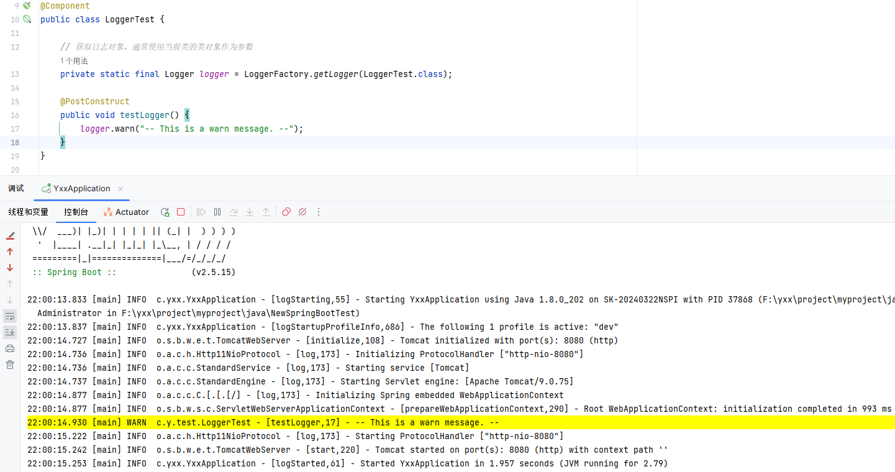
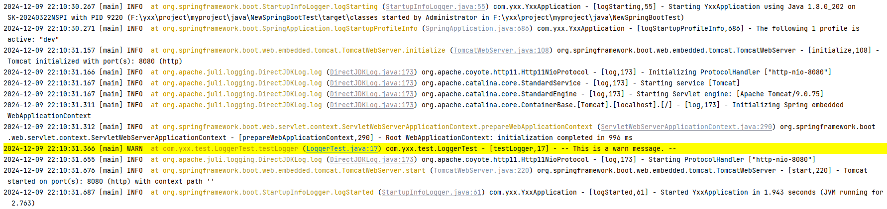
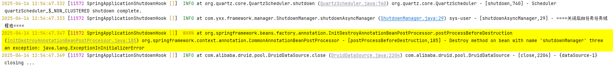
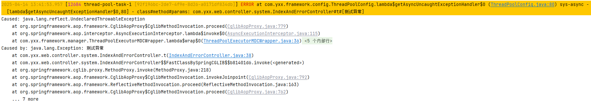
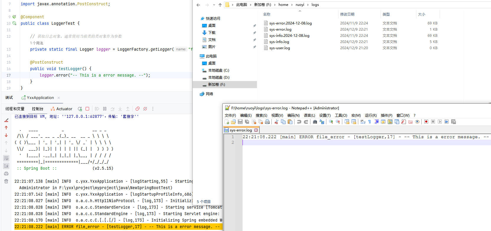

# 日志logback

> Spring框架默认使用Commons Logging作为日志的门面，这意味着它可以在运行时选择使用任何日志实现框架，例如log4j、java.util.logging或者logback

日志级别：

- `TRACE`：记录最详细的跟踪信息，用于开发调试
- `DEBUG`：记录调试信息，帮助理解程序运行流程
- `INFO`：记录一般信息，描述应用程序的运行状态
- `WARN`：记录潜在的问题，可能影响程序运行的警告信息
- `ERROR`：记录错误信息，表示程序中发生了错误，需要立即关注

日志标签：

- `<property>`：用于定义变量，这些变量可以在配置文件的其他部分通过`${variableName}`的形式被引用

  - ```xml
    <property name="log.path" value="/var/log/myapp" />
    ```

- `<appender>`：用于定义日志的输出目的地，比如控制台、文件或者远程服务器。每个`appender`都有一个唯一的名字，并且可以配置不同的日志格式和策略（例如按大小滚动或按时间滚动）

  - ```xml
    <appender name="FILE" class="ch.qos.logback.core.rolling.RollingFileAppender">
      <file>${log.path}/sys.log</file>
      <rollingPolicy class="ch.qos.logback.core.rolling.TimeBasedRollingPolicy">
        <fileNamePattern>${log.path}/sys.%d{yyyy-MM-dd}.log</fileNamePattern>
        <maxHistory>60</maxHistory>
      </rollingPolicy>
      <encoder>
        <pattern>%d{yyyy-MM-dd HH:mm:ss} - %msg%n</pattern>
      </encoder>
    </appender>
    ```

- `root`：标签用于配置根日志记录器，它是所有日志记录器的祖先。如果在`<logger>`中没有特别指定，所有的日志事件都会被传递到根日志记录器。`<root>`标签可以设置日志级别和引用`appender`

  - ```xml
    <root level="INFO">
      <appender-ref ref="STDOUT" />
      <appender-ref ref="FILE" />
    </root>
    ```

- `<logger>`：标签用于配置特定包或类的日志记录器。可以为不同的包或类设置不同的日志级别和`appender`。`<logger>`标签允许更细粒度的日志管理

  - ```xml
    <logger name="com.example.myapp" level="DEBUG">
      <appender-ref ref="FILE" />
    </logger>
    ```

## 日志插件

`Grep Console`：允许用户自定义控制台输出（console output）的颜色和样式

> 

## 基本使用

### 配置文件

> 默认读取`resources`目录下的`logback.xml`文件，或者`logback-spring.xml`文件(可以通过`<springProfile>`标签使用`Spring Boot`的`profiles`)

```yaml
spring:
  profiles:
    active: dev
```

> 注意：这里也可以在运行时手动指定`java -jar -Dspring.profiles.active=prod your-app.jar`

也可以直接指定日志文件，但同时使用会导致冲突：

```yaml
logging:
  config: classpath:logback.xml
  level:
    org.springframework: warn
```

> 配置优先级高于`xml`文件

logback-spring.xml

```xml
<configuration>

    <!-- 默认日志配置 -->
    <appender name="console" class="ch.qos.logback.core.ConsoleAppender">
        <encoder>
            <pattern>%d{HH:mm:ss.SSS} [%thread] %-5level %logger{20} - [%method,%line] - %msg%n</pattern>
        </encoder>
    </appender>

    <root level="DEBUG">
        <appender-ref ref="console"/>
    </root>

    <!-- 开发环境配置 -->
    <springProfile name="dev">
        <root level="INFO">
            <appender-ref ref="console"/>
        </root>
    </springProfile>

    <!-- 测试环境配置 -->
    <springProfile name="test">
        <root level="WARN">
            <appender-ref ref="console"/>
        </root>
    </springProfile>

    <!-- 生产环境配置 -->
    <springProfile name="prod">
        <root level="ERROR">
            <appender-ref ref="console"/>
        </root>
    </springProfile>
</configuration>
```

> 这里通过读取`springProfile`中的值和`name`进行匹配执行对应的日志级别

### LoggerFactory

- `public static Logger getLogger(Class<?> clazz)`：这个方法是最常用的方法之一，它接受一个类对象作为参数，并返回与该类关联的`Logger`实例
- `public static Logger getLogger(String name)`：这个方法允许通过一个字符串名称来获取`Logger`实例。用于创建与特定组件或模块相关的日志记录

LoggerTest.java

```java
import org.slf4j.Logger;
import org.slf4j.LoggerFactory;
import org.springframework.stereotype.Component;

import javax.annotation.PostConstruct;

@Component
public class LoggerTest {

    // 获取日志对象，通常使用当前类的类对象作为参数
    private static final Logger logger = LoggerFactory.getLogger(LoggerTest.class);

    @PostConstruct
    public void testLogger() {
        logger.warn("-- This is a warn message. --");
    }
}
```

### 日志格式

对于日志格式：

```
%d{HH:mm:ss.SSS} [%thread] %-5level %logger{20} - [%method,%line] - %msg%n
```

- `%d{HH:mm:ss.SSS}`：这是日期和时间格式化参数。`%d`表示日期和时间，`HH:mm:ss.SSS`是具体的格式，表示小时（24小时制）、分钟、秒和毫秒。例如，`14:02:57.123`
- `[%thread]`：这个参数输出产生日志的线程名称，可以用来跟踪哪个线程产生了特定的日志消息
- `%-5level`：这个参数输出日志级别，`-5`表示左对齐，并且至少占用5个字符的宽度。如果日志级别名称短于5个字符，它将在右侧填充空格。例如，`ERROR`
- `%logger{20}`：这个参数输出日志记录器的名称，`20`表示最大宽度。如果日志记录器的名称超过20个字符，它将被截断。如果少于20个字符，它将在右侧填充空格
- `[%method,%line]`：这个参数输出日志记录发生的方法名和行号。这对于调试来说非常有用，因为它可以直接跳转到代码中生成日志的那一行
- `%msg`：这个参数输出实际的日志消息
- `%n`：这个参数输出平台独立的换行符。在UNIX系统中，它表示`\n`，在 Windows 系统中，它表示`\r\n`

示例输出的日志内容：

```
22:00:14.930 [main] WARN  c.y.test.LoggerTest - [testLogger,17] - -- This is a warn message. --
```

> 

调整输出：

```xml
    <!-- 默认日志配置 -->
    <appender name="STDOUT" class="ch.qos.logback.core.ConsoleAppender">
        <encoder>
            <pattern>%d{yyyy-MM-dd HH:mm:ss.SSS} [%thread] %-5level %yellow(at %class.%method) \(%file:%line\) %logger{200} - [%method,%line] - %msg%n</pattern>
        </encoder>
    </appender>
```

> 注意：如果被格式内容字符串包裹，需要使用二次转义`\\(%file:%line\\)`，参考配置：
>
> ```xml
>     <!-- 日志输出格式 -->
> 	<property name="log.pattern" value="%d{yyyy-MM-dd HH:mm:ss.SSS} [%thread] %-5level %yellow(at %class.%method) \\(%file:%line\\) %logger{200} - [%method,%line] - %msg%n" />
> ```

示例输出的日志内容：

```
2024-12-09 22:10:31.366 [main] WARN  at com.yxx.test.LoggerTest.testLogger (LoggerTest.java:17) com.yxx.test.LoggerTest - [testLogger,17] - -- This is a warn message. --
```

> 点击可以进行代码行跳转：
>
> 

### Logback染色

> - 使用`%yellow()`的方式染色是通过Ascii码染色，会导致日志中有特殊字符
>
> - 使用`%clr(){color}`染色则不会
>
> 引入配置：
>
> ```xml
>     <!-- 关键：引入 Spring Boot 的默认 Logback 配置 -->
>     <include resource="org/springframework/boot/logging/logback/defaults.xml"/>
> ```

配置`logback-spring`：

```xml
        <!-- 日志输出格式(颜色) -->
        <property name="log.pattern.color"
                  value="%clr(%d{yyyy-MM-dd HH:mm:ss.SSS}){yellow} [%clr(${PID}){magenta} %thread %clr([%X{traceId}]){yellow}] %clr(${LOG_LEVEL_PATTERN:-%5p}) at %class.%method \\(%file:%line\\) %logger{200} - [%method,%line] - %msg%n"/>
```

> 

### traceId

> 分布式系统中用于追踪一个请求从客户端发起直到服务器端处理完成整个流程的唯一标识符

```java
import org.slf4j.MDC;

public class TraceIdUtil {
    private static final String TRACE_ID_KEY = "traceId";

    // 设置 traceId 到 MDC
    public static void setTraceId(String traceId) {
        MDC.put(TRACE_ID_KEY, traceId);
    }

    // 清除 MDC 中的 traceId
    public static void clearTraceId() {
        MDC.remove(TRACE_ID_KEY);
    }
}
```

> 在进行异步任务配置时可以使用到：
>
> 

## 参考配置

logback.xml

```xml
<?xml version="1.0" encoding="UTF-8"?>
<configuration>
    <!-- 日志存放路径 -->
    <property name="log.path" value="/home/ruoyi/logs"/>
    <!-- 日志输出格式 -->
    <property name="log.pattern" value="%d{HH:mm:ss.SSS} [%thread] %-5level %logger{20} - [%method,%line] - %msg%n"/>

    <!-- 系统模块日志级别控制  -->
    <logger name="com.ruoyi" level="info"/>
    <!-- Spring日志级别控制  -->
    <logger name="org.springframework" level="warn"/>

    <!-- 控制台输出 -->
    <appender name="console" class="ch.qos.logback.core.ConsoleAppender">
        <encoder>
            <pattern>${log.pattern}</pattern>
        </encoder>
    </appender>

    <!-- 系统日志输出 -->
    <appender name="file_info" class="ch.qos.logback.core.rolling.RollingFileAppender">
        <file>${log.path}/sys-info.log</file>
        <!-- 循环政策：基于时间创建日志文件 -->
        <rollingPolicy class="ch.qos.logback.core.rolling.TimeBasedRollingPolicy">
            <!-- 日志文件名格式 -->
            <fileNamePattern>${log.path}/sys-info.%d{yyyy-MM-dd}.log</fileNamePattern>
            <!-- 日志最大的历史 60天 -->
            <maxHistory>60</maxHistory>
        </rollingPolicy>
        <encoder>
            <pattern>${log.pattern}</pattern>
        </encoder>
        <filter class="ch.qos.logback.classic.filter.LevelFilter">
            <!-- 过滤的级别 -->
            <level>INFO</level>
            <!-- 匹配时的操作：接收（记录） -->
            <onMatch>ACCEPT</onMatch>
            <!-- 不匹配时的操作：拒绝（不记录） -->
            <onMismatch>DENY</onMismatch>
        </filter>
    </appender>

    <appender name="file_error" class="ch.qos.logback.core.rolling.RollingFileAppender">
        <file>${log.path}/sys-error.log</file>
        <!-- 循环政策：基于时间创建日志文件 -->
        <rollingPolicy class="ch.qos.logback.core.rolling.TimeBasedRollingPolicy">
            <!-- 日志文件名格式 -->
            <fileNamePattern>${log.path}/sys-error.%d{yyyy-MM-dd}.log</fileNamePattern>
            <!-- 日志最大的历史 60天 -->
            <maxHistory>60</maxHistory>
        </rollingPolicy>
        <encoder>
            <pattern>${log.pattern}</pattern>
        </encoder>
        <filter class="ch.qos.logback.classic.filter.LevelFilter">
            <!-- 过滤的级别 -->
            <level>ERROR</level>
            <!-- 匹配时的操作：接收（记录） -->
            <onMatch>ACCEPT</onMatch>
            <!-- 不匹配时的操作：拒绝（不记录） -->
            <onMismatch>DENY</onMismatch>
        </filter>
    </appender>

    <!-- 用户访问日志输出  -->
    <appender name="sys-user" class="ch.qos.logback.core.rolling.RollingFileAppender">
        <file>${log.path}/sys-user.log</file>
        <rollingPolicy class="ch.qos.logback.core.rolling.TimeBasedRollingPolicy">
            <!-- 按天回滚 daily -->
            <fileNamePattern>${log.path}/sys-user.%d{yyyy-MM-dd}.log</fileNamePattern>
            <!-- 日志最大的历史 60天 -->
            <maxHistory>60</maxHistory>
        </rollingPolicy>
        <encoder>
            <pattern>${log.pattern}</pattern>
        </encoder>
    </appender>

    <root level="info">
        <appender-ref ref="console"/>
    </root>

    <!-- 系统操作日志  -->
    <root level="info">
        <appender-ref ref="file_info"/>
        <appender-ref ref="file_error"/>
    </root>

    <!-- 系统用户操作日志  -->
    <logger name="sys-user" level="info">
        <appender-ref ref="sys-user"/>
    </logger>
</configuration>
```

> 对于`appender name="file_error"`配置：
>
> - `<file>${log.path}/sys-error.log</file>`：这行配置指定了日志文件的初始位置和文件名。`${log.path}`是一个变量，已在配置文件中定义或者在系统属性中设置，表示日志文件的基路径。`sys-error.log`是日志文件的名称
> - `<rollingPolicy class="ch.qos.logback.core.rolling.TimeBasedRollingPolicy">`：定义了日志文件的滚动策略。这里使用的是基于时间的滚动策略，即每天创建一个新的日志文件
>   - `<fileNamePattern>${log.path}/sys-error.%d{yyyy-MM-dd}.log</fileNamePattern>`：指定了滚动日志文件的命名模式。`%d{yyyy-MM-dd}`是日期格式化模式，表示每天滚动一次，日志文件名会包含日期
>   - `<maxHistory>60</maxHistory>`：`maxHistory`指定了保留日志文件的最大天数。在这个例子中，超过60天的日志文件将会被自动删除
>   - `<encoder>`：负责将日志事件转换为字符串，并追加到文件中
>     - `<pattern>${log.pattern}</pattern>`：pattern定义了日志消息的格式。`${log.pattern}`是一个变量，已在的配置文件中定义，表示日志消息的格式字符串
>   - `<filter class="ch.qos.logback.classic.filter.LevelFilter">`：定义了一个过滤器，用于根据日志级别过滤日志事件
>     - `<level>ERROR</level>`：指定了过滤器要匹配的日志级别。在这个例子中，只匹配`ERROR`级别的日志
>     - `<onMatch>ACCEPT</onMatch>`：指定了当日志级别匹配时执行的操作。`ACCEPT`表示接受并记录该日志事件
>     - `<onMismatch>DENY</onMismatch>`：指定了当日志级别不匹配时执行的操作。`DENY`表示拒绝并忽略该日志事件
>
> 通过`private static final Logger logger = LoggerFactory.getLogger("file_error");`去获取对象，进行记录时会自动保存到文件中：
>
> 
