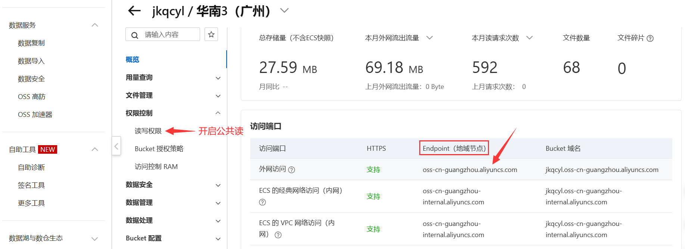
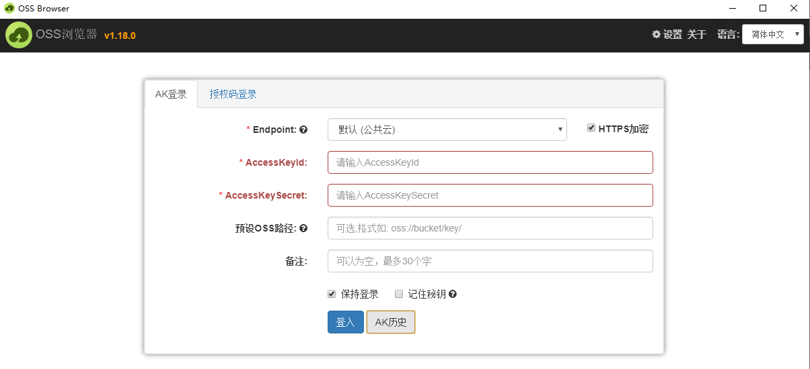

# 阿里云OSS存储

阿里云对象存储OSS（Object Storage Service），是一款海量、安全、低成本、高可靠的云存储服务。使用OSS，可以通过网络随时存储和调用包括文本、图片、音频和视频在内的各种文件

使用流程：


> Bucket：存储空间是用户用户存储对象（Object）的容器，所有的对象都必需隶属于某个存储空间

官方开发文档：[如何安装OSS Java SDK_对象存储 OSS-阿里云帮助中心 (aliyun.com)](https://help.aliyun.com/zh/oss/developer-reference/java-installation?spm=a2c4g.11186623.0.0.a2493ba3Lves58)



pom.xml

```xml
        <!-- 阿里云OSS对象存储 -->
        <dependency>
            <groupId>com.aliyun.oss</groupId>
            <artifactId>aliyun-sdk-oss</artifactId>
            <version>3.15.1</version>
        </dependency>
```

> 较高的JDK版本引入的依赖有所不同，具体参考官方文档

## 图形操作

Windows下载地址：https://gosspublic.alicdn.com/ossbrowser/1.18.0/oss-browser-win32-x64.zip

解压运行`oss-browser.exe`，填入密钥即可使用

> 

## OSS操作

### 上传

Demo.java

```java
import com.aliyun.oss.ClientException;
import com.aliyun.oss.OSS;
import com.aliyun.oss.common.auth.*;
import com.aliyun.oss.OSSClientBuilder;
import com.aliyun.oss.OSSException;
import com.aliyun.oss.model.PutObjectRequest;
import com.aliyun.oss.model.PutObjectResult;
import java.io.FileInputStream;
import java.io.InputStream;

public class Demo {

    public static void main(String[] args) throws Exception {
        // Endpoint以华东1（杭州）为例，其它Region请按实际情况填写。
        // String endpoint = "https://oss-cn-hangzhou.aliyuncs.com";
        String endpoint = "https://oss-cn-guangzhou.aliyuncs.com";
        // 从环境变量中获取访问凭证。运行本代码示例之前，请确保已设置环境变量OSS_ACCESS_KEY_ID和OSS_ACCESS_KEY_SECRET。
        // EnvironmentVariableCredentialsProvider credentialsProvider = CredentialsProviderFactory.newEnvironmentVariableCredentialsProvider();
        // 这里使用传统方式指定
        String accessKeyId = "accessKeyId";
        String accessKeySecret = "accessKeySecret";
        // 填写Bucket名称，例如examplebucket。
        String bucketName = "jkqcyl";
        // 填写Object完整路径，完整路径中不能包含Bucket名称，例如exampledir/exampleobject.txt。
        String objectName = "3.png";
        // 填写本地文件的完整路径，例如D:\\localpath\\examplefile.txt。
        // 如果未指定本地路径，则默认从示例程序所属项目对应本地路径中上传文件流。
        String filePath = "D:\\京东内存卡\\壁纸\\3.png";
        // 传输完成后，且权限开启”公共读“，访问地址为：bucketName、endpoint、objectName的组合
        // https://jkqcyl.oss-cn-guangzhou.aliyuncs.com/3.png

        // 创建OSSClient实例。
        // OSS ossClient = new OSSClientBuilder().build(endpoint, credentialsProvider);
        OSS ossClient = new OSSClientBuilder().build(endpoint, accessKeyId, accessKeySecret);

        try {
            InputStream inputStream = new FileInputStream(filePath);
            // 创建PutObjectRequest对象。
            PutObjectRequest putObjectRequest = new PutObjectRequest(bucketName, objectName, inputStream);
            // 创建PutObject请求。
            PutObjectResult result = ossClient.putObject(putObjectRequest);
        } catch (OSSException oe) {
            System.out.println("Caught an OSSException, which means your request made it to OSS, "
                    + "but was rejected with an error response for some reason.");
            System.out.println("Error Message:" + oe.getErrorMessage());
            System.out.println("Error Code:" + oe.getErrorCode());
            System.out.println("Request ID:" + oe.getRequestId());
            System.out.println("Host ID:" + oe.getHostId());
        } catch (ClientException ce) {
            System.out.println("Caught an ClientException, which means the client encountered "
                    + "a serious internal problem while trying to communicate with OSS, "
                    + "such as not being able to access the network.");
            System.out.println("Error Message:" + ce.getMessage());
        } finally {
            if (ossClient != null) {
                ossClient.shutdown();
            }
        }
    }
}
```

> 主要的流程就是在创建OSSClient实例后，调用对象的方法进行操作

### 下载

流式下载：

```java
            // ossObject包含文件所在的存储空间名称、文件名称、文件元信息以及一个输入流。
            OSSObject ossObject = ossClient.getObject(bucketName, objectName);

            // 读取文件内容。
            System.out.println("Object content:");
            BufferedReader reader = new BufferedReader(new InputStreamReader(ossObject.getObjectContent()));
            while (true) {
                String line = reader.readLine();
                if (line == null) break;

                System.out.println("\n" + line);
            }
            // 数据读取完成后，获取的流必须关闭，否则会造成连接泄漏，导致请求无连接可用，程序无法正常工作。
            reader.close();
            // ossObject对象使用完毕后必须关闭，否则会造成连接泄漏，导致请求无连接可用，程序无法正常工作。            
            ossObject.close();
```

下载到本地：

```java
        String pathName = "D:\\localpath\\examplefile.txt";


            // 下载Object到本地文件，并保存到指定的本地路径中。如果指定的本地文件存在会覆盖，不存在则新建。
            // 如果未指定本地路径，则下载后的文件默认保存到示例程序所属项目对应本地路径中。
            ossClient.getObject(new GetObjectRequest(bucketName, objectName), new File(pathName));
```

### 删除

删除单个：

```java
            // 删除文件或目录。如果要删除目录，目录必须为空。
            ossClient.deleteObject(bucketName, objectName);
```

删除多个：

```java
            // 删除文件。
            // 填写需要删除的多个文件完整路径。文件完整路径中不能包含Bucket名称。
            List<String> keys = new ArrayList<String>();
            keys.add("exampleobjecta.txt");
            keys.add("testfolder/sampleobject.txt");
            keys.add("exampleobjectb.txt");

            DeleteObjectsResult deleteObjectsResult = ossClient.deleteObjects(new DeleteObjectsRequest(bucketName).withKeys(keys).withEncodingType("url"));
            List<String> deletedObjects = deleteObjectsResult.getDeletedObjects();
```

### 查找

判断文件是否存在：

```java
            // 判断文件是否存在。如果返回值为true，则文件存在，否则存储空间或者文件不存在。
            // 设置是否进行重定向或者镜像回源。默认值为true，表示忽略302重定向和镜像回源；如果设置isINoss为false，则进行302重定向或者镜像回源。
            //boolean isINoss = true;
            boolean found = ossClient.doesObjectExist(bucketName, objectName);
            //boolean found = ossClient.doesObjectExist(bucketName, objectName, isINoss);
            System.out.println(found);
```

### 目录

在Bucket下创建目录：

```java
        // 填写目录名称，目录需以正斜线结尾。(可以一次创建多层)
        String objectName = "exampledir/";


            String content = "";

            // 创建PutObjectRequest对象。       
            PutObjectRequest putObjectRequest = new PutObjectRequest(bucketName, objectName, new ByteArrayInputStream(content.getBytes()));
            
            // 如果需要上传时设置存储类型和访问权限，请参考以下示例代码。
            // ObjectMetadata metadata = new ObjectMetadata();
            // metadata.setHeader(OSSHeaders.OSS_STORAGE_CLASS, StorageClass.Standard.toString());
            // metadata.setObjectAcl(CannedAccessControlList.Private);
            // putObjectRequest.setMetadata(metadata);

            // 上传字符串。
            ossClient.putObject(putObjectRequest);
```

## OSS使用

> 使用MultipartFile对象接收，常用的方法有：
>
> - `getOriginalFilename()`：获取上传的文件名
> - `getInputStream()`：获取输入流
> - `transferTo(File dest)`：将接收的文件转存到磁盘文件中
> - `getSize()`：获取文件的大小，单位字节
> - `getBytes()`：获取文件内容的字节数组

Spring Boot默认最大文件上传为1MB，修改application.yml

```yaml
spring:
  servlet:
    multipart:
      max-file-size: 10MB
      max-request-size: 10MB
```

控制层代码示例：

```java
    @PostMapping("/testUp")
    public void testUp(MultipartFile multipartFile) throws IOException {
        String endpoint = "https://oss-cn-guangzhou.aliyuncs.com";
        String accessKeyId = "accessKeyId";
        String accessKeySecret = "accessKeySecret";
        String bucketName = "jkqcyl";
        // 如果objectName指定的目录不存在，则会在bucket中创建对应的目录
        String objectName = "a.png";

        OSSOperateUtils ossOperateUtils = new OSSOperateUtils(endpoint,accessKeyId,accessKeySecret,bucketName);
        System.out.println(ossOperateUtils.upload(objectName, multipartFile.getInputStream()));
        System.out.println(ossOperateUtils.getThumbnailURL(objectName,200,null));
    }
```

OSSOperateUtils.java

```java
import com.aliyun.oss.ClientException;
import com.aliyun.oss.OSS;
import com.aliyun.oss.OSSClientBuilder;
import com.aliyun.oss.OSSException;
import com.aliyun.oss.model.GetObjectRequest;
import com.aliyun.oss.model.PutObjectRequest;
import com.aliyun.oss.model.PutObjectResult;

import java.io.*;

public class OSSOperateUtils {
    private String endpoint;
    private String accessKeyId;
    private String accessKeySecret;
    private String bucketName;

    public OSSOperateUtils() {
    }

    public OSSOperateUtils(String endpoint, String accessKeyId, String accessKeySecret, String bucketName) {
        this.endpoint = endpoint;
        this.accessKeyId = accessKeyId;
        this.accessKeySecret = accessKeySecret;
        this.bucketName = bucketName;
    }

    /**
     * 上传本地文件到OSS服务器上
     * @param objectName OSS路径
     * @param filePath 本地文件路径
     */
    public String upload(String objectName, String filePath) throws OSSException, ClientException{
        // 创建OSSClient实例。
        // OSS ossClient = new OSSClientBuilder().build(endpoint, credentialsProvider);
        OSS ossClient = new OSSClientBuilder().build(endpoint, accessKeyId, accessKeySecret);

        try {
            InputStream inputStream = new FileInputStream(filePath);
            // 创建PutObjectRequest对象。
            PutObjectRequest putObjectRequest = new PutObjectRequest(bucketName, objectName, inputStream);
            // 创建PutObject请求。
            PutObjectResult result = ossClient.putObject(putObjectRequest);
            return getMontageURL(objectName);
        } catch (OSSException oe) {
            System.out.println("Caught an OSSException, which means your request made it to OSS, "
                    + "but was rejected with an error response for some reason.");
            System.out.println("Error Message:" + oe.getErrorMessage());
            System.out.println("Error Code:" + oe.getErrorCode());
            System.out.println("Request ID:" + oe.getRequestId());
            System.out.println("Host ID:" + oe.getHostId());
        } catch (ClientException ce) {
            System.out.println("Caught an ClientException, which means the client encountered "
                    + "a serious internal problem while trying to communicate with OSS, "
                    + "such as not being able to access the network.");
            System.out.println("Error Message:" + ce.getMessage());
        } catch (FileNotFoundException e) {
            e.printStackTrace();
        } finally {
            if (ossClient != null) {
                ossClient.shutdown();
            }
        }
        return null;
    }

    /**
     * 以文件流形式上传到OSS服务器上
     * @param objectName OSS路径
     * @param inputStream 文件流
     */
    public String upload(String objectName, InputStream inputStream){
        // 创建OSSClient实例。
        // OSS ossClient = new OSSClientBuilder().build(endpoint, credentialsProvider);
        OSS ossClient = new OSSClientBuilder().build(endpoint, accessKeyId, accessKeySecret);

        try {
            // 创建PutObjectRequest对象。
            PutObjectRequest putObjectRequest = new PutObjectRequest(bucketName, objectName, inputStream);
            // 创建PutObject请求。
            PutObjectResult result = ossClient.putObject(putObjectRequest);
            return getMontageURL(objectName);
        } catch (OSSException oe) {
            System.out.println("Caught an OSSException, which means your request made it to OSS, "
                    + "but was rejected with an error response for some reason.");
            System.out.println("Error Message:" + oe.getErrorMessage());
            System.out.println("Error Code:" + oe.getErrorCode());
            System.out.println("Request ID:" + oe.getRequestId());
            System.out.println("Host ID:" + oe.getHostId());
        } catch (ClientException ce) {
            System.out.println("Caught an ClientException, which means the client encountered "
                    + "a serious internal problem while trying to communicate with OSS, "
                    + "such as not being able to access the network.");
            System.out.println("Error Message:" + ce.getMessage());
        } finally {
            if (ossClient != null) {
                ossClient.shutdown();
            }
        }
        return null;
    }

    /**
     * 下载文件到本机服务器上
     * @param objectName OSS路径
     * @param pathName 本地文件路径
     */
    public void downloadLocality(String objectName, String pathName){
        // 创建OSSClient实例。
        // OSS ossClient = new OSSClientBuilder().build(endpoint, credentialsProvider);
        OSS ossClient = new OSSClientBuilder().build(endpoint, accessKeyId, accessKeySecret);

        try {
            // 下载Object到本地文件，并保存到指定的本地路径中。如果指定的本地文件存在会覆盖，不存在则新建。
            // 如果未指定本地路径，则下载后的文件默认保存到示例程序所属项目对应本地路径中。
            ossClient.getObject(new GetObjectRequest(bucketName, objectName), new File(pathName));
        } catch (OSSException oe) {
            System.out.println("Caught an OSSException, which means your request made it to OSS, "
                    + "but was rejected with an error response for some reason.");
            System.out.println("Error Message:" + oe.getErrorMessage());
            System.out.println("Error Code:" + oe.getErrorCode());
            System.out.println("Request ID:" + oe.getRequestId());
            System.out.println("Host ID:" + oe.getHostId());
        } catch (ClientException ce) {
            System.out.println("Caught an ClientException, which means the client encountered "
                    + "a serious internal problem while trying to communicate with OSS, "
                    + "such as not being able to access the network.");
            System.out.println("Error Message:" + ce.getMessage());
        } finally {
            if (ossClient != null) {
                ossClient.shutdown();
            }
        }
    }

    /**
     * 删除OSS服务器上的文件
     * @param objectName OSS路径
     */
    public void delete(String objectName){
        // 创建OSSClient实例。
        // OSS ossClient = new OSSClientBuilder().build(endpoint, credentialsProvider);
        OSS ossClient = new OSSClientBuilder().build(endpoint, accessKeyId, accessKeySecret);

        try {
            // 删除文件或目录。如果要删除目录，目录必须为空。
            ossClient.deleteObject(bucketName, objectName);
        } catch (OSSException oe) {
            System.out.println("Caught an OSSException, which means your request made it to OSS, "
                    + "but was rejected with an error response for some reason.");
            System.out.println("Error Message:" + oe.getErrorMessage());
            System.out.println("Error Code:" + oe.getErrorCode());
            System.out.println("Request ID:" + oe.getRequestId());
            System.out.println("Host ID:" + oe.getHostId());
        } catch (ClientException ce) {
            System.out.println("Caught an ClientException, which means the client encountered "
                    + "a serious internal problem while trying to communicate with OSS, "
                    + "such as not being able to access the network.");
            System.out.println("Error Message:" + ce.getMessage());
        } finally {
            if (ossClient != null) {
                ossClient.shutdown();
            }
        }
    }

    /**
     * 查找OSS服务器上文件是否存在
     * @param objectName OSS路径
     * @return 文件是否存在
     */
    public boolean seek(String objectName){
        // 创建OSSClient实例。
        // OSS ossClient = new OSSClientBuilder().build(endpoint, credentialsProvider);
        OSS ossClient = new OSSClientBuilder().build(endpoint, accessKeyId, accessKeySecret);

        boolean found = false;
        try {
            // 判断文件是否存在。如果返回值为true，则文件存在，否则存储空间或者文件不存在。
            // 设置是否进行重定向或者镜像回源。默认值为true，表示忽略302重定向和镜像回源；如果设置isINoss为false，则进行302重定向或者镜像回源。
            //boolean isINoss = true;
            found = ossClient.doesObjectExist(bucketName, objectName);
            return found;
            //boolean found = ossClient.doesObjectExist(bucketName, objectName, isINoss);
            //System.out.println(found);
        } catch (OSSException oe) {
            System.out.println("Caught an OSSException, which means your request made it to OSS, "
                    + "but was rejected with an error response for some reason.");
            System.out.println("Error Message:" + oe.getErrorMessage());
            System.out.println("Error Code:" + oe.getErrorCode());
            System.out.println("Request ID:" + oe.getRequestId());
            System.out.println("Host ID:" + oe.getHostId());
        } catch (ClientException ce) {
            System.out.println("Caught an ClientException, which means the client encountered "
                    + "a serious internal problem while trying to communicate with OSS, "
                    + "such as not being able to access the network.");
            System.out.println("Error Message:" + ce.getMessage());
        } finally {
            if (ossClient != null) {
                ossClient.shutdown();
            }
        }
        return found;
    }

    /**
     * 创建文件目录
     * @param objectName 需要创建的文件目录
     */
    public void createDirectory(String objectName){
        OSS ossClient = new OSSClientBuilder().build(endpoint, accessKeyId, accessKeySecret);
        try {
            String content = "";

            // 创建PutObjectRequest对象。
            PutObjectRequest putObjectRequest = new PutObjectRequest(bucketName, objectName, new ByteArrayInputStream(content.getBytes()));

            // 如果需要上传时设置存储类型和访问权限，请参考以下示例代码。
            // ObjectMetadata metadata = new ObjectMetadata();
            // metadata.setHeader(OSSHeaders.OSS_STORAGE_CLASS, StorageClass.Standard.toString());
            // metadata.setObjectAcl(CannedAccessControlList.Private);
            // putObjectRequest.setMetadata(metadata);

            // 上传字符串。
            ossClient.putObject(putObjectRequest);
        } catch (OSSException oe) {
            System.out.println("Caught an OSSException, which means your request made it to OSS, "
                    + "but was rejected with an error response for some reason.");
            System.out.println("Error Message:" + oe.getErrorMessage());
            System.out.println("Error Code:" + oe.getErrorCode());
            System.out.println("Request ID:" + oe.getRequestId());
            System.out.println("Host ID:" + oe.getHostId());
        } catch (ClientException ce) {
            System.out.println("Caught an ClientException, which means the client encountered "
                    + "a serious internal problem while trying to communicate with OSS, "
                    + "such as not being able to access the network.");
            System.out.println("Error Message:" + ce.getMessage());
        } finally {
            if (ossClient != null) {
                ossClient.shutdown();
            }
        }
    }

    /**
     * 获取图片访问的url
     * @param objectName OSS路径
     * @return 图片访问的url
     */
    public String getMontageURL(String objectName){
        if (endpoint.contains("ttp")){
            endpoint = endpoint.split("//")[1];
        }
        return "https://" + bucketName + "." + endpoint + "/" + objectName;
    }

    /**
     * 上传图片后获取压缩后的url（都赋值会进行两次压缩，而不会返回width×height的图）
     * @param width 定义图片宽
     * @param height 定义图片高
     * @return 压缩后的url
     */
    public String getThumbnailURL(String objectName, Integer width, Integer height){
        String montageURL = getMontageURL(objectName);
        if (!(width == null || width.equals(0)) && !(height == null || height.equals(0))){
            return montageURL + "?x-oss-process=image/resize,w_" + width + ",h_" + height;
        }
        if (!(width == null || width.equals(0))){
            return montageURL + "?x-oss-process=image/resize,w_" + width;
        }
        if (!(height == null || height.equals(0))){
            return montageURL + "?x-oss-process=image/resize,h_" + height;
        }
        return null;
    }
}
```

