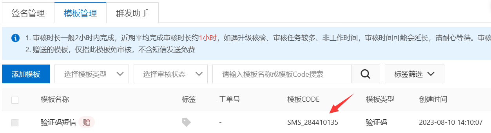

# 阿里云短信服务

pom.xml

```xml
        <!--阿里云短信服务-->
        <dependency>
            <groupId>com.aliyun</groupId>
            <artifactId>aliyun-java-sdk-core</artifactId>
            <version>4.5.16</version>
        </dependency>
        <dependency>
            <groupId>com.aliyun</groupId>
            <artifactId>aliyun-java-sdk-dysmsapi</artifactId>
            <version>2.1.0</version>
        </dependency>
```

SMSUtils.java

```java
import com.aliyuncs.DefaultAcsClient;
import com.aliyuncs.IAcsClient;
import com.aliyuncs.dysmsapi.model.v20170525.SendSmsRequest;
import com.aliyuncs.dysmsapi.model.v20170525.SendSmsResponse;
import com.aliyuncs.exceptions.ClientException;
import com.aliyuncs.profile.DefaultProfile;

/**
 * 短信发送工具类
 */
public class SMSUtils {

    /**
     * 发送短信
     * @param signName 签名
     * @param templateCode 模板
     * @param phoneNumbers 手机号
     * @param param 参数
     */
    public static void sendMessage(String signName, String templateCode,String phoneNumbers,String param){
        DefaultProfile profile = DefaultProfile.getProfile("cn-hangzhou", "accessKeyId", "secret");
        IAcsClient client = new DefaultAcsClient(profile);

        SendSmsRequest request = new SendSmsRequest();
        request.setSysRegionId("cn-hangzhou");
        request.setPhoneNumbers(phoneNumbers);
        request.setSignName(signName);
        request.setTemplateCode(templateCode);
        request.setTemplateParam("{\"code\":\""+param+"\"}");
        try {
            SendSmsResponse response = client.getAcsResponse(request);
            if(!response.getCode().equals("OK")){
                throw new ClientException("短信发送失败——" + response.getMessage());
            }
        }catch (ClientException e) {
            e.printStackTrace();
        }
    }
}
```

> 返回结果实例
>
> ```json
> {
>    "RequestId": "614048FB-0619-4439-A1D5-AA8B218A****",
>    "Message": "OK",
>    "BizId": "3***************0",
>    "Code": "OK"
> }
> ```

ValidateCodeUtils.java

```java
import java.util.Random;

/**
 * 随机生成验证码工具类
 */
public class ValidateCodeUtils {
    /**
     * 随机生成验证码
     * @param length 长度为4位或者6位
     * @return
     */
    public static Integer generateValidateCode(int length){
        Integer code =null;
        if(length == 4){
            code = new Random().nextInt(9999);//生成随机数，最大为9999
            if(code < 1000){
                code = code + 1000;//保证随机数为4位数字
            }
        }else if(length == 6){
            code = new Random().nextInt(999999);//生成随机数，最大为999999
            if(code < 100000){
                code = code + 100000;//保证随机数为6位数字
            }
        }else{
            throw new RuntimeException("只能生成4位或6位数字验证码");
        }
        return code;
    }

    /**
     * 随机生成指定长度字符串验证码
     * @param length 长度
     * @return
     */
    public static String generateValidateCode4String(int length){
        Random rdm = new Random();
        String hash1 = Integer.toHexString(rdm.nextInt());
        String capstr = hash1.substring(0, length);
        return capstr;
    }
}
```

SMSTest.java

```java
    @Test
    public void testSMS(){
        String code = ValidateCodeUtils.generateValidateCode(4).toString();
        String phone = "13242823158";
        SMSUtils.sendMessage("阿里云短信测试","SMS_154950909",phone,code);
    }
```

> 在申请签名通过后，有赠送的模板：
>
> 
>
> 这里赠送的模板code为：`templateCode = "SMS_284410135"`
