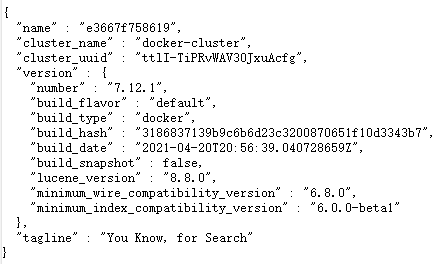

# Elasticsearch

> 搜索引擎技术排名：
>
> - Elasticsearch：开源的分布式搜索引擎
> - Splunk：商业项目
> - Solr：Apache的开源搜索引擎
>
> 官网地址：https://www.elastic.co/cn/
>
> `elasticsearch`结合`kibana`、`Logstash`、`Beats`，是一整套技术栈，被叫做ELK。被广泛应用在日志数据分析、实时监控等领域
>
> 

elasticsearch具备下列优势：

- 支持分布式，可水平扩展
- 提供Restful接口，可被任何语言调用


## 基本架构

- `Mysql`：擅长事务类型操作，可以确保数据的安全和一致性
- `Elasticsearch`：擅长海量数据的搜索、分析、计算


## 安装es

因为还需要部署kibana容器，需要让es喝kibana容器互联，先创建一个网络：

```
docker network create es-net
```

运行容器：

```
docker run -d \
  --name es \
  -e "ES_JAVA_OPTS=-Xms512m -Xmx512m" \
  -e "discovery.type=single-node" \
  -e TZ="Asia/Shanghai" \
  -v es-data:/usr/share/elasticsearch/data \
  -v es-plugins:/usr/share/elasticsearch/plugins \
  --privileged \
  --network es-net \
  -p 9200:9200 \
  -p 9300:9300 \
  elasticsearch:7.12.1
```

> - `--privileged`：容器将获得几乎与主机相同的权限，可以访问主机的大部分硬件设备和内核功能

访问`http://localhost:9200`即可看到`elasticsearch`的响应结果：



## 安装kibana

> `kibana`可以提供一个`elsticsearch`的可视化界面

```
docker run -d \
  --name kibana \
  -e ELASTICSEARCH_HOSTS=http://es:9200 \
  -e TZ="Asia/Shanghai" \
  --network=es-net \
  -p 5601:5601 \
  kibana:7.12.1
```

访问`http://localhost:5601`：


## 安装ik插件

在线安装：

```
# 进入容器内部
docker exec -it es /bin/bash

# 在线下载并安装
bin/elasticsearch-plugin install https://get.infini.cloud/elasticsearch/analysis-ik/7.12.1

# 退出
exit

# 重启容器
docker restart es
```

离线安装：

> 安装插件需要知道es的plugins目录位置，因为使用了数据卷挂载，因此需要查看es的数据卷目录，通过下面目录查看

```
docker volume inspect es-plugins
```

> ```
> [
>     {
>         "CreatedAt": "2025-02-27T15:39:43+08:00",
>         "Driver": "local",
>         "Labels": null,
>         "Mountpoint": "/var/lib/docker/volumes/es-plugins/_data",
>         "Name": "es-plugins",
>         "Options": null,
>         "Scope": "local"
>     }
> ]
> ```

移动ik文件夹到`/var/lib/docker/volumes/es-plugins/_data`目录：

> 
>
> 

查看插件：

```
[root@iZf8zaso97ymfxtjl94idqZ _data]# curl -X GET "localhost:9200/_cat/plugins?v"
name         component   version
768ea1845c9d analysis-ik 7.12.1
```

## 倒排索引


## IK分词器

> 中文分词往往需要根据语义分析，比较复杂，这就需要用到中文分词器，例如IK分词器。IK分词器是林良益在2006年开源发布的，其采用的正向迭代最细粒度切分算法一直沿用至今

在`Kibana`的`DevTools`中使用默认分词器：

```
POST /_analyze
{
  "analyzer": "standard",
  "text": "黑马程序员学习java太棒了"
}
```

> 

测试IK分词器：

- `ik_smart`：最少切分
- `ik_max_word`：最细切分

```
{
  "tokens" : [
    {
      "token" : "黑马",
      "start_offset" : 0,
      "end_offset" : 2,
      "type" : "CN_WORD",
      "position" : 0
    },
    {
      "token" : "程序员",
      "start_offset" : 2,
      "end_offset" : 5,
      "type" : "CN_WORD",
      "position" : 1
    },
    {
      "token" : "学习",
      "start_offset" : 5,
      "end_offset" : 7,
      "type" : "CN_WORD",
      "position" : 2
    },
    {
      "token" : "java",
      "start_offset" : 7,
      "end_offset" : 11,
      "type" : "ENGLISH",
      "position" : 3
    },
    {
      "token" : "太棒了",
      "start_offset" : 11,
      "end_offset" : 14,
      "type" : "CN_WORD",
      "position" : 4
    }
  ]
}
```

```
{
  "tokens" : [
    {
      "token" : "黑马",
      "start_offset" : 0,
      "end_offset" : 2,
      "type" : "CN_WORD",
      "position" : 0
    },
    {
      "token" : "程序员",
      "start_offset" : 2,
      "end_offset" : 5,
      "type" : "CN_WORD",
      "position" : 1
    },
    {
      "token" : "程序",
      "start_offset" : 2,
      "end_offset" : 4,
      "type" : "CN_WORD",
      "position" : 2
    },
    {
      "token" : "员",
      "start_offset" : 4,
      "end_offset" : 5,
      "type" : "CN_CHAR",
      "position" : 3
    },
    {
      "token" : "学习",
      "start_offset" : 5,
      "end_offset" : 7,
      "type" : "CN_WORD",
      "position" : 4
    },
    {
      "token" : "java",
      "start_offset" : 7,
      "end_offset" : 11,
      "type" : "ENGLISH",
      "position" : 5
    },
    {
      "token" : "太棒了",
      "start_offset" : 11,
      "end_offset" : 14,
      "type" : "CN_WORD",
      "position" : 6
    },
    {
      "token" : "太棒",
      "start_offset" : 11,
      "end_offset" : 13,
      "type" : "CN_WORD",
      "position" : 7
    },
    {
      "token" : "了",
      "start_offset" : 13,
      "end_offset" : 14,
      "type" : "CN_CHAR",
      "position" : 8
    }
  ]
}
```

