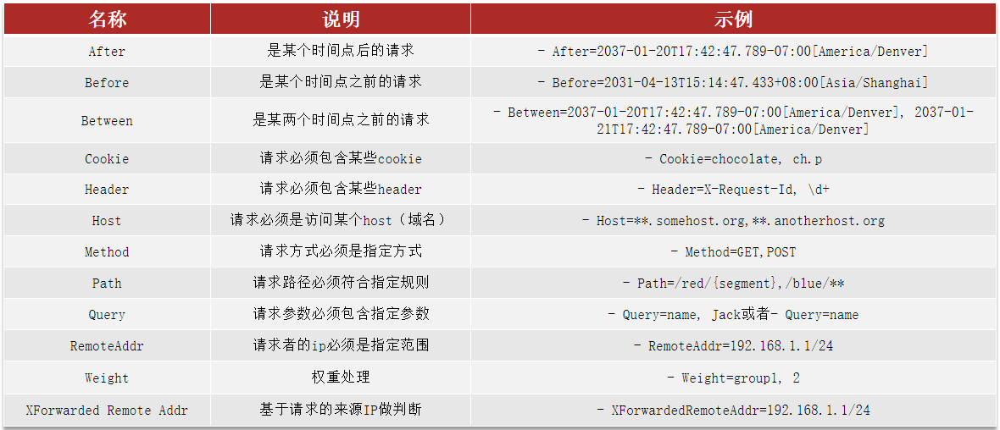
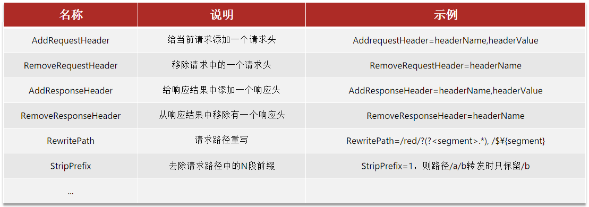

# Gateway网关

> 在SpringCloud中网关的实现包括两种
>
> - Spring Cloud Gateway：
>
>   - Spring官方出品
>
>   - 基于WebFlux响应式编程
>
>   - 无需调优即可获得优异性能
>
> - Netfilx Zuul
>
>   - Netflix出品
>   - 基于Servlet的阻塞式编程
>   - 需要调优才能获得与SpringCloudGateway类似的性能

pom.xml

```xml
    <!--网关-->
    <dependency>
        <groupId>org.springframework.cloud</groupId>
        <artifactId>spring-cloud-starter-gateway</artifactId>
    </dependency>
```

配置路由规则：

```yaml
spring:
  cloud:
    gateway:
      routes:
        - id: item # 路由规则id，自定义，唯一
          uri: lb://item-service # 路由目标微服务，lb代表负载均衡
          predicates: # 路由断言，判断请求是否符合规则，符合则路由到目标
            - Path=/items/** # 以请求路径做判断，以/items开头则符合
        - id: xx
          uri: lb://xx-service
          predicates:
            - Path=/xx/**

```

## 路由属性

网关路由对应的Java类型是RouteDefinition，其中常见的属性有：

- `id`：路由唯一标示
- `uri`：路由目标地址
- `predicates`：路由断言，判断请求是否符合当前路由
- `filters`：路由过滤器，对请求或响应做特殊处理

### 路由断言

Spring提供了12种基本的RoutePredicateFactory实现：



### 路由过滤器

网关中提供了33种路由过滤器，每种过滤器都有独特的作用：

