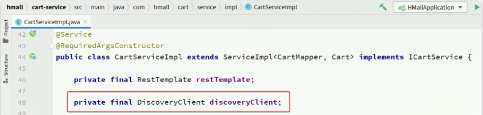
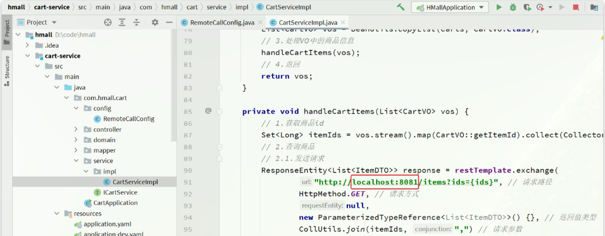
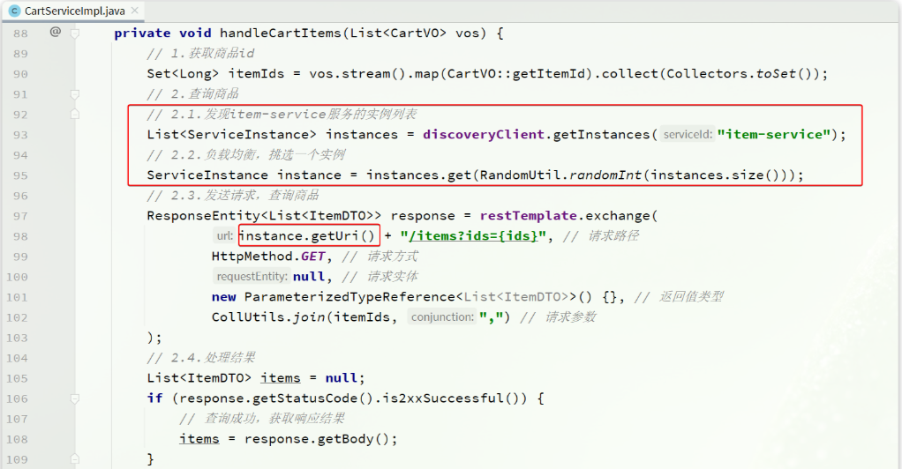

# Nacos注册中心

> Nacos是目前国内企业中占比最多的注册中心组件。它是阿里巴巴的产品，目前已经加入SpringCloudAlibaba中
>
> 官网：[Nacos官网| Nacos 配置中心 | Nacos 下载| Nacos 官方社区 | Nacos 官网](https://nacos.io/)

## 服务注册

> 把`item-service`注册到Nacos，步骤如下：
>
> - 引入依赖
> - 配置Nacos地址
> - 重启

pom.xml

```xml
    <!--nacos 服务注册发现-->
    <dependency>
        <groupId>com.alibaba.cloud</groupId>
        <artifactId>spring-cloud-starter-alibaba-nacos-discovery</artifactId>
    </dependency>
```

application.yml

```yaml
spring:
  cloud:
    nacos:
      server-addr: 192.168.0.101:8848 # nacos地址
```

## 服务发现

> 服务的消费者要去Nacos订阅服务，这个过程就是服务发现，步骤如下：
>
> - 引入依赖
> - 配置Nacos地址
> - 发现并调用服务

服务发现除了要引入Nacos依赖以外，由于还需要负载均衡，因此要引入Spring Cloud提供的LoadBalancer依赖，新增依赖在`pom.xml`：

```xml
    <!-- nacos 服务注册发现 -->
    <dependency>
        <groupId>com.alibaba.cloud</groupId>
        <artifactId>spring-cloud-starter-alibaba-nacos-discovery</artifactId>
    </dependency>
```

application.yml

```yaml
spring:
  cloud:
    nacos:
      server-addr: 192.168.0.101:8848 # nacos地址
```

## 示例代码

> 通过服务发现工具类`DiscoveryClieny`，服务调用者`cart-service`就可以去订阅`item-service`服务了。不过`item-service`有多个实例，而真正发起调用时只需要知道一个实例的地址

服务调用者必须利用负载均衡的算法，从多个实例中挑选一个去访问：

- 随机
- 轮询
- IP的hash
- 最近最少访问

测试代码：

```java
    private final DiscoveryClient discoveryClient;

    private void handleCartItems(List<CartVO> vos) {
        // 1.根据服务名称，拉取服务的实例列表
        List<ServiceInstance> instances = discoveryClient.getInstances("item-service");
        // 2.负载均衡，挑选一个实例
        ServiceInstance instance = instances.get(RandomUtil.randomInt(instances.size()));
        // 3.获取实例的IP和端口
        URI uri = instance.getUri();
        // ... 略
    }
```





