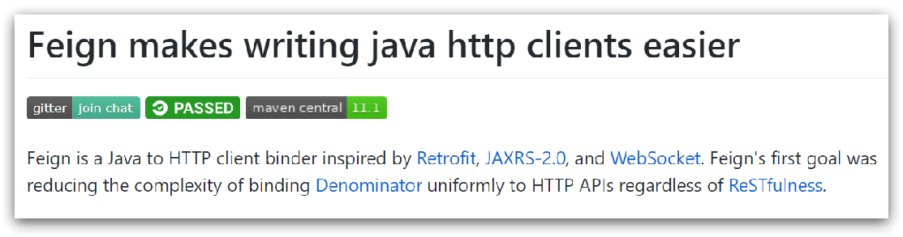
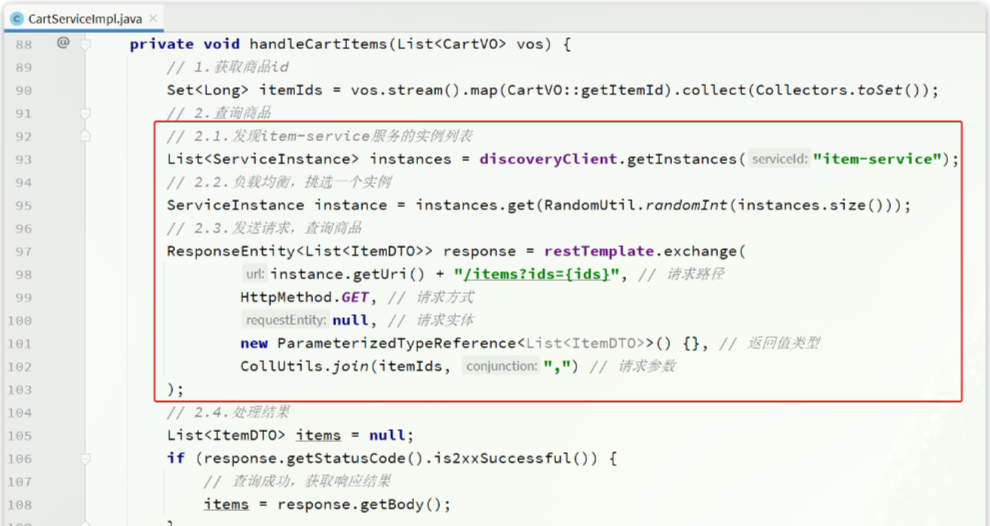
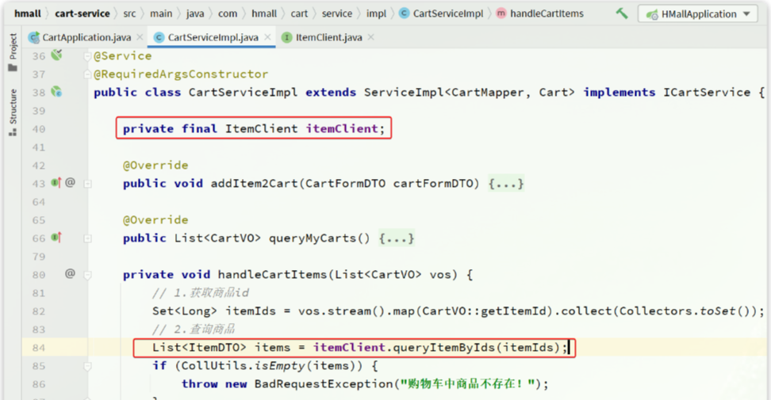

# OpenFeign远程调用

> OpenFeign是一个声明式的http客户端，是SpringCloud在Eureka公司开源的Feign基础上改造而来，其作用就是基于SpringMVC的常见注解，优雅的实现http请求的发送
>
> 官方地址：[OpenFeign/feign: Feign makes writing java http clients easier (github.com)](https://github.com/OpenFeign/feign)



## 基本使用

pom.xml

```xml
    <!-- openFeign -->
    <dependency>
        <groupId>org.springframework.cloud</groupId>
        <artifactId>spring-cloud-starter-openfeign</artifactId>
    </dependency>

    <!-- 负载均衡器 -->
    <dependency>
        <groupId>org.springframework.cloud</groupId>
        <artifactId>spring-cloud-starter-loadbalancer</artifactId>
    </dependency>
```

测试代码：

```java
import org.springframework.cloud.openfeign.FeignClient;
import org.springframework.web.bind.annotation.GetMapping;
import org.springframework.web.bind.annotation.RequestParam;
import java.util.List;

@FeignClient("item-service")
public interface ItemClient {

    @GetMapping("/items")
    List<ItemDTO> queryItemByIds(@RequestParam("ids") Collection<Long> ids);
}
```

这里只需要声明接口，无需实现方法。接口中的几个关键信息：

- `@FeignClient("item-service")`：声明服务名称
- `@GetMapping`：声明请求方式
- `@GetMapping("/items")`：声明请求路径
- `@RequestParam("ids") Collection<Long> ids`：声明请求参数
- `List<ItemDTO>`：返回值类型

## 连接池

Feign底层发起http请求，依赖于其它的框架。其底层支持的http客户端实现包括：

- `HttpURLConnection`：默认实现，不支持连接池
- `Apache HttpClient`：支持连接池
- `OKHttp`：支持连接池

pom.xml

```xml
    <!-- OK http 的依赖 -->
    <dependency>
        <groupId>io.github.openfeign</groupId>
        <artifactId>feign-okhttp</artifactId>
    </dependency>
```

application.yml

```yaml
feign:
  okhttp:
    enabled: true  # 开启OKHttp功能
```

## 日志配置

OpenFeign只会在FeignClient所在包的日志级别为DEBUG时，才会输出日志。而且其日志级别有4级：

- `NONE`：不记录任何日志信息，这是默认值
- `BASIC`：仅记录请求的方法，URL以及响应状态码和执行时间
- `HEADERS`：在BASIC的基础上，额外记录了请求和响应的头信息
- `FULL`：记录所有请求和响应的明细，包括头信息、请求体、元数据

定义日志配置类`DefaultFeignConfig.java`：

```java
import feign.Logger;
import org.springframework.context.annotation.Bean;

public class DefaultFeignConfig {

    @Bean
    public Logger.Level feignLogLevel(){
        return Logger.Level.FULL;
    }
}
```

要让日志级别生效，还需要配置这个类。有两种方式：

- **局部生效**：在某个`FeignClient`中配置，只对当前`FeignClient`生效

  - ```java
    @FeignClient(value = "item-service", configuration = DefaultFeignConfig.class)
    ```

- **全局生效**：在`@EnableFeignClients`中配置，针对所有`FeignClient`生效

  - ```java
    @EnableFeignClients(defaultConfiguration = DefaultFeignConfig.class)
    ```

日志格式：

```
17:35:32:148 DEBUG 18620 --- [nio-8082-exec-1] com.hmall.api.client.ItemClient          : [ItemClient#queryItemByIds] ---> GET http://item-service/items?ids=100000006163 HTTP/1.1
17:35:32:148 DEBUG 18620 --- [nio-8082-exec-1] com.hmall.api.client.ItemClient          : [ItemClient#queryItemByIds] ---> END HTTP (0-byte body)
17:35:32:278 DEBUG 18620 --- [nio-8082-exec-1] com.hmall.api.client.ItemClient          : [ItemClient#queryItemByIds] <--- HTTP/1.1 200  (127ms)
17:35:32:279 DEBUG 18620 --- [nio-8082-exec-1] com.hmall.api.client.ItemClient          : [ItemClient#queryItemByIds] connection: keep-alive
17:35:32:279 DEBUG 18620 --- [nio-8082-exec-1] com.hmall.api.client.ItemClient          : [ItemClient#queryItemByIds] content-type: application/json
17:35:32:279 DEBUG 18620 --- [nio-8082-exec-1] com.hmall.api.client.ItemClient          : [ItemClient#queryItemByIds] date: Fri, 26 May 2023 09:35:32 GMT
17:35:32:279 DEBUG 18620 --- [nio-8082-exec-1] com.hmall.api.client.ItemClient          : [ItemClient#queryItemByIds] keep-alive: timeout=60
17:35:32:279 DEBUG 18620 --- [nio-8082-exec-1] com.hmall.api.client.ItemClient          : [ItemClient#queryItemByIds] transfer-encoding: chunked
17:35:32:279 DEBUG 18620 --- [nio-8082-exec-1] com.hmall.api.client.ItemClient          : [ItemClient#queryItemByIds] 
17:35:32:280 DEBUG 18620 --- [nio-8082-exec-1] com.hmall.api.client.ItemClient          : [ItemClient#queryItemByIds] [{"id":100000006163,"name":"巴布豆(BOBDOG)柔薄悦动婴儿拉拉裤XXL码80片(15kg以上)","price":67100,"stock":10000,"image":"https://m.360buyimg.com/mobilecms/s720x720_jfs/t23998/350/2363990466/222391/a6e9581d/5b7cba5bN0c18fb4f.jpg!q70.jpg.webp","category":"拉拉裤","brand":"巴布豆","spec":"{}","sold":11,"commentCount":33343434,"isAD":false,"status":2}]
17:35:32:281 DEBUG 18620 --- [nio-8082-exec-1] com.hmall.api.client.ItemClient          : [ItemClient#queryItemByIds] <--- END HTTP (369-byte body)
```

## 示例代码

利用Nacos实现服务的治理，利用RestTemplate实现了服务的远程调用，但是远程代码太复杂了：



直接使用`ItemClient`方法：


