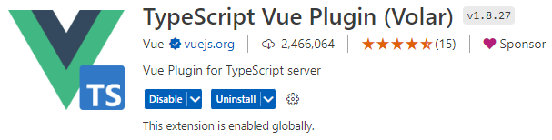
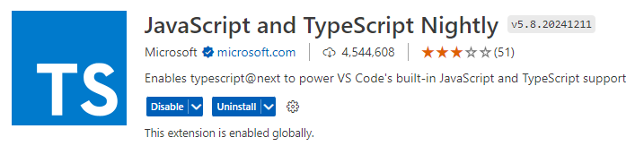

# TS在项目中的使用

> 在 Node.js 环境中运行 TypeScript (TS) 文件，你需要先将 TypeScript 代码编译成 JavaScript (JS) 代码，因为 Node.js 本身并不直接支持 TypeScript

## VSCode插件





## node环境运行TS

### 安装TypeScript

使用 npm（Node.js 的包管理器）来安装 TypeScript 编译器

```
npm install -g typescript
```

> 全局安装 TypeScript 编译器，可以在任何项目中使用 tsc 命令来编译 TypeScript 文件

### 编译TypeScript代码

```
tsc hello.ts
```

> 生成一个同名的 JavaScript 文件`hello.js`（以及一个`.js.map`文件，如果启用了源码映射）

###  运行编译后的JavaScript代码

```
node hello.js
```

### 使用ts-node简化流程

> 使用`ts-node`，它是一个可以直接运行 TypeScript 代码的工具，无需先手动编译到 JavaScript

安装

```
npm install -g ts-node
```

运行

```
ts-node hello.ts
```

> ts-node 会自动编译并运行 TypeScript 文件，就可以即时看到结果

## Vue2项目使用TS

### 在创建时指定

> 使用 Vue CLI 来创建一个支持 TypeScript 的项目。确保在创建项目时选择 TypeScript 作为选项

```
vue create my-vue2-project
# 在交互式提示中选择 TypeScript
```

### 手动配置

> 配置一个现有的 Vue 2 项目以支持 TypeScript

- 安装 TypeScript 和 Vue 的类型定义文件

  - ```
    npm install --save-dev typescript @vue/cli-plugin-typescript
    ```

- 创建或更新`tsconfig.json`文件(TypeScript 编译器的配置文件)

- 更新`.vue`文件，使其支持 TypeScript。需要在`<script>`标签中添加`lang="ts"`属性

  - ```vue
    <script lang="ts">
    export default {
      data() {
        return {
          message: 'Hello, TypeScript!'
        };
      },
      mounted() {
        console.log(this.message);
      }
    };
    </script>
    ```

## Vue3项目中使用TS

> Vue 3本身就已经很好地支持TypeScript，因此在创建Vue 3项目时，TypeScript支持是开箱即用的

- 创建项目： 使用Vue CLI创建一个Vue 3项目，并选择TypeScript作为选项

  - ```
    vue create my-vue3-project
    # 在交互式提示中选择 Vue 3 和 TypeScript
    ```

- 更新`.vue`文件： 在 .vue 文件中，可以在`<script>`标签中使用TypeScript语法

  - ```vue
    <script lang="ts">
    export default {
      data() {
        return {
          message: 'Hello, TypeScript!'
        };
      },
      mounted() {
        console.log(this.message);
      }
    };
    </script>
    ```

## 可能存在的问题

### 低版本node不支持问题

如果编译一个TypeScript文件时遇到了问题。具体错误是`SyntaxError: Unexpected token '?'`，这通常意味着JavaScript解释器遇到了它不理解的语法，`?`是JavaScript中的可选链操作符，这是一个较新的特性，要求Node.js版本14以上才支持

想支持ES2019（不含可选链操作符），可以在`tsconfig.json`中这样设置

```json
{
  "compilerOptions": {
    "target": "ES2019",
    // 其他编译器选项...
  }
}
```

