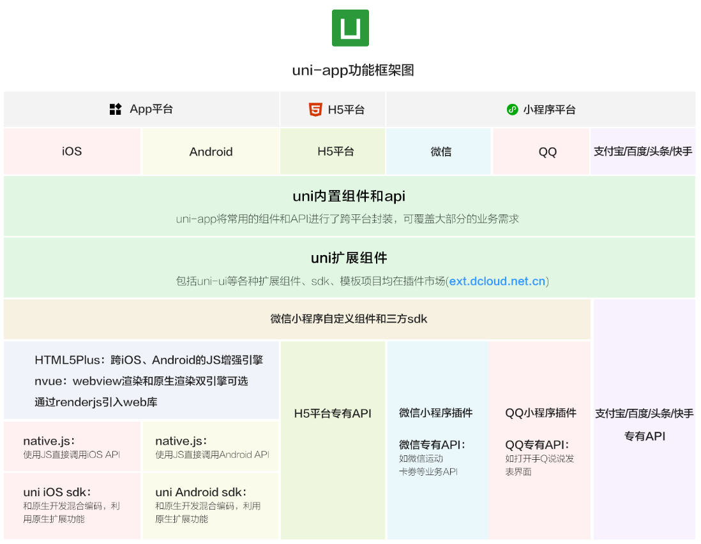

# uni-app项目

> `uni-app` 是一个使用 [Vue.js](https://vuejs.org/) 开发所有前端应用的框架，开发者编写一套代码，可发布到iOS、Android、Web（响应式）、以及各种小程序（微信/支付宝/百度/头条/飞书/QQ/快手/钉钉/淘宝）、快应用等多个平台



## HBuilderX 创建项目

下载安装 HbuilderX 编辑器[HBuilderX-高效极客技巧 (dcloud.io)](https://www.dcloud.io/hbuilderx.html)，解压压缩包到需要安装的目录即可：


创建 uni-app vue3 项目：


安装编译器插件：


开启微信小程序服务端口：


编译成微信小程序端代码：


效果：


模拟器窗口分离和置顶：


整体流程：


## 命令行创建项目

> 安装pnpm
>
> ```
> npm install -g pnpm
> ```


```
npx degit dcloudio/uni-preset-vue#vite-ts uni-app-vue3-ts
```

> - npx：利用了npm功能，增加了额外便捷性，临时安装一个包，使用它提供的命令行工具，然后在完成后将其卸载
>   - 避免全局安装：减少了系统污染，确保每次执行都是最新版本
>   - 简化命令：不需要先安装包再执行
>   - 版本控制：可以指定执行特定版本的包
> - degit：npx会临时安装degit(如果系统中尚未安装)，然后拉取项目，与`git clone`区别在于
>   - 避免克隆整个Git记录：默认只克隆最新的提交，可以更快的复制
>   - 删除`.git`目录：克隆完成后，会删除Git源文件夹
>   - 只支持如下仓库：` GitHub, GitLab, Sourcehut and BitBucket`
>
> 


## 命令行运行

安装依赖：

```
npm install
```

运行命令：
```
npm run dev:mp-weixin
```


## 和原生小程序开发区别


## VS Code 开发 uni-app 项目

- HbuilderX 对 TS 类型支持暂不完善
- VS Code 对 TS 类型支持友好，编辑器更加熟悉


配置步骤：

