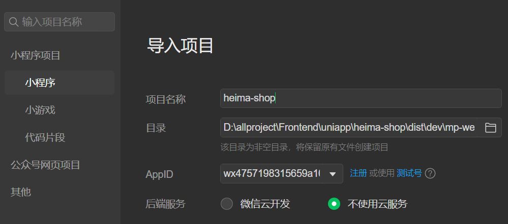

# 项目基础架构

## 项目拉取

项目拉取：

```
git clone http://git.itcast.cn/heimaqianduan/erabbit-uni-app-vue3-ts.git heima-shop
```

在 manifest.json 中添加微信小程序的 appid：


```
wx4757198315659a10
```

启动项目：

```
# 使用包管理器的不同，启动项目的命令也有所不同
npm run dev:mp-weixin

pnpm dev:mp-weixin
```

使用微信开发者工具导入项目：



## 引入 uni-ui 组件库


官方文档：[uni-app官网 (dcloud.net.cn)](https://uniapp.dcloud.net.cn/component/uniui/quickstart.html#npm安装)

```
pnpm i @dcloudio/uni-ui


// pages.json
  // 组件自动引入规则
  "easycom": {
    // 是否开启自动扫描
    "autoscan": true,
    // 以正则方式自定义组件匹配规则
    "custom": {
        // uni-ui 规则如下配置
        "^uni-(.*)": "@dcloudio/uni-ui/lib/uni-$1/uni-$1.vue"
      }
  },


pnpm i -D @uni-helper/uni-ui-types


// tsconfig.json
"@uni-helper/uni-ui-types"
```

## 小程序端 Pinia 持久化


官方文档：[Configuration | pinia-plugin-persistedstate (prazdevs.github.io)](https://prazdevs.github.io/pinia-plugin-persistedstate/guide/config.html#storage)

member.ts

```tsx
  // TODO: 持久化
  {
    // 网页端配置
    // persist: true,
    // 小程序端配置
    persist: {
      // 调整为兼容多平台的API
      storage: {
        setItem(key, value) {
          uni.setStorageSync(key, value)
        },
        getItem(key) {
          return uni.getStorageSync(key)
        }
      }
    }
  },
```

## 请求和上传文件拦截器


拦截器文档：[uni.addInterceptor(STRING, OBJECT) | uni-app官网 (dcloud.net.cn)](https://uniapp.dcloud.net.cn/api/interceptor.html#addinterceptor)

接口文档：[说明 - 小兔鲜儿-小程序版 (apifox.com)](https://apifox.com/apidoc/shared-0e6ee326-d646-41bd-9214-29dbf47648fa/doc-1521513)


修改my.vue中的代码

```vue
  <view class="my">
    <view>会员信息：{{ memberStore.profile }}</view>
    <button
      @tap="
        memberStore.setProfile({
          nickname: '黑马先锋',
          token: '12345',
        })
      "
```

在my.vue中添加代码

```vue
<script setup lang="ts">
import '@/utils/http'


// 测试请求
const getData = () => {
  uni.request({
    method: 'GET',
    url: '/home/banner',
  })
}
</script>

<template>


    <button @tap="getData" size="mini" plain type="primary">测试请求</button>
</template>
```

新增文件`src/utils/http.tx`

```tsx
import { useMemberStore } from "@/stores"

/**
 * 添加拦截器
 *  拦截 request 请求
 *  拦截 uploadFile 文件上传
 * 
 * TODO:
 *  1.非 http 开头需拼接地址
 *  2.请求超时
 *  3.添加小程序端请求头标识
 *  4.添加 token 请求头标识
 */
const baseURL = 'https://pcapi-xiaotuxian-front-devtest.itheima.net'

// 添加拦截器
const httpInterceptor = {
    // 拦截前触发
    invoke(options: UniApp.RequestOptions) {
        // 1.非 http 开头需拼接地址
        if (!options.url.startsWith('http')) {
            options.url = baseURL + options.url
        }

        // 2.请求超时，默认60s
        options.timeout = 10000

        // 3.添加小程序端请求头标识
        options.header = {
            // 将原有的属性展开成独立的键值对，用于组成新的HTTP请求头信息
            ...options.header,
            'source-client': 'miniapp',
        }

        // 4.添加 token 请求头标识
        const memberStore = useMemberStore()
        const token = memberStore.profile?.token
        if (token) {
            options.header.Authorization = token
        }

        console.log(options);
    }
}

// 拦截request请求
uni.addInterceptor('request', httpInterceptor)
// 拦截uploadFile文件上传请求
uni.addInterceptor('uploadFile', httpInterceptor)
```

> 

## 封装 Promise 请求函数


修改my.vue

```vue
<script setup lang="ts">
import { http } from '@/utils/http'


// 测试请求
const getData = async () => {
  const res = await http<string[]>({
    method: 'GET',
    url: '/home/banner',
    header: {},
  })
  console.log('请求成功', res.result)
}
</script>
```

在http.ts中添加代码

```tsx
/**
 * 请求函数
 * @param UniApp.RequestOptions
 * @return Promise
 * 2.请求成功
 *  2.1 提取核心数据 res.data
 *  2.2 添加类型，支持泛型
 * 3.请求失败
 *  3.1 网络错误 -> 提示用户换网络
 *  3.1 401错误 -> 清理用户信息，跳转到登录页
 *  3.1 其它错误 -> 根据后端错误信息轻提示
 */

interface Data<T> {
    code: string
    msg: string
    result: T
}

// 2.2 添加类型，支持泛型
export const http = <T>(options: UniApp.RequestOptions) => {
    // 1.返回 Promise 对象
    return new Promise<Data<T>>((resolve, reject) => {
        uni.request({
            ...options,
            // 2.请求成功
            success(res) {
                // 2.1 提取核心数据 res.data，断言为Data类型
                resolve(res.data as Data<T>)
            },
        })
    })
}
```

> 

### 对请求成功的情况进行处理

- uni.request 的 success 回调函数只是表示服务器响应成功，没处理响应状态码，业务中使用不方便
- axios 函数是只有响应状态码是 2xx 才调用 resolve 函数，表示获取数据成功，业务中使用更准确


修改http.ts

```tsx
    return new Promise<Data<T>>((resolve, reject) => {
        uni.request({
            ...options,
            // 2.请求成功
            success(res) {
                if (res.statusCode >= 200 && res.statusCode < 300) {
                    // 2.1 提取核心数据 res.data
                    resolve(res.data as Data<T>)
                } else if (res.statusCode === 401) {
                    // 401错误 -> 清理用户信息，跳转到登录页
                    const memberStore = useMemberStore()
                    memberStore.clearProfile()
                    uni.navigateTo({ url: '/pages/login/login' })
                    reject(res)
                } else {
                    // 其它错误 -> 根据后端错误信息轻提示
                    uni.showToast({
                        icon: 'none',
                        title: (res.data as Data<T>).msg || '请求错误'
                    })
                    reject(res)
                }
            },
```

### 对请求失败的情况进行处理


修改http.ts

```tsx
            // 响应失败
            fail(err) {
                uni.showToast({
                    icon: 'none',
                    title: '网络错误，换个网络试试',
                })
                reject(err)
            },
```

