# 首页导航栏和轮播图

## 自动导入组件

修改`src/pages.json`

```json
  // 组件自动引入规则
  "easycom": {
    // 是否开启自动扫描
    "autoscan": true,
    // 以正则方式自定义组件匹配规则
    "custom": {
        // uni-ui 规则如下配置
        "^uni-(.*)": "@dcloudio/uni-ui/lib/uni-$1/uni-$1.vue",
        // 以 Xtx 开头的组件，在 components 目录中查找
        "^Xtx(.*)": "@/components/Xtx$1.vue"
      }
  },
```

## 自定义导航栏

自定义导航栏的样式需要适配不同的机型

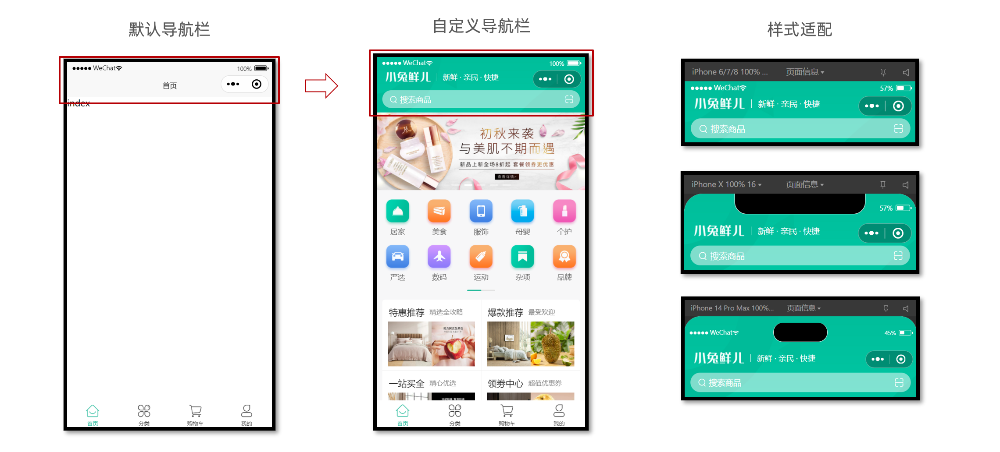

不同手机的安全区域不同，适配安全区域能防止页面重要内容被遮挡。可通过 `uni.getSystemInfoSync()` 获取屏幕边界到安全区的距离

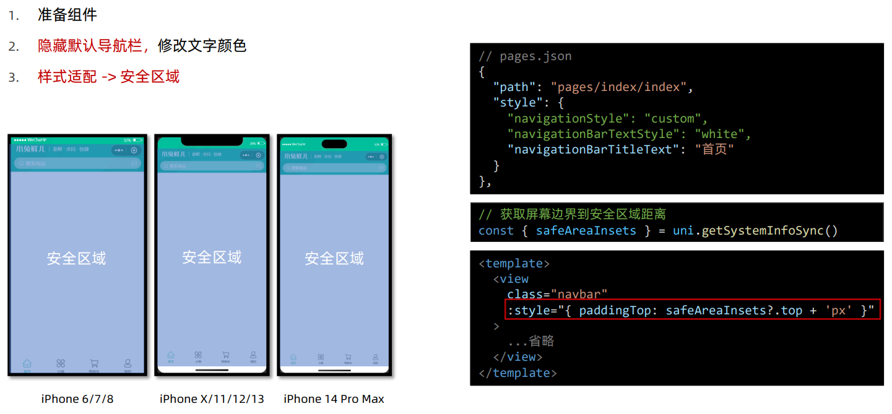

新建组件`src/pages/index/components/CustomNavbar.vue`

```vue
<script setup lang="ts">
//
</script>

<template>
  <view class="navbar">
    <!-- logo文字 -->
    <view class="logo">
      <image class="logo-image" src="@/static/images/logo.png"></image>
      <text class="logo-text">新鲜 · 亲民 · 快捷</text>
    </view>
    <!-- 搜索条 -->
    <view class="search">
      <text class="icon-search">搜索商品</text>
      <text class="icon-scan"></text>
    </view>
  </view>
</template>

<style lang="scss">
/* 自定义导航条 */
.navbar {
  background-image: url(@/static/images/navigator_bg.png);
  background-size: cover;
  position: relative;
  display: flex;
  flex-direction: column;
  padding-top: 20px;
  .logo {
    display: flex;
    align-items: center;
    height: 64rpx;
    padding-left: 30rpx;
    padding-top: 20rpx;
    .logo-image {
      width: 166rpx;
      height: 39rpx;
    }
    .logo-text {
      flex: 1;
      line-height: 28rpx;
      color: #fff;
      margin: 2rpx 0 0 20rpx;
      padding-left: 20rpx;
      border-left: 1rpx solid #fff;
      font-size: 26rpx;
    }
  }
  .search {
    display: flex;
    align-items: center;
    justify-content: space-between;
    padding: 0 10rpx 0 26rpx;
    height: 64rpx;
    margin: 16rpx 20rpx;
    color: #fff;
    font-size: 28rpx;
    border-radius: 32rpx;
    background-color: rgba(255, 255, 255, 0.5);
  }
  .icon-search {
    &::before {
      margin-right: 10rpx;
    }
  }
  .icon-scan {
    font-size: 30rpx;
    padding: 15rpx;
  }
}
</style>
```

自定义导航配置

```json
// src/pages.json
    {
      "path": "pages/index/index",
      "style": {
        "navigationStyle": "custom", // 隐藏默认导航
        "navigationBarTextStyle": "white",
        "navigationBarTitleText": "首页"
      }
    },
```

组件安全区适配

```vue
<!-- src/pages/index/componets/CustomNavbar.vue -->
<script>
// 获取屏幕边界到安全区域距离
const { safeAreaInsets } = uni.getSystemInfoSync()
</script>

<template>
  <!-- 顶部占位 -->
  <view class="navbar" :style="{ paddingTop: safeAreaInsets?.top + 'px' }">
    <!-- ...省略 -->
  </view>
</template>
```

在`src/pages/index/index.vue`中引入

```vue
<script setup lang="ts">
import CustomNavbar from './componets/CustomNavbar'
</script>

<template>
  <!-- 自定义导航栏 -->
  <CustomNavbar />
  <view class="index">index</view>
</template>
```

> 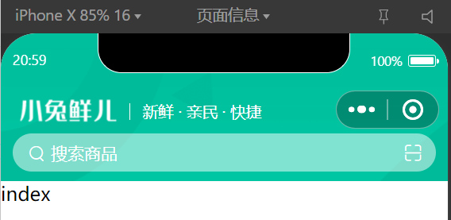
>
> 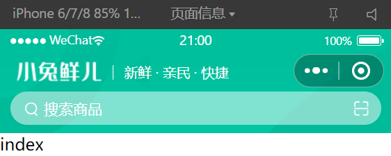

## 自定义轮播图

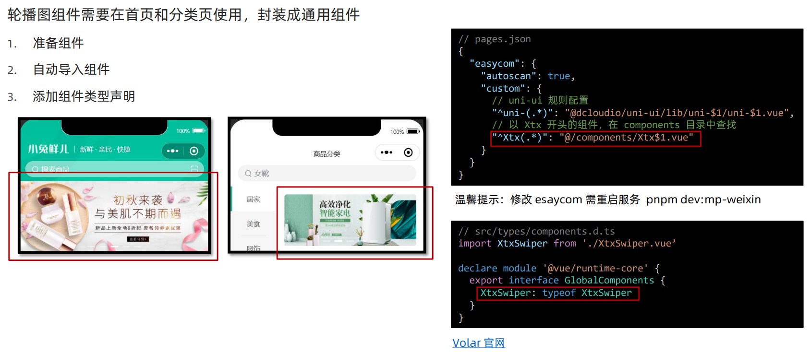

Volar 插件说明：[Vue Language Tools](https://github.com/vuejs/language-tools)

新建`src/components/XtxSwiper.vue`

```vue
<script setup lang="ts">
import { ref } from 'vue'

const activeIndex = ref(0)
</script>

<template>
  <view class="carousel">
    <swiper :circular="true" :autoplay="false" :interval="3000">
      <swiper-item>
        <navigator url="/pages/index/index" hover-class="none" class="navigator">
          <image
            mode="aspectFill"
            class="image"
            src="https://pcapi-xiaotuxian-front-devtest.itheima.net/miniapp/uploads/slider_1.jpg"
          ></image>
        </navigator>
      </swiper-item>
      <swiper-item>
        <navigator url="/pages/index/index" hover-class="none" class="navigator">
          <image
            mode="aspectFill"
            class="image"
            src="https://pcapi-xiaotuxian-front-devtest.itheima.net/miniapp/uploads/slider_2.jpg"
          ></image>
        </navigator>
      </swiper-item>
      <swiper-item>
        <navigator url="/pages/index/index" hover-class="none" class="navigator">
          <image
            mode="aspectFill"
            class="image"
            src="https://pcapi-xiaotuxian-front-devtest.itheima.net/miniapp/uploads/slider_3.jpg"
          ></image>
        </navigator>
      </swiper-item>
    </swiper>
    <!-- 指示点 -->
    <view class="indicator">
      <text
        v-for="(item, index) in 3"
        :key="item"
        class="dot"
        :class="{ active: index === activeIndex }"
      ></text>
    </view>
  </view>
</template>

<style lang="scss">
:host {
  display: block;
  height: 280rpx;
}
/* 轮播图 */
.carousel {
  height: 100%;
  position: relative;
  overflow: hidden;
  transform: translateY(0);
  background-color: #efefef;
  .indicator {
    position: absolute;
    left: 0;
    right: 0;
    bottom: 16rpx;
    display: flex;
    justify-content: center;
    .dot {
      width: 30rpx;
      height: 6rpx;
      margin: 0 8rpx;
      border-radius: 6rpx;
      background-color: rgba(255, 255, 255, 0.4);
    }
    .active {
      background-color: #fff;
    }
  }
  .navigator,
  .image {
    width: 100%;
    height: 100%;
  }
}
</style>
```

新建`src/components/components.d.ts`

```java
import XtxSwiper from './XtxSwiper.vue'

declare module 'vue' {
  export interface GlobalComponents {
    XtxSwiper: typeof XtxSwiper
  }
}
```

在`src/pages/index/index.vue`中引入

```vue
<script setup lang="ts">
import CustomNavbar from './components/CustomNavbar'
</script>

<template>
  <!-- 自定义导航栏 -->
  <CustomNavbar />
  <!-- 自定义轮播图 -->
  <XtxSwiper />
  <view class="index">index</view>
</template>
```

> 

### 轮播图指示点

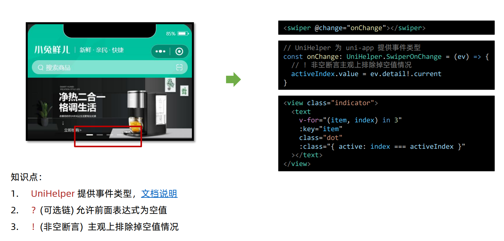

修改`src/components/XtxSwiper.vue`

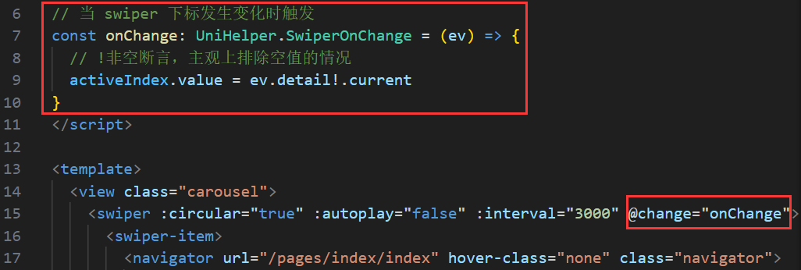

> 轮播图指示点会跟着发生变化

### 获取轮播图数据

**接口说明**

- 接口地址：/home/banner
- 请求方式：GET
- 请求参数

| 字段名           | 必须 | 默认值 | 备注                                                     |
| ---------------- | ---- | ------ | -------------------------------------------------------- |
| distributionSite | 否   | 1      | 活动 banner 位置，1 代表首页，2 代表商品分类页，默认为 1 |

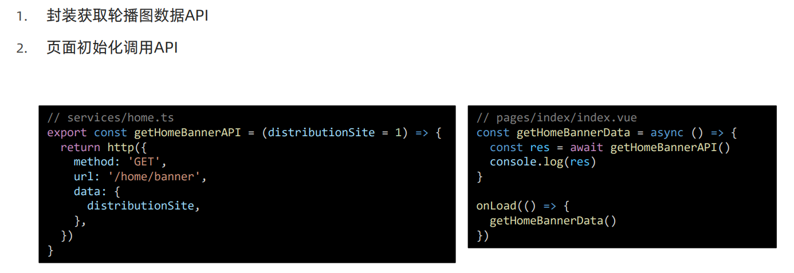

新增`src/types/home.d.ts`

```tsx
/** 首页-广告区域数据类型 */
export type BannerItem = {
    /** 跳转链接 */
    hrefUrl: string
    /** id */
    id: string
    /** 图片链接 */
    imgUrl: string
    /** 跳转类型 */
    type: number
  }
```

新增`services/home.ts`

```tsx
import type { BannerItem } from '@/types/home'
import { http } from '@/utils/http'

/**
 * 首页-广告区域-小程序
 * @param distributionSite 广告区域展示位置（投放位置 投放位置，1为首页，2为分类商品页） 默认是1
 */
export const getHomeBannerAPI = (distributionSite = 1) => {
  return http<BannerItem[]>({
    method: 'GET',
    url: '/home/banner',
    data: {
      distributionSite,
    },
  })
}
```

修改`pages/index/index.vue`

```vue
<script setup lang="ts">
import CustomNavbar from './components/CustomNavbar'
import { getHomeBannerAPI } from '@/services/home'
import { onLoad } from '@dcloudio/uni-app'

const getHomeBannerData = async () => {
  const res = await getHomeBannerAPI()
  console.log(res)
}

onLoad(() => {
  getHomeBannerData()
})
</script>
```

> 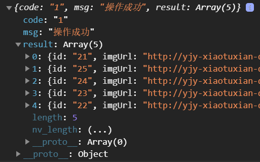

### 定义数据类型并渲染

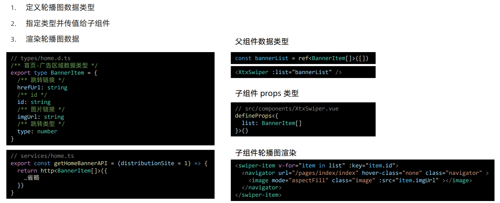

修改`pages/index/index.vue`

```vue
<script setup lang="ts">
import CustomNavbar from './components/CustomNavbar'
import { getHomeBannerAPI } from '@/services/home'
import { onLoad } from '@dcloudio/uni-app'
import { ref } from 'vue'
import type { BannerItem } from '@/types/home'

// 获取轮播图数据
const bannerList = ref<BannerItem[]>([])
const getHomeBannerData = async () => {
  const res = await getHomeBannerAPI()
  // console.log(res)
  bannerList.value = res.result
}

onLoad(() => {
  getHomeBannerData()
})
</script>

<template>
  <!-- 自定义导航栏 -->
  <CustomNavbar />
  <!-- 自定义轮播图 -->
  <XtxSwiper :list="bannerList" />
  <view class="index">index</view>
</template>
```

修改`src/components/XtxSwiper.vue`

```vue
<script setup lang="ts">
import type { BannerItem } from '@/types/home'
import { ref } from 'vue'

const activeIndex = ref(0)

// 当 swiper 下标发生变化时触发
const onChange: UniHelper.SwiperOnChange = (ev) => {
  // ! 非空断言，主观上排除掉空值情况
  activeIndex.value = ev.detail.current
}
// 定义 props 接收
defineProps<{
  list: BannerItem[]
}>()
</script>

<template>
  <view class="carousel">
    <swiper :circular="true" :autoplay="false" :interval="3000" @change="onChange">
      <swiper-item v-for="item in list" :key="item.id">
        <navigator url="/pages/index/index" hover-class="none" class="navigator">
          <image mode="aspectFill" class="image" :src="item.imgUrl"></image>
        </navigator>
      </swiper-item>
    </swiper>
    <!-- 指示点 -->
    <view class="indicator">
      <text
        v-for="(item, index) in list"
        :key="item.id"
        class="dot"
        :class="{ active: index === activeIndex }"
      ></text>
    </view>
  </view>
</template>
```

> 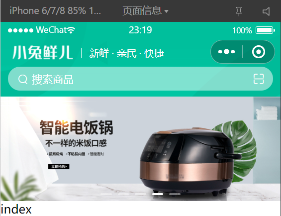

### 轮播图总结

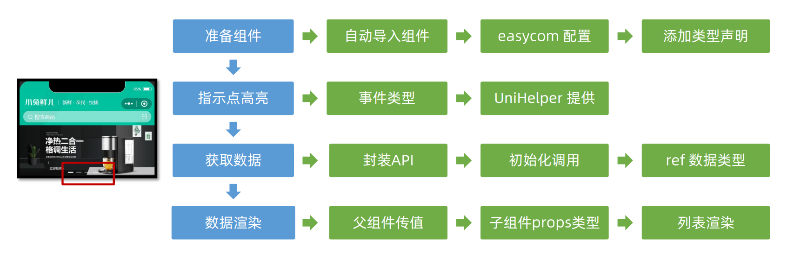
