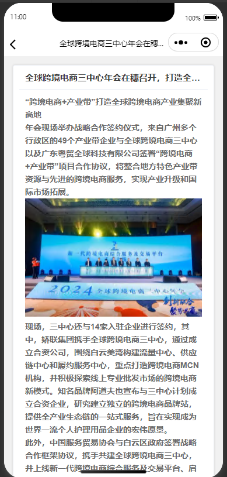

# text-view

```vue
<template>
  <view>
    <uni-card class="view-title" :title="title">
      <!-- <text class="uni-body view-content">{{ content }}</text> -->
      <!-- 允许粘贴 -->
      <!-- <text class="uni-body view-content" user-select="auto">{{ content }}</text> -->
      <u-parse :content="content" :selectable="true"></u-parse>
    </uni-card>
  </view>
</template>

<script>
  export default {
    data() {
      return {
        title: '',
        content: ''
      }
    },
    onLoad(options) {
      // this.title = options.title
      this.title = this.$store.state.text.title
      // this.content = options.content
      this.content = this.$store.state.text.content
      uni.setNavigationBarTitle({
        title: this.title
      })
    }
  }
</script>

<style scoped>
  page {
    background-color: #ffffff;
  }

  .view-title {
    font-weight: bold;
  }

  .view-content {
    font-size: 26rpx;
    padding: 12px 5px 0;
    color: #333;
    line-height: 24px;
    font-weight: normal;
  }
</style>

```

> 