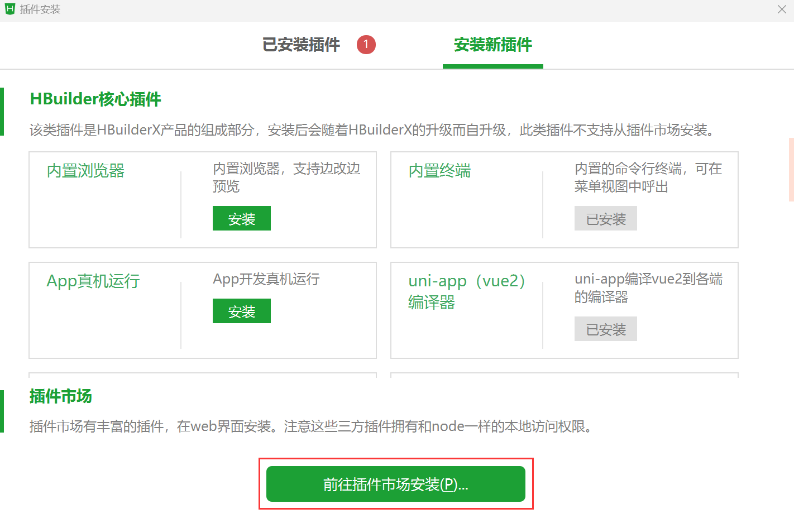
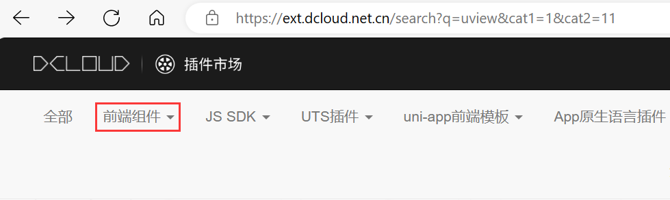
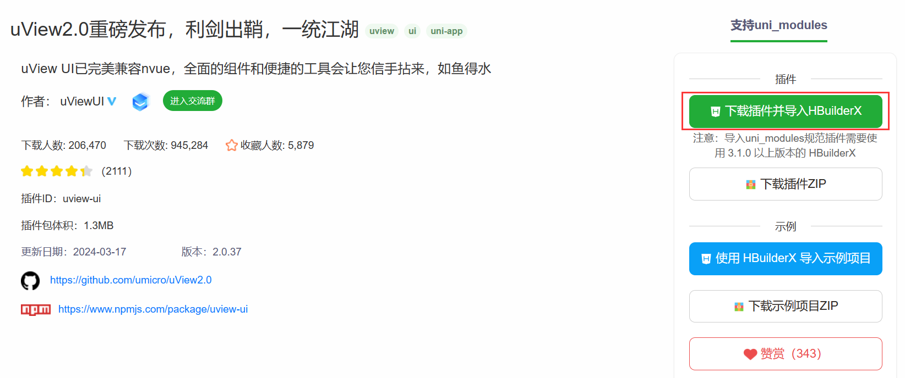
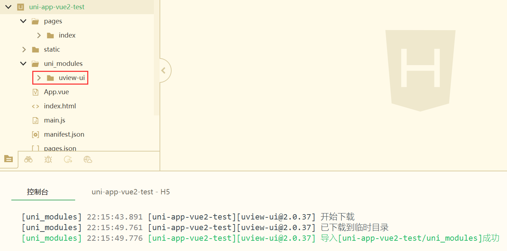
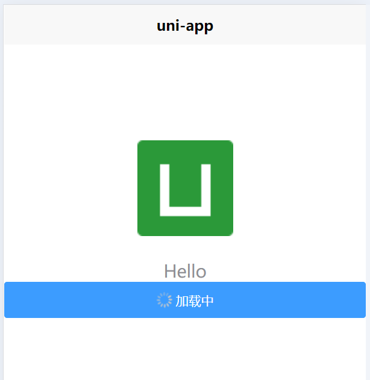

# uView

> 官网：[uView 2.0 - 全面兼容 nvue 的 uni-app 生态框架 - uni-app UI 框架 (uviewui.com)](https://www.uviewui.com/)

## 安装

> 依赖scss插件，如果没有，在HX菜单的 工具->插件安装中找到"scss/sass编译"插件进行安装

选择工具->插件安装



前往插件市场：[DCloud 插件市场](https://ext.dcloud.net.cn/?cat1=1&cat2=11)

选择前端组件



搜索uView


登录后可进行下载



安装成功页面



## 配置

引入uView主JS库，在项目根目录中的`main.js`中，引入并使用uView的JS库，注意这两行要放在`import Vue`之后

```js
// main.js
import uView from '@/uni_modules/uview-ui'
Vue.use(uView)
```

在引入uView的全局SCSS主题文件，在项目根目录的`uni.scss`中引入此文件

```scss
/* uni.scss */
@import '@/uni_modules/uview-ui/theme.scss';
```

引入uView基础样式，在`App.vue`首行引入

```vue
<style lang="scss">
	/* 注意要写在第一行，同时给style标签加入lang="scss"属性 */
	@import "@/uni_modules/uview-ui/index.scss";
</style>
```

在pages目录下的index下的`index.vue`添加测试代码

```
<u-button type="primary" loading loadingText="加载中"></u-button>
```

> 
