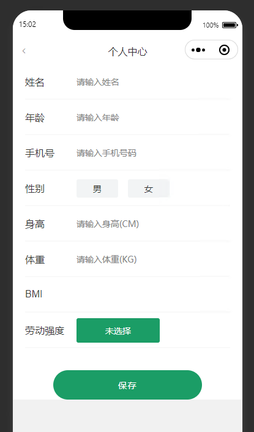
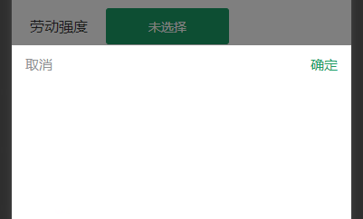

# uView

> 官网：[uView 2.0 - 全面兼容 nvue 的 uni-app 生态框架 - uni-app UI 框架 (uviewui.com)](https://www.uviewui.com/)

## 安装

> 依赖scss插件，如果没有，在HX菜单的 工具->插件安装中找到"scss/sass编译"插件进行安装

选择工具->插件安装


前往插件市场：[DCloud 插件市场](https://ext.dcloud.net.cn/?cat1=1&cat2=11)

选择前端组件


搜索uView


登录后可进行下载


安装成功页面


## 配置

引入uView主JS库，在项目根目录中的`main.js`中，引入并使用uView的JS库，注意这两行要放在`import Vue`之后

```js
// main.js
import uView from '@/uni_modules/uview-ui'
Vue.use(uView)
```

在引入uView的全局SCSS主题文件，在项目根目录的`uni.scss`中引入此文件

```scss
/* uni.scss */
@import '@/uni_modules/uview-ui/theme.scss';
```

引入uView基础样式，在`App.vue`首行引入

```vue
<style lang="scss">
	/* 注意要写在第一行，同时给style标签加入lang="scss"属性 */
	@import "@/uni_modules/uview-ui/index.scss";
</style>
```

在pages目录下的index下的`index.vue`添加测试代码

```
<u-button type="primary" loading loadingText="加载中"></u-button>
```

> 

## 基本使用

index.vue

```vue
<template>
	<view class="user-index-container">
		<u-navbar :title="title" safeAreaInsetTop fixed placeholder :autoBack="true">
		</u-navbar>
		<view class="infoItem" v-for="(item,index) in dataInfo.conf" :key="index">
			<view class="infoLabel">
				{{item.name}}
			</view>
			<view class="inputContainer">
				<!-- 输入框 文本text 小数digit 数字number -->
				<input v-if="['text','digit','number'].indexOf(item.type) !== -1" 
					:type="item.type" :placeholder="item.placeholder" 
					v-model="dataInfo.data[item.prop]" :ref="item.prop" :disabled="item.isDisable"/>
				<!-- 单选类型 -->
				<view class="radioForm" v-if="item.type === 'radio'">
					<view @click="changeRadioValue(item.prop,opt.value)" 
					:class="dataInfo.data[item.prop] === opt.value?'radioOptionActive':'radioOption'" 
						v-for="(opt,i) in item.option" :key="i">
						{{opt.label}}
					</view>
				</view>
				<!-- 下拉框类型 -->
				<view class="radioGroup" v-if="item.type === 'radioGroup'">
					<u-picker :closeOnClickOverlay="true" :show="show" 
					confirmColor="#1B9D66"
					v-model="radioGroupValue"
					:columns='radioGroupColumns' 
					@cancel="show = false"
					@confirm="changeRadioGroupValue($event ,item.prop)"
					></u-picker>
					<view class="radioGroupButton">
						<u-button @click="show = true" color="#1B9D66" >
						{{ radioGroupValue ? radioGroupValue : "未选择" }}
						</u-button>
					</view>
				</view>
			</view>
		</view>
		<view class="submitBtn" @click="submitForm()">保存</view>
	</view>
</template>

<script>
	export default {
		data() {
			return {
				// 下拉框数据
				radioGroupValue: "",
				radioGroupColumns: [],
				
				show: false,
				title: "个人中心",
				dataInfo:{
					conf:[
						{
							name:"姓名",	//label名称
							prop:"empName",//属性
							type:"text",//类型
							placeholder:"请输入姓名",//placeholder
							reg:"",//正则
							isRequire:false, //是否必填
							isDisable:true,
						},
						{
							name:"年龄",	//label名称
							prop:"empAge",//属性
							type:"text",//类型
							placeholder:"请输入年龄",//placeholder
							reg:"",//正则
							isRequire:false, //是否必填
							isDisable:false,
						},
						{
							name:"手机号",	//label名称
							prop:"phoneNumber",//属性
							type:"number",//类型
							placeholder:"请输入手机号码",//placeholder
							reg:"",//正则
							isRequire:false, //是否必填
							isDisable:true,
						},
						{
							name:"性别",
							prop:"empSex",
							type:"radio",
							reg:"",
							option:[{label:"男",value:"1"},{label:"女",value:"2"}],
							isRequire:false ,//是否必填
							isDisable:false
						},
						{
							name:"身高",
							prop:"empHeight",
							placeholder:"请输入身高(CM)",
							type:"digit",
							isRequire:false ,//是否必填
							isDisable:false
						},
						{
							name:"体重",
							prop:"empWeight",
							placeholder:"请输入体重(KG)",
							type:"digit",
							isRequire:false ,//是否必填
							isDisable:false
						},
						{
							name:"BMI",
							prop:"bmiNum",
							type:"digit",
							isRequire:false ,//是否必填
							isDisable:true
						},
						{
							name:"劳动强度",
							prop:"laborIntensity",
							type:"radioGroup",
							option:[{label:"无",value:"0"},{label:"卧床",value:"1"},{label:"轻度",value:"2"},{label:"中度",value:"3"},{label:"重度",value:"4"}],
							isRequire:false ,//是否必填
							isDisable:false
						},
					],
					data:{
						
					}
				},
				tempData:{},
				userInfo:{
					
				}
			}
		},
		created() {
			// this.userInfo = this.$storage.getJson("userInfo")
			// this.initEmpInfo();
		},
		methods: {
			// 获取值并修改
			changeRadioGroupValue(e, prop){
				this.radioGroupValue = e.value[0]
				this.changeRadioValue(prop, e.value[0])
				this.show = false
			},
			//初始化获取信息
			initEmpInfo(){
				//判断手机号是否存在
				if(!this.userInfo.phonenumber){
					this.$storage.clear();
					uni.reLaunch({
						url:"/pages/index/index"
					})
				}
				//构造查询参数
				let param = {
					phoneNumber:this.userInfo.phonenumber
				}
				let data = {
					path: '/sysmgr/employee-card-info/selectEmpByPhoneNumber',
					jsonString: JSON.stringify(param)
				}
				this.$http.httpPost("api/request", data).then(res => {
					if (res.code === 200) {
						if(res.data){
							this.tempData = JSON.parse(JSON.stringify(res.data));
							this.dataInfo.data = JSON.parse(JSON.stringify(res.data));
							this.changeStorageUserInfo(res.data);
							
							// 构建下拉框数据
							let temp = this.dataInfo.conf.filter(item => item.name === "劳动强度")[0]

							let tempOption = temp.option.map(item => item.label)
							this.radioGroupColumns = []
							this.radioGroupColumns.push(tempOption)

							this.radioGroupValue = res.data.laborIntensity
						}
						// else{
						// 	this.$storage.clear();
						// 	uni.reLaunch({
						// 		url:"/pages/index/index"
						// 	})
						// }
					}
				})
			},
			//设置自定义单选框的值
			changeRadioValue(prop,value){
				this.$set(this.dataInfo.data,prop,value);
			},
			//提交表单
			submitForm(){
				//信息未修改不请求接口
				if(JSON.stringify(this.dataInfo.data) === JSON.stringify(this.tempData)){
					uni.showToast({
					  title: '信息未修改无需保存',
					  icon: 'none',
					  duration: 2000
					});
				}else{
					//循环判断正则和非空
					for(let i = 0; i < this.dataInfo.conf.length; i++){
						let conf = this.dataInfo.conf[i];
						let tempData = this.dataInfo.data[conf.prop];
						if(conf.isRequire){
							if(this.isDataNull(tempData)){
								uni.showToast({
								  title: (conf.name + "不能为空"),
								  icon: 'error',
								  duration: 2000
								});
								return;
							}
						}
					}
					let that = this;
					uni.showModal({
						title: '提示',
						content: '请确认要修改信息吗？',
						confirmText: '确认', // 自定义确认按钮文字
						cancelText: '取消', // 自定义取消按钮文字
						success: function(res) {
							if (res.confirm) {
								that.changeEmpInfo();
							} else if (res.cancel) {
								uni.showToast({
								  title: ("已取消操作"),
								  icon: 'none',
								  duration: 2000
								});
							}
						}
					});
				}
			},
			//更新职工信息
			changeEmpInfo(){
				this.getBmiNum()
				let data = {
					path: '/sysmgr/employee-card-info/updateEmp',
					jsonString: JSON.stringify(this.dataInfo.data)
				}
				this.$http.httpPost("api/request", data).then(res => {
					if (res.code === 200) {
						uni.showToast({
						  title: '信息更新成功',
						  icon: 'none',
						  duration: 2000
						});
						this.initEmpInfo();
					}else{
						this.$storage.clear();
						uni.reLaunch({
							url:"/pages/index/index"
						})
					}
				})
			},
			//更新缓存
			changeStorageUserInfo(info){
				this.userInfo.staffName = info.empName;
				this.userInfo.sex = info.empSex;
				this.userInfo.patientHeight = info.patientHeight;
				this.userInfo.patientWeight = info.patientWeight;
				this.$storage.setJson("userInfo",this.userInfo);
			},
			//可为0的非空判断
			isDataNull(data){
				if(data === null || data === '' || data === undefined){
					return true;
				}
				return false;
			},
			// 计算BMI
			getBmiNum(){
				let height = this.dataInfo.data['empHeight']
				let weight = this.dataInfo.data['empWeight']
				let result = (parseFloat(weight) / Math.pow((parseFloat(height)/100), 2)).toFixed(2)
				this.dataInfo.data['bmiNum'] = result
				return result
			}
		}
	}
</script>

<style scoped lang="scss">
	@import "@/static/css/user_index.scss";
	// .u-page {
	// 		>.u-content {
	// 			position: relative;
	// 			margin-top: -246rpx;
	// 			padding: 54rpx 30rpx;
	// 		}
	// 	}

	/* #ifndef APP-NVUE */
		page {
			background-color: $u-bg-color;
		}
		/* #endif */
		
		.u-page {
			padding: 0;
			flex: 1;
			background-color: $u-bg-color;
	
			&__item {
	
				&__title {
					color: $u-tips-color;
					background-color: $u-bg-color;
					padding: 15px;
					font-size: 15px;
	
					&__slot-title {
						color: $u-primary;
						font-size: 14px;
					}
				}
			}
		}
	
		.u-nav-slot {
			@include flex;
			align-items: center;
			justify-content: space-between;
			border-width: 0.5px;
			border-radius: 100px;
			border-color: $u-border-color;
			padding: 3px 7px;
			opacity: 0.8;
		}
</style>
```

user_index.scss

```scss
.user-index-container{
	width: 100%;
	height: 100%;
	background-size: cover;
	overflow: auto;
	background: #fff;
	.infoItem{
		width: calc(100% - 40px);
		height: 58px;
		margin: 0 auto;
		border-bottom: 2px solid #f9f9f9;
		display: flex;
		justify-content: flex-start;
		align-items: center;
		.infoLabel{
			width: 25%;
			font-size: 1rem;
			color: #373737;
		}
		.inputContainer{
			width: 72%;
			margin-top: 2px; /*解决输入框与标题对不齐的问题*/
			color: #303133;
			.radioForm{
				display: flex;
				justify-content: flex-start;
				align-items: center;
				gap: 16px;
				.radioOption{
					width: 68px;
					height: 30px;
					background: #f2f4f5;
					color: #303133;
					display: flex;
					justify-content: center;
					align-items: center;
					border-radius: 3px;
				}
				.radioOptionActive{
					width: 68px;
					height: 30px;
					background: #1B9D66;
					color: #fff;
					display: flex;
					justify-content: center;
					align-items: center;
					border-radius: 3px;
				}
			}
			.radioGroup{
				.radioGroupButton{
					display: flex;
					width: 136px;
				}
			}
		}
	}
	.submitBtn{
		width: 65%;
		height: 48px;
		color: #fff;
		display: flex;
		background: #1B9D66;
		margin: 36px auto 0 auto;
		justify-content: center;
		align-items: center;
		letter-spacing: 0.1em;
		border-radius: 50px;
	}
}
```

> 
>
> 选择劳动强度，可以根据后端的数据来显示
>
> 