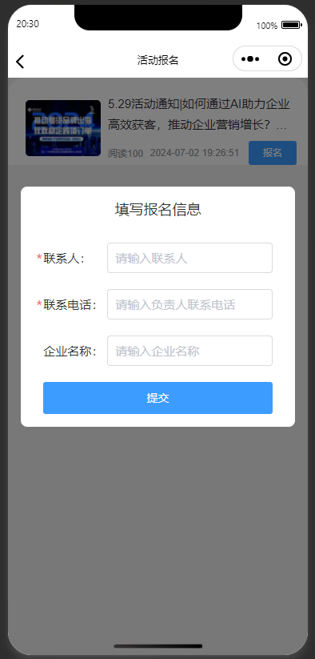

# uView表单

## 普通表单

```vue
		<u-overlay :show="show" @click="show = false">
			<view style="height: 100%;">
				<u-row customStyle="height: 100%;" justify="center" align="center">
					<u-col span="11">
						<u-row
							customStyle="background-color: #ffffff;height: 300px;margin-bottom: 300rpx;border-radius: 8px;">
							<u-col justify="center" offset="1" span="10">
								<u-row customStyle="margin-bottom: 40rpx">
									<u-col><u--text text="填写报名信息" size="36rpx" align="center"></u--text></u-col>
								</u-row>
								<u-row justify="center">
									<u-col span="12">
										<view @tap.stop>
											<u-form :model="formData" ref="uForm">
												<u-form-item required label="联系人：" label-width="160rpx"
													prop="supervisor">
													<u-input type="text" v-model="formData.supervisor"
														placeholder="请输入联系人" />
												</u-form-item>
												<u-form-item required label="联系电话：" label-width="160rpx" prop="phone">
													<u-input type="text" v-model="formData.phone"
														placeholder="请输入负责人联系电话" />
												</u-form-item>
												<u-form-item label="企业名称：" label-width="160rpx" prop="companyName">
													<u-input type="text" v-model="formData.companyName"
														placeholder="请输入企业名称" />
												</u-form-item>
											</u-form>
										</view>
									</u-col>
								</u-row>
								<u-row justify="center" customStyle="margin-top: 20rpx" @tap.stop>
									<u-col><u-button type="primary" @click="submit">提交</u-button></u-col>
								</u-row>
							</u-col>
						</u-row>
					</u-col>
				</u-row>
			</view>
		</u-overlay>


			formData: {
				supervisor: "",
				phone: "",
				companyName: ""
			},
			rules: {
				supervisor: [
					{
						required: true,
						message: '请输入联系人',
						// 可以单个或者同时写两个触发验证方式
						trigger: ['change', 'blur'],
					}
				],
				phone: [
					{
						required: true,
						message: '请输入电话号码',
						// 可以单个或者同时写两个触发验证方式
						trigger: ['change', 'blur'],
					}
				],
			}


	// 必须要在onReady生命周期，因为onLoad生命周期组件可能尚未创建完毕
	onReady() {
		this.$refs.uForm.setRules(this.rules);
	},


		// 活动报名
		submit() {
			console.log(this.formData)
			this.$refs.uForm.validate().then(value => {
				if (value) {
					addActivityUser(this.formData).then((res) => {
						this.show = false
						this.$modal.msgSuccess("报名成功")
					})
				}
			})
		}
```

> 