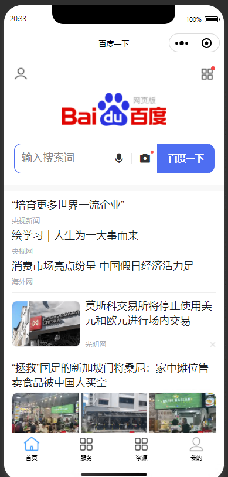
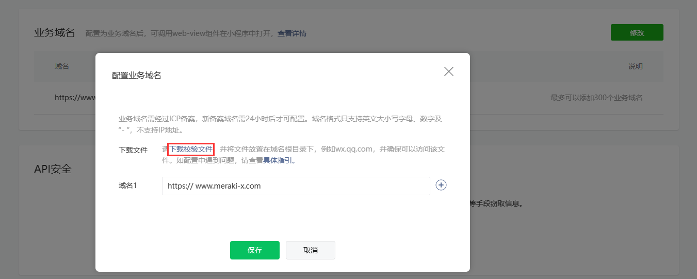

# web-view

## 组件

> 对于可能需要带外链去展示调用的情况，需要使用`<web-view>`标签

index.vue

```vue
<template>
<view>
  <view v-if="params.url">
    <web-view :webview-styles="webviewStyles" :src="`${params.url}`"></web-view>
  </view>
  <view v-if="src">
    <web-view :webview-styles="webviewStyles" :src="src"></web-view>
  </view>
</view>
</template>

<script>
  export default {
    data() {
      return {
        params: {},
        webviewStyles: {
          progress: {
            color: "#FF3333"
          }
        }
      }
    },
    props: {
      src: {
        type: [String],
        default: null
      }
    },
    onLoad(event) {
      this.params = event
      if (event.title) {
        uni.setNavigationBarTitle({
          title: event.title
        })
      }
    }
  }
</script>

```

注册页面：

page.json

```json
  }, {
    "path": "pages/common/webview/index",
    "style": {
      "navigationBarTitleText": "浏览网页"
    }
  }, {
```

调用方式：

```js
	uni.navigateTo({
		url: `/pages/common/webview/index?url=${item.url}`
	});
```

> 会警告需要启用跨源隔离

或者：

```vue
<template>
  <view>
    <web-view-component :src="webViewUrl"></web-view-component>
  </view>
</template>

<script>
import webViewComponent from '@/pages/common/webview/index.vue';

export default {
  components: {
    webViewComponent
  },
  data() {
    return {
      webViewUrl: 'https://www.baidu.com'
    };
  }
};
</script>
```

> 

注意事项：

- 允许随意访问网页仅限于开发环境
- 在打包上传之后的环境需要配置`业务域名`并把`校验文件`放到域名根目录

