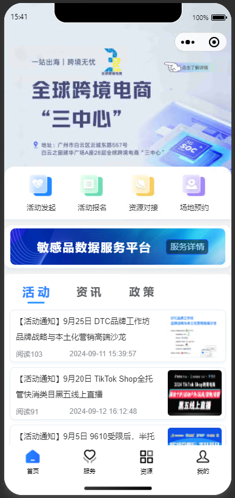

# 三中心小程序首页

index.js

```js
import request from '@/utils/request'

const urlList = [
	'/uniapp/activity/listUniapp', // 活动
	'/uniapp/message/listUniapp', // 资讯
	'/uniapp/policy/listUniapp', // 政策
	'/uniapp/investment/listUniapp' // 招商
]
const pageParam = {
	'pageNum': 1,
	'pageSize': 10
}

// 依据下表获取资讯信息
export function getInformationByIndex(index=0, data=null) {
  return request({
    url: urlList[index],
    method: 'get',
    params: data ? data : pageParam
  })
}

// 查询用户个人信息
export function getSwiper() {
  return request({
    url: '/uniapp/swiper/list',
    method: 'get'
  })
}

```

skip.js

```js
import text from '@/store/modules/text.js'


// 判断优先级 优先内容，再pages跳转，最后嵌套网页方式
const skip = (item) => {
	if (!item) {
		return
	}
	if (!!item.content && item.content.trim() && item.content.trim().replace("<p>", "").replace("</p>", "").replace("<br>", "")) {
		text.state.title = item.title ? item.title : ""
		text.state.content = item.content
		uni.navigateTo({
			url: `/pages/common/textview/index`
		});
	} else if(!!item.url) {
		// 如果是pages跳转，则优先
		if (item.url.includes("pages/")) {
			uni.navigateTo({
				url: item.url
			})
		} else {
			// text.state.title = item.title ? item.title : ""
			uni.navigateTo({
				url: `/pages/common/webview/index?url=${item.url}`
			});
		}
	}
}


export default skip;

```

requestController.js

```js
export function debounce(callback, delay=500) {
    let timeout = null;
    return (...args) => { // 使用剩余参数来捕获所有参数
        if (timeout) {
            clearTimeout(timeout);
        }
        timeout = setTimeout(() => {
            callback.apply(this, args); // 使用args作为参数传递给callback
        }, delay);
    };
}
```

index.vue

```vue
<template>
	<view style="background-color: #f4f5f9;">
		<!-- <u-row :customStyle="{ 'margin-top': topSafeArea + 'px;' }"> -->
		<u-row>
			<u-col>
				<u-swiper height="285px" :list="swiperList" indicator indicatorMode="line" circular radius="5 5 0 0"
					bgColor="#ffffff" @click="handleSwiperClick"></u-swiper>
			</u-col>
		</u-row>

		<u-row customStyle="position:absolute;top:270px;width:100%">
			<u-col>
				<!-- 四大模块 -->
				<view
					style="background-color: #ffffff; border-radius: 34rpx 34rpx 0 0;  box-shadow: 0 6rpx 8rpx 0 rgba(24, 144, 255, 0.06);">
					<u-grid :border="false" col="4" align="center"
						customStyle="padding: 15rpx 0;border-radius: 10rpx;width: 90%;margin:0 5%">
						<u-grid-item v-for="(listItem, listIndex) in gridList" :key="listIndex"
							@click="gridClick(listItem)">
							<image :src="listItem.img" style="width: 100rpx; border-radius: 10rpx;height: 90rpx;">
							</image>
							<text style="margin-top: 12rpx; margin-bottom: 10rpx; font-size: 24rpx;">{{ listItem.title
								}}</text>
						</u-grid-item>
					</u-grid>
				</view>

				<!-- 带电服务平台 MycustomStyle-->
				<view
					style="background-color: #fff; border-radius: 24rpx;height: 140rpx;margin-top: 20rpx; box-shadow: 0 10rpx 10rpx 0 rgba(24, 144, 255, 0.06);">
					<view style="height: 10rpx;"></view>
					<u-row :customStyle="MycustomStyle">
						<u-col span="1" offset="0.5">
							<!-- <image src="@/static/images/index/fly.png" style="width: 50px;height: 40px; border-radius: 5px;"></image> -->
						</u-col>
						<u-col span="7">
							<u--text text="敏感品数据服务平台" size="38rpx" bold="true"
								customStyle="color: #ffffff;letter-spacing: 4rpx"></u--text>
						</u-col>
						<u-col span="2" offset="0.2">
							<u-button color="blue" text="服务详情" plain=true
								@click="skip({ url: 'https://mp.weixin.qq.com/s/Xt43U6wY6n-vjV3OnsEzgQ' })"
								customStyle="border-radius: 10rpx; width: 140rpx; height: 50rpx; opacity: 0.5;background-color:#000;color:#fff;"></u-button>
						</u-col>
					</u-row>
				</view>

				<!-- 标签切换展示 -->
				<view
					style="background-color: #fff; border-radius: 17rpx 17rpx 0 0; padding: 4rpx 0;margin-top: 20rpx;">
					<u-row customStyle="background-color: #fff; border-radius: 34rpx;margin-top: 10rpx;">
						<u-col span="0.3"></u-col>
						<u-col span="9">
							<!-- color: '#303133', -->
							<!-- <u-subsection :list="subsection.subsectionList" activeColor="#55aaff" :current="subsection.curNow" @change="sectionChange" bgColor="#ffffff"></u-subsection> -->
							<u-tabs :list="tabs.tabsList" @click="tabsClick" lineWidth="56rpx" :activeStyle="{
								color: '#3787ff',
								fontWeight: 'bold',
								fontSize: '38rpx',
								margin: '0 auto',
								transform: 'scale(1.05)',
								width: '130rpx',
								textAlign: 'center'
							}" :inactiveStyle="{
								fontWeight: 'bold',
								fontSize: '36rpx',
								width: '130rpx',
								textAlign: 'center'
							}"></u-tabs>
						</u-col>
					</u-row>

					<!-- scroll-y='true'开启y轴滚动，scrolltolower滚动到底部触发 -->
					<scroll-view scroll-y="true" style="height: 50vh;" @scrolltolower="scrolltolower">
						<u-row align="top">
							<u-col span="0.3"></u-col>
							<u-col span="11.4">
								<view v-for="(item, index) in information.informationList[tabs.currentTab]" :key="index"
									v-show="information.informationList[tabs.currentTab]"
									style="border: 2rpx solid #e6edf2;border-radius: 17rpx; margin: 17rpx 0;box-shadow: 0px 6rpx 8rpx 0px rgba(24, 144, 255, 0.06);">
									<u-row @click.native="getDetail(item)" customStyle="height: 170rpx">
										<u-col span="8" offset="0.3">
											<u--text :text="item.title" :lines="2" lineHeight="26"
												size="27rpx"></u--text>
											<view style="height: 12rpx"></view>
											<u-row>
												<u-col span="4">
													<u--text :text="'阅读' + item.hit" size="24rpx" type="info"></u--text>
												</u-col>
												<u-col span="7" offset="0.5">
													<u--text :text="item.time" size="24rpx" type="info"></u--text>
												</u-col>
											</u-row>
										</u-col>
										<u-col span="3" offset="0.5">
											<image :src="item.img && Array.isArray(item.img) ? item.img[0] : item.img"
												style="width: 200rpx;height: 150rpx; border-radius: 10rpx;"></image>
										</u-col>
									</u-row>
								</view>
							</u-col>
						</u-row>
					</scroll-view>
				</view>
			</u-col>
		</u-row>
	</view>
</template>

<script>
import { getInformationByIndex, getSwiper } from '@/api/index/index.js'
import config from '@/config'
import skip from '@/utils/skip.js'
import { getObjType } from '@/utils/examineEnum.js'
import { addInformationHit } from '@/api/information/information.js'
import { debounce } from '@/utils/requestController.js'


export default {
	data() {
		return {
			topSafeArea: 0,
			skip: skip,
			swiperList: [],
			swiperItemList: [],
			MycustomStyle: {
				'margin': '0 20rpx',
				'border-radius': '16rpx',
				'height': '120rpx',
				'background-image': 'url(' + config.resourceUrl + '/background-image/batteryService.png)', // 替换为图片路径
				'background-size': 'cover',
				'background-position': 'center',
				'background-repeat': 'no-repeat',
				'box-shadow': '4rpx 6rpx 4rpx 6rpx rgba(255, 255, 255, 0.4)',
			},
			gridList: [{
				name: 'photo',
				title: '活动发起',
				url: '/pages/initiateActivities/index',
				img: config.resourceUrl + '/icon/index_icon/招商入驻.png'
			},
			{
				name: 'lock',
				title: '活动报名',
				url: '/pages/activity/index',
				img: config.resourceUrl + '/icon/index_icon/活动报名.png'
			},
			{
				name: 'star',
				title: '资源对接',
				// url: '/pages/resource/index',
				url: '/pages/assets/index',
				img: config.resourceUrl + '/icon/index_icon/资源对接.png'
			},
			{
				name: 'hourglass',
				title: '场地预约',
				url: '/pages/place/index',
				img: config.resourceUrl + '/icon/index_icon/场地预约.png'
			},
			],
			tabs: {
				tabsList:
					[{
						name: '活    动',
					}, {
						name: '资    讯',
					}, {
						name: '政    策'
					}],
				currentTab: 0,
			},

			// 记录分页list
			pageObjList: [],

			// 信息对象
			information: {
				informationList: [
				]
			},
			// 创建防抖对象
			InformationDebounce: Function,

		}
	},
	created() {
		uni.showShareMenu({
			// 设置 withShareTicket 为 true ，当用户将小程序转发到任一群聊之后，此转发卡片在群聊中被其他用户打开时，可以在 App.onLaunch 或 App.onShow 获取到一个 shareTicket。
			// 通过调用 wx.getShareInfo 接口传入此 shareTicket 可以获取到转发信息
			withShareTicket: true,
			// shareAppMessage好友，shareTimeline朋友圈
			menus: ['shareAppMessage', 'shareTimeline'],
		});
	},
	async onLoad() {
		uni.getSystemInfo({
			success: (res) => {
				// res.safeArea.top 即为顶部的安全距离
				// console.log('顶部的安全距离:', res.safeArea.top);
				this.topSafeArea = res.safeArea.top;
			}
		});
		let res = await getSwiper()
		// 初始化一些数据
		for (let [index, item] of this.tabs.tabsList.entries()) {
			this.pageObjList.push(this.getPageObj())
			this.information.informationList.push([])
		}

		// console.log(res)
		// 获取首页轮播图
		let currentList = []
		for (let i of res.rows) {
			// 图片请求地址
			currentList.push(config.baseUrl + i.img)
			this.swiperItemList.push(i)
		}
		this.swiperList = currentList
		await this.getInformation(0, this.pageObjList[0].pageParam)

		this.InformationDebounce = debounce(this.getInformation)
	},
	methods: {
		toLogin() {
			this.$login.checkToLogin()
		},
		// 配置分享好友
		onShareAppMessage(res) {
			// from: "menu", target: undefined
			console.log(res, "res")
			return {
				title: "三中心小程序",
				path: "/pages/index"
			}
		},
		// 配置分享到朋友圈
		onShareTimeline(res) {
			return {
				title: "三中心小程序",
				path: "/pages/index"
			}
		},
		getPageObj() {
			// 分页对象
			return {
				pageParam: {
					'pageNum': 1,
					'pageSize': 7
				},
				total: 0,
				endFlag: false
			}
		},
		handleSwiperClick(index) {
			// console.log("点击第"+index+"个轮播图"+this.swiperItemList)
			// uni.navigateTo({
			// 	url: '/pages/common/webview/index?url=' + this.swiperList[index]
			// });
			skip(this.swiperItemList[index])
		},
		gridClick(item) {
			// this.$modal.msgSuccess(String(name))
			// console.log(getApp())
			this.$login.confirmToLogin().then((res) => {
				if (res) {
					if (item.url.includes("assets")) {
						this.$tab.switchTab(item.url)
					}
					this.$tab.navigateTo(item.url)
				}
			})
		},
		// sectionChange(index) {
		// 	this.subsection.curNow = index;
		// }
		getDetail(item) {
			// 发送请求增加次数
			let objName = this.tabs.tabsList[this.tabs.currentTab].name.replace("最新", "")
			let objId = getObjType(objName)
			addInformationHit({
				'id': item.id,
				'objType': objId
			})
			skip(item)
		},
		// 通过下表获取数据
		async getInformation(index) {
			let pageObj = this.pageObjList[index]
			// 是否已经获取全部数据
			if (!pageObj.endFlag) {
				let res = await getInformationByIndex(index, pageObj.pageParam)
				let currentResult = []
				for (let i of res.rows) {
					let id = 0
					// 获取id
					for (let j in i) {
						if (j.includes("Id")) {
							id = i[j]
						}
					}
					currentResult.push({
						'id': id,
						'title': i.title,
						'img': i.img && i.img.includes('http') ? i.img : config.baseUrl + i.img,
						'time': i.createTime,
						'hit': i.hit,
						'url': i.url,
						'content': i.content
					})
				}
				// 添加信息
				this.$set(this.information.informationList, index, [...this.information.informationList[index], ...currentResult]);
				// this.information.informationList[index] = [...this.information.informationList[index], ...currentResult]
				// console.log(this.information.informationList, res)
				// 判断是否已经获取全部数据
				if (pageObj.pageParam.pageNum * pageObj.pageParam.pageSize >= res.total) {
					pageObj.endFlag = true
					// 否则加一让下一次使用
				} else {
					pageObj.pageParam.pageNum = pageObj.pageParam.pageNum + 1
				}
			}
		},

		async tabsClick(item) {
			// 如果检测发生了变化
			if (item.index != this.tabs.currentTab) {
				this.tabs.currentTab = item.index
				// 检测数据是否已经存在，如果不存在则发送请求
				if (this.information.informationList[item.index].length === 0) {
					let currentResult = await this.getInformation(item.index)
				}
			}
		},
		scrolltolower() {
			this.InformationDebounce(this.tabs.currentTab)
		}
	}
}
</script>

<style></style>

```

> 