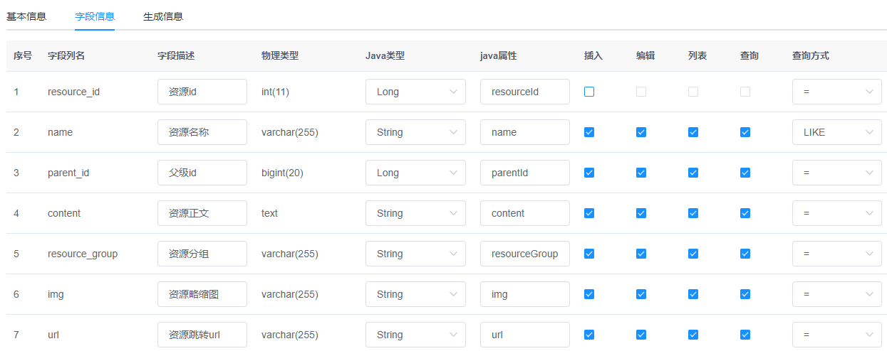
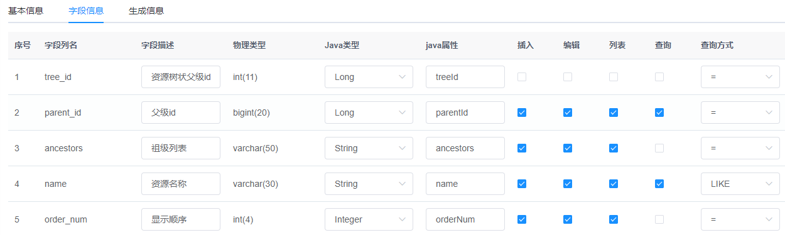
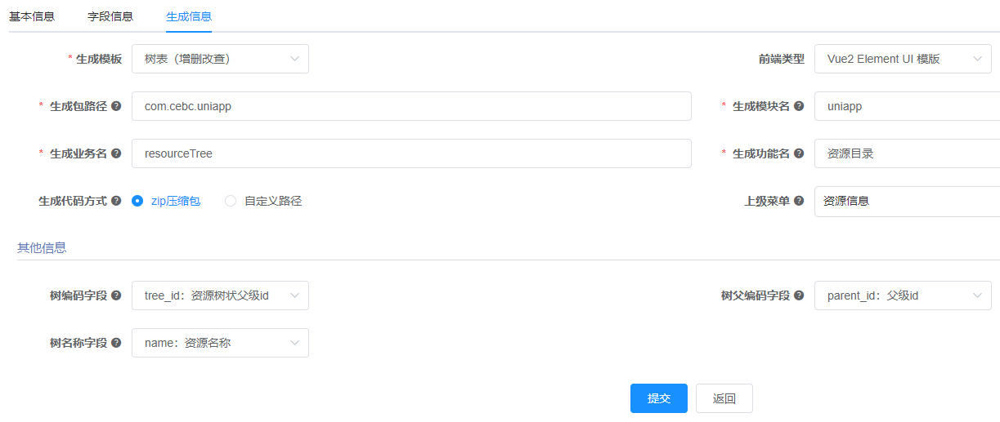
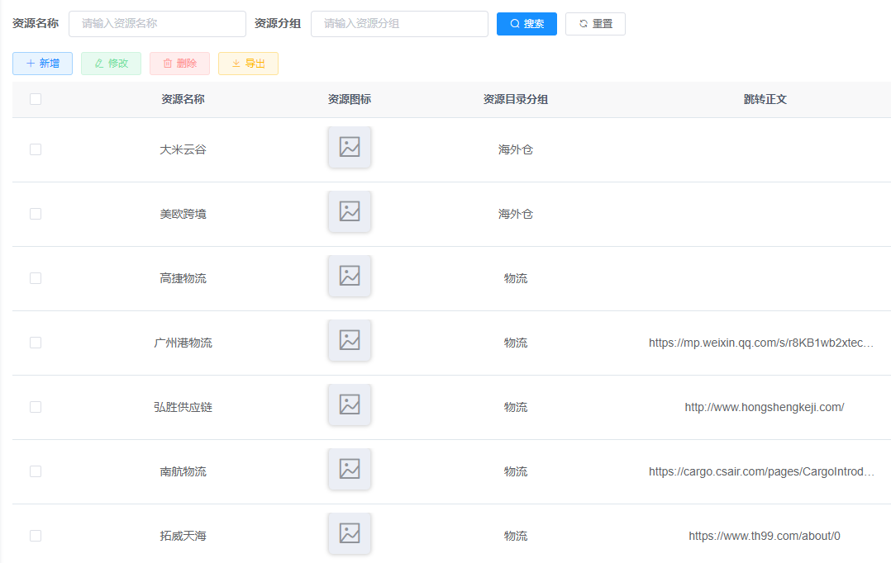
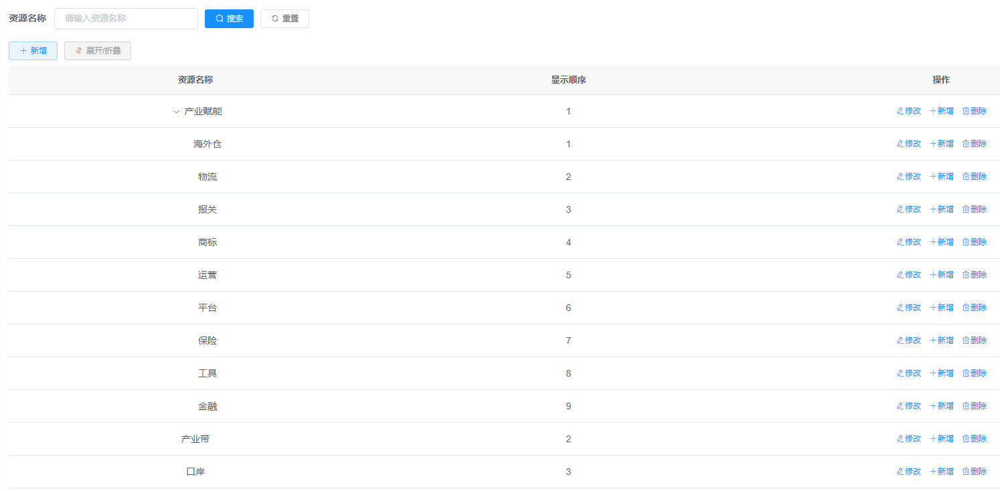
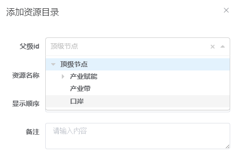
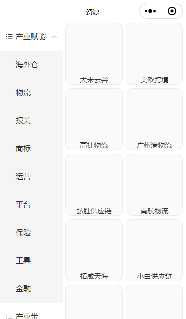

# 树目录

## 前端代码

> 引入并使用组件`menu.vue`

```vue
    <uni-menu :initData="listResourceTree" @selectChange="selectChange" @open="onOpen" @close="onClose" />
```

> 其中请求地址为：
>
> ```js
> const pageParam = {
>   'pageNum': 1,
>   'pageSize': 200
> }
> 
> // 获取资源信息
> export function getResourceList(data=null) {
>   return request({
>     url: '/uniapp/resource/list',
>     method: 'get',
>     params: data ? { ...data, ...pageParam } : pageParam
>   })
> }
> 
> 
> // 查询资源目录列表
> export function listResourceTree(query) {
>   return request({
>     url: '/uniapp/resourceTree/list',
>     method: 'get',
>     params: query
>   })
> }
> 
> // 获取父级资源信息
> export function getParentResource(data) {
>   return request({
>     url: '/uniapp/resourceTree/parentList',
>     method: 'get',
>     params: data
>   })
> }
> ```
>
> 其余方法为：
>
> ```js
> 		// 接收子组件的信息
> 		selectChange(e) {
> 			this.query.parentId = e.menu_id
> 			this.initData()
> 		},
> 		// 父级菜单展开，递归获取信息
> 		onOpen(e) {
> 			// console.log(e)
> 			this.query.parentId = e.menu_id
> 			this.getParentData()
> 		},
> 		// 父级菜单关闭，递归获取信息
> 		onClose(e) {
> 			this.query.parentId = e.menu_id
> 			this.getParentData()
> 		}
> ```
>
> 右边卡片数据展示方法：
>
> ```js
> 		// 处理右边卡片数据
> 		dealRightCard(item) {
> 			return {
> 				name: item.name,
> 				img: item.img && item.img.includes('http') ? item.img : config.baseUrl + item.img,
> 				url: item.url ? item.url : "",
> 				content: item.content
> 			}
> 		},
> 		// 获取资源信息
> 		initData() {
> 			// query: {parentId: '',}
> 			getResourceList(this.query).then((res) => {
> 				this.rightCardList = []
> 				for (let i = 0; i < res.rows.length - 1; i += 2) { // 减1以避免在最后一个元素时访问越界
> 				  this.rightCardList.push([this.dealRightCard(res.rows[i]), this.dealRightCard(res.rows[i + 1])]);
> 				}
> 				// 如果res.rows.length是奇数，最后一个元素没有配对，可以单独处理
> 				if (res.rows.length % 2 !== 0) {
> 				  this.rightCardList.push([this.dealRightCard(res.rows[res.rows.length - 1])]);
> 				}
> 			})
> 		},
> 		// 获取父亲节点的所有资源数据
> 		getParentData() {
> 			getParentResource(this.query).then((res) => {
> 				this.rightCardList = []
> 				for (let i = 0; i < res.data.length - 1; i += 2) { // 减1以避免在最后一个元素时访问越界
> 				  this.rightCardList.push([this.dealRightCard(res.data[i]), this.dealRightCard(res.data[i + 1])]);
> 				}
> 				// 如果res.data.length是奇数，最后一个元素没有配对，可以单独处理
> 				if (res.data.length % 2 !== 0) {
> 				  this.rightCardList.push([this.dealRightCard(res.data[res.data.length - 1])]);
> 				}
> 			})
> 		},
> ```

## 后端代码

正常结构表，用于存储叶子节点信息`tb_resource`：



> - `parent_id`为指定到树表的`tree_id`，和后续的查询相关联
> - `resource_group`需要和树形结构表的`name`相关联，在后续的sql语句中有体现

树形结构表：



> - `ancestors`祖级列表暂且未用得上
>
> 生成信息：
>
> 

TbResourceController.java

```java
    /**
     * 查询资源信息列表
     */
//    @PreAuthorize("@ss.hasPermi('uniapp:resource:list')")
    @GetMapping("/list")
    @Anonymous
    public TableDataInfo list(TbResource tbResource)
    {
        startPage();
        List<TbResource> list = tbResourceService.selectTbResourceList(tbResource);
        return getDataTable(list);
    }
```

TbResourceTreeController.java

```java
    @Autowired
    private ITbResourceTreeService tbResourceTreeService;

    /**
     * 查询资源目录列表
     */
//    @PreAuthorize("@ss.hasPermi('uniapp:resourceTree:list')")
    @GetMapping("/list")
    @Anonymous
    public AjaxResult list(TbResourceTree tbResourceTree) {
        List<TbResourceTree> list = tbResourceTreeService.selectTbResourceTreeList(tbResourceTree);
        return success(list);
    }

    /**
     * @param list     资源树集合
     * @param parentId 资源树状父级id
     * @return 此父id的所有从属子节点
     */
    private List<TbResourceTree> getChildMenus(List<TbResourceTree> list, Long parentId) {
        List<TbResourceTree> result = new ArrayList<>();
        list.forEach((item) -> {
            if (item.getParentId().equals(parentId)) {
                // 检查当前菜单是否有子菜单
                if (list.stream().noneMatch(m -> m.getParentId().equals(item.getTreeId()))) {
                    result.add(item);
                }
                // 递归添加子菜单的子菜单
                result.addAll(getChildMenus(list, item.getTreeId()));
            }
        });
        return result;
    }

    @Autowired
    private ITbResourceService tbResourceService;

    @GetMapping("/parentList")
    @Anonymous
    public AjaxResult parentList(TbResourceTree tbResourceTree) {
        List<TbResourceTree> list = tbResourceTreeService.selectTbResourceTreeList(tbResourceTree);
        // 通过父节点获取所有的从属子节点
        List<TbResourceTree> childMenus = getChildMenus(list, tbResourceTree.getParentId());
        // 包括直接以父节点作为从属节点的
        TbResourceTree current = new TbResourceTree();
        current.setTreeId(tbResourceTree.getParentId());
        childMenus.add(current);
        List<TbResource> tbResources = new ArrayList<>();
        childMenus.forEach((item) -> {
            // 查询出所有parent_id为tree_id的资源信息
            tbResources.addAll(tbResourceService.selectTbResourceListByParentId(item.getTreeId()));
        });

        return success(tbResources);
    }
```

TbResourceMapper.xml

```xml
    <select id="selectTbResourceListByParentId" parameterType="Long" resultMap="TbResourceResult">
        select r.resource_id, r.content, r.name, r.img, r.url,
        r.sort, r.status, r.create_by, r.create_time, r.update_by, r.update_time, r.remark, r.delete_flag,
        rt.name as resource_group from tb_resource as r left join tb_resource_tree as rt on r.parent_id = rt.tree_id
        <where>
            <if test="parentId != null  and parentId != ''"> and r.parent_id = #{parentId}</if>
        </where>
    </select>
```

## 前端管理

resource界面：



resourceTree界面：

```vue
        <el-form-item label="父级id" prop="parentId">
          <treeselect v-model="form.parentId" :options="resourceTreeOptions" :normalizer="normalizer" placeholder="请选择父级id" />
        </el-form-item>


import Treeselect from "@riophae/vue-treeselect";
import "@riophae/vue-treeselect/dist/vue-treeselect.css";


    /** 转换资源目录数据结构 */
    normalizer(node) {
      if (node.children && !node.children.length) {
        delete node.children;
      }
      return {
        id: node.treeId,
        label: node.name,
        children: node.children
      };
    },
    /** 查询资源目录下拉树结构 */
    getTreeselect() {
      listResourceTree().then(response => {
        this.resourceTreeOptions = [];
        const data = { treeId: 0, name: '顶级节点', children: [] };
        data.children = this.handleTree(response.data, "treeId", "parentId");
        this.resourceTreeOptions.push(data);
      });
    },
```

> 
>
> 添加效果：
>
> 

## 小程序展示


