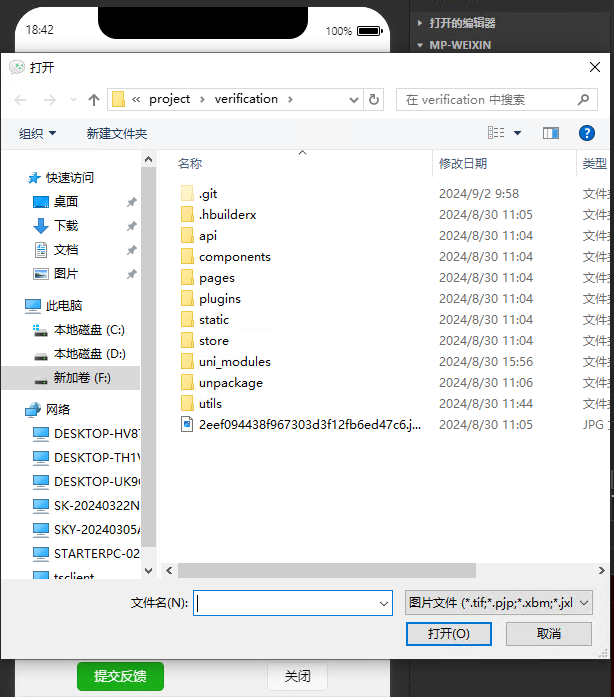

# 图片选择

> 官方文档：[uni-app官网 (dcloud.net.cn)](https://uniapp.dcloud.net.cn/api/media/image.html#chooseimage)

## 示例代码

```js
export default function chooseImage() {
	return new Promise((resolve, reject) => {
		uni.chooseImage({
			count: 1, // 默认选择一张图片
			sourceType: ['camera', 'album'], // 选择图片的来源，相机或相册
			success: async(res) => {
				// 成功回调方法
				console.log('图片选择成功', res);
				// res.tempFilePaths 是一个数组，包含了选择的图片的临时文件路径
				const tempFilePaths = res.tempFilePaths;
				try {
					modal.msg("正在上传图片。。。")
					let imagePath = await uploadImage(tempFilePaths[0])
					modal.msgSuccess("上传成功！")
					resolve(`${baseUrl}${imagePath}`)
				} catch(error) {
					modal.msgError("上传出错，请稍后重试")
					reject(error)
				}
			},
			fail: (err) => {
				// 失败回调方法
				console.error('图片选择失败', err);
				// 可以在这里处理错误情况，比如提示用户
				reject('图片选择失败')
			}
		});
	})
}

function uploadImage(tempFilePath) {
	return new Promise((resolve, reject) => {
		uni.uploadFile({
			url: `${baseUrl}public/index.php/upload`,
			filePath: tempFilePath,
			name: 'image',
			formData: {
				// 其它表单信息
				token: 'yxx123'
			},
			success: (uploadRes) => {
				// 上传成功
				console.log('图片上传成功', uploadRes);
				let code = uploadRes && uploadRes.statusCode
				// uploadRes.data 是服务器返回的数据
				// if (code == 200) {
				// 	resolve('图片上传成功')
				// }
				let data = JSON.parse(uploadRes.data)
				if (data.code == 200) {
					resolve(data.data)
				}
				reject('图片上传失败' + uploadRes && uploadRes.errMsg)
			},
			fail: (err) => {
				// 上传失败
				console.error('图片上传失败', err);
				reject('图片上传失败' + err)
			}
		});
	})
}
```

> 点击触发方法之后跳出图片选择
>
> 