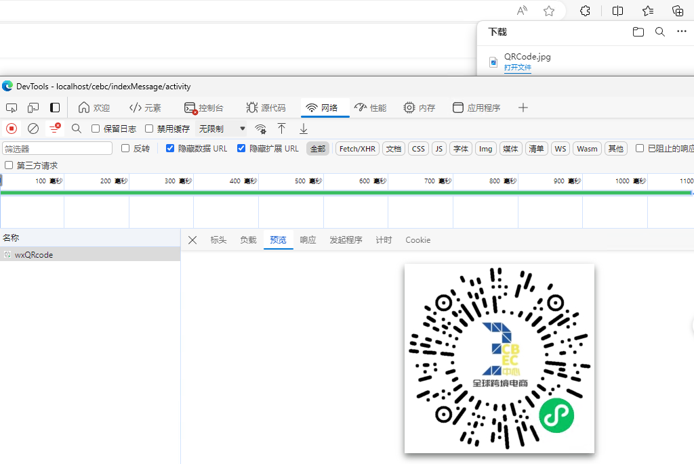

# 微信小程序二维码

> 官方文档：[小程序码与小程序链接 / 小程序码 / 获取小程序码 (qq.com)](https://developers.weixin.qq.com/miniprogram/dev/OpenApiDoc/qrcode-link/qr-code/getQRCode.html)

## 示例代码

### 前端请求

```js
    /** 生成二维码 **/
    handleDownload(row) {
      this.download('uniapp/wxapi/wxQRcode', {
        // path=pages%2Factivity%2Findex%3Fid%3D35&
        path: `pages/activity/index?id=${row.activityId}`
      }, 'QRCode.jpg')
    }
```

### 后端处理

WxRestTemplate.java

```java
    /**
     * 获取微信生成的二维码
     *
     * @param wxQRCode 请求对象
     * @return 相应结果
     */
    public byte[] getWxQRCode(WxQRCode wxQRCode) {
        // pages/activity/index?id=36
        // 构建请求的url
        String wxQRUrl = String.format("https://api.weixin.qq.com/wxa/getwxacode?access_token=%s", getAccessToken());

        if (active.equals("dev")) {
            wxQRCode.setEnv_version("trial");
        } else {
            wxQRCode.setEnv_version("release");
        }

        // 发送请求
        ResponseEntity<byte[]> forEntity = restTemplate.postForEntity(
                wxQRUrl, wxQRCode, byte[].class
        );

        // 异常处理
        byte[] body = forEntity.getBody();
        // 当长度过短，很有可能是出现了错误，返回错误信息的JSON字符串
        if (body == null || body.length < 500) {
            if (body != null) {
                throw new UniappException(new String(body, StandardCharsets.UTF_8));
            } else {
                throw new UniappException("未知错误，微信未返回任何信息");
            }
        }

        // 开发环境允许保存到桌面
        if (active.equals("dev")) {
            try {

                // 获取桌面路径
                String desktopPath = System.getProperty("user.home") + File.separator + "Desktop";

                // 创建文件对象
                File imageFile = new File(desktopPath, "trial.jpg");

                // 使用文件输出流写入文件
                try (FileOutputStream outputStream = new FileOutputStream(imageFile)) {
                    outputStream.write(body);
                    System.out.println("图片已保存到桌面: " + imageFile.getAbsolutePath());
                }
            } catch (IOException e) {
                e.printStackTrace();
            }
        }
        return body;
    }
```

WxServiceImpl.java

```java
    public void getWxQRCode(HttpServletResponse httpServletResponse, WxQRCode wxQRCode) {

        try {
            // 获取微信二维码图片的二进制数据
            byte[] codeByte = wxRestTemplate.getWxQRCode(wxQRCode);

            // 设置HTTP响应头信息，指示文件下载
            httpServletResponse.setContentType("image/jpeg");
            httpServletResponse.setHeader("Content-Disposition", "attachment; filename=wx_qr_code.jpg"); // 设置下载的文件名

            // 获取HTTP响应的输出流
            OutputStream outputStream = httpServletResponse.getOutputStream();

            // 将图片数据写入到HTTP响应的输出流中
            outputStream.write(codeByte);

            // 刷新并关闭输出流
            outputStream.flush();
            outputStream.close();
        } catch (IOException e) {
            // 处理异常，例如记录日志或设置HTTP错误状态码
            e.printStackTrace();
            httpServletResponse.setStatus(HttpServletResponse.SC_INTERNAL_SERVER_ERROR);
        }

    }
```

> 