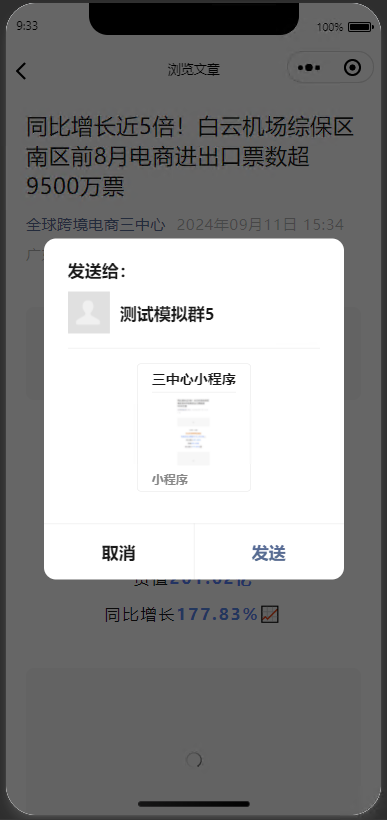
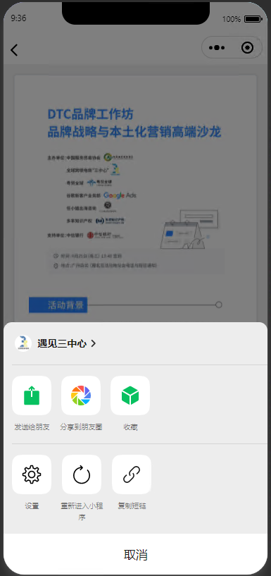
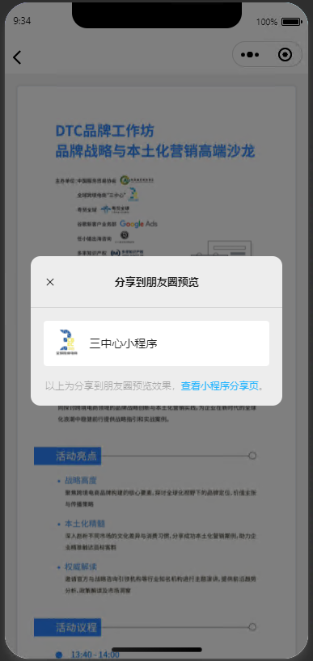

# 微信小程序分享

> 官方文档：[开放能力 / 转发 / 转发 (qq.com)](https://developers.weixin.qq.com/miniprogram/dev/framework/open-ability/share.html)
>
> Page对象：[框架接口 / 页面 / Page (qq.com)](https://developers.weixin.qq.com/miniprogram/dev/reference/api/Page.html#onshareappmessageobject-object)


## Uniapp兼容

> 显示分享按钮：[分享 | uni-app官网 (dcloud.net.cn)](https://uniapp.dcloud.net.cn/api/plugins/share.html#showsharemenu)

webview.vue

```vue
<template>
  <view>
    <view v-if="params.url">
      <web-view :webview-styles="webviewStyles" :src="params.url"></web-view>
    </view>
    <view v-if="src">
      <web-view :webview-styles="webviewStyles" :src="src"></web-view>
    </view>
  </view>
</template>

<script>
export default {
  data() {
    return {
      params: {},
      webviewStyles: {
        progress: {
          color: "#FF3333"
        }
      }
    }
  },
  props: {
    src: {
      type: [String],
      default: null
    }
  },
  created() {
    uni.showShareMenu({
      // 设置 withShareTicket 为 true ，当用户将小程序转发到任一群聊之后，此转发卡片在群聊中被其他用户打开时，可以在 App.onLaunch 或 App.onShow 获取到一个 shareTicket。
      // 通过调用 wx.getShareInfo 接口传入此 shareTicket 可以获取到转发信息
      withShareTicket: true,
      // shareAppMessage好友，shareTimeline朋友圈
      menus: ['shareAppMessage', 'shareTimeline'],
    });
  },
  onLoad(event) {
    this.params = event
    if (event.title) {
      uni.setNavigationBarTitle({
        title: ""
      })
    }
  },
  methods: {
    // 配置分享好友
    onShareAppMessage(res) {
      // from: "menu", target: undefined
      console.log(res, "res")
      return {
        title: "三中心小程序",
        path: `/pages/common/webview/index?url=${this.params.url ? this.params.url : this.src}`
      }
    },
    // 配置分享到朋友圈
    onShareTimeline(res) {
      return {
        title: "三中心小程序",
        path: `/pages/common/webview/index?url=${this.params.url ? this.params.url : this.src}`
      }
    },
  }
}
</script>

```

> `<web-view>`无法分享到朋友圈
>
> 

textview.vue

```vue
<template>
  <view>
    <uni-card class="view-title" :title="title">
      <!-- 		<template v-slot:title>
			<uni-list>
				<uni-list-item :show-switch="true" title="自定义标题"/>
			</uni-list>
		</template> -->
      <!-- <text class="uni-body view-content">{{ content }}</text> -->
      <!-- 允许复制 -->
      <!-- <text class="uni-body view-content" user-select="auto">{{ content }}</text> -->
      <u-parse :content="content" :selectable="true"></u-parse>
    </uni-card>
  </view>
</template>

<script>
export default {
  data() {
    return {
      title: '',
      content: ''
    }
  },
  created() {
    uni.showShareMenu({
      // 设置 withShareTicket 为 true ，当用户将小程序转发到任一群聊之后，此转发卡片在群聊中被其他用户打开时，可以在 App.onLaunch 或 App.onShow 获取到一个 shareTicket。
      // 通过调用 wx.getShareInfo 接口传入此 shareTicket 可以获取到转发信息
      withShareTicket: true,
      // shareAppMessage好友，shareTimeline朋友圈
      menus: ['shareAppMessage', 'shareTimeline'],
    });
  },
  onLoad(options) {
    // this.title = options.title
    // this.title = this.$store.state.text.title
    // this.content = options.content
    this.content = this.$store.state.text.content
    uni.setNavigationBarTitle({
      title: ""
    })
  },
  methods: {
    // 配置分享好友
    onShareAppMessage(res) {
      // from: "menu", target: undefined
      console.log(res, "res")
      return {
        title: "三中心小程序",
        path: "/pages/index"
      }
    },
    // 配置分享到朋友圈
    onShareTimeline(res) {
      return {
        title: "三中心小程序",
        path: "/pages/index"
      }
    },
  }
}
</script>

<style scoped>
page {
  background-color: #ffffff;
}

.view-title {
  font-weight: bold;
}

.view-content {
  font-size: 26rpx;
  padding: 12px 5px 0;
  color: #333;
  line-height: 24px;
  font-weight: normal;
}
</style>

```

> 
>
> 
