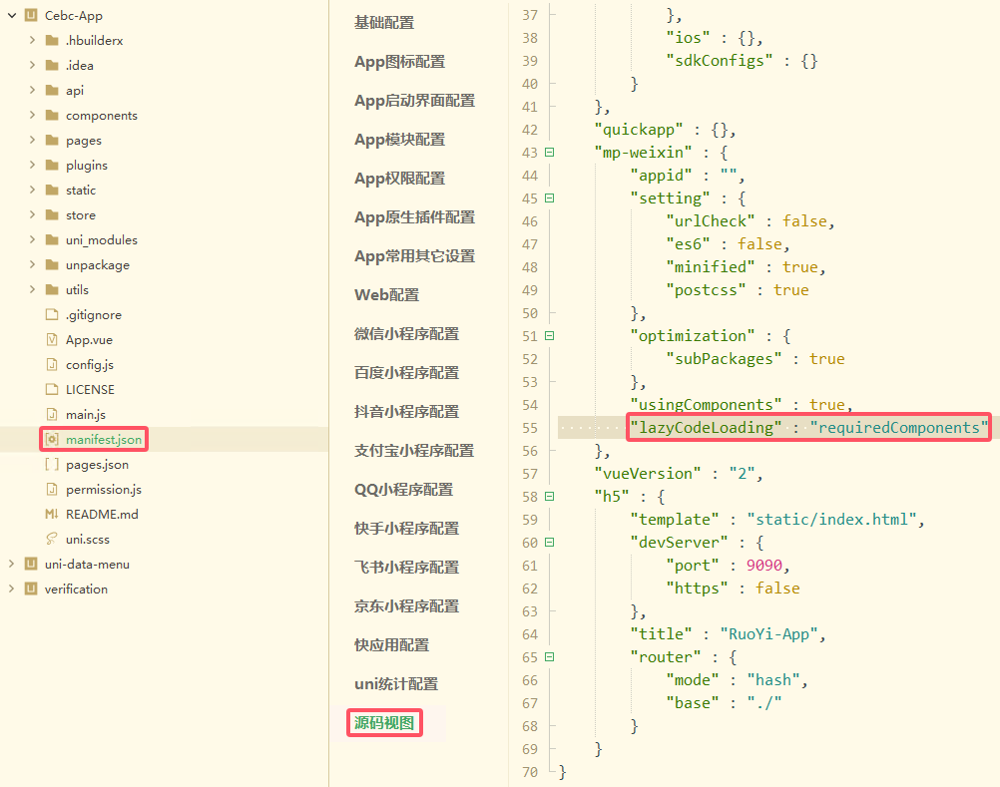

# 微信小程序性能优化

> 官方优化指南：[小程序性能优化指南 | 微信开放社区 (qq.com)](https://developers.weixin.qq.com/community/develop/doc/00040e5a0846706e893dcc24256009)

## 代码质量

## 开启压缩

## 使用分包

> [基础能力 / 分包加载 / 使用分包 (qq.com)](https://developers.weixin.qq.com/miniprogram/dev/framework/subpackages/basic.html)

## 代码依赖分析

## 开启按需注入

> 指定一部分自定义组件不在小程序启动时导入，而是真正渲染的时候进行才进行注入

