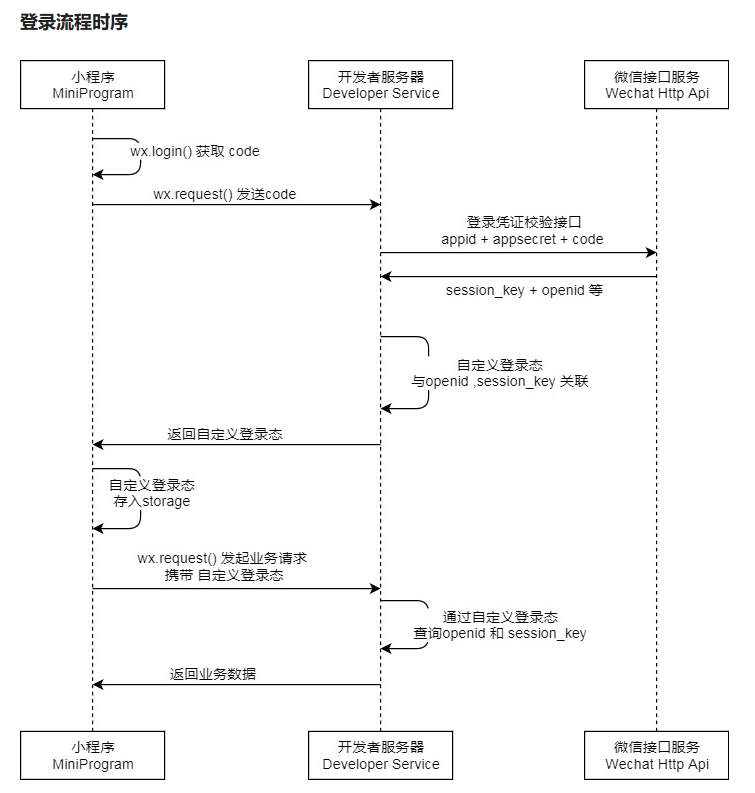
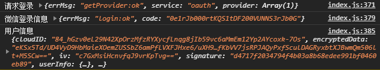

# 微信小程序登录

## 登录时序图



说明：

- 调用`wx.login()`获取 临时登录凭证code ，并回传到开发者服务器
- 调用`auth.code2Session`接口，换取 用户唯一标识 OpenID 、 用户在微信开放平台账号下的唯一标识UnionID（若当前小程序已绑定到微信开放平台账号） 和会话密钥`session_key`

之后开发者服务器可以根据用户标识来生成自定义登录态，用于后续业务逻辑中前后端交互时识别用户身份

注意事项：

- 会话密钥 session_key 是对用户数据进行 加密签名 的密钥。为了应用自身的数据安全，开发者服务器不应该把会话密钥下发到小程序，也不应该对外提供这个密钥
- 临时登录凭证 code 只能使用一次

## 前端请求代码

调用接口获取登录凭证（code）。通过凭证进而换取用户登录态信息，包括用户在当前小程序的唯一标识（openid）、微信开放平台账号下的唯一标识（unionid，若当前小程序已绑定到微信开放平台账号）及本次登录的会话密钥（session_key）等。用户数据的加解密通讯需要依赖会话密钥完成

示例代码：

```js
wx.login({
  success (res) {
    if (res.code) {
      //发起网络请求
      wx.request({
        url: 'https://example.com/onLogin',
        data: {
          code: res.code
        }
      })
    } else {
      console.log('登录失败！' + res.errMsg)
    }
  }
})
```

完整参数代码：

```js
wx.login({
  timeout: 10000, // 设置超时时间为10秒
  success: function(res) {
    if (res.code) {
      // 发起网络请求
      wx.request({
        url: 'https://example.com/onLogin',
        data: {
          code: res.code
        }
      })
    } else {
      console.log('登录失败！' + res.errMsg)
    }
  },
  fail: function(err) {
    // 登录失败的回调函数
    console.log('登录接口调用失败')
  },
  complete: function() {
    // 接口调用结束的回调函数，无论成功还是失败都会执行
    console.log('登录流程结束')
  }
})
```

回调函数：

- `object.success`回调函数，`code`为用户登录凭证（有效期五分钟）。开发者需要在开发者服务器后台调用`code2Session`，使用 code 换取 openid、unionid、session_key 等信息
- `object.fail`回调函数，`errMsg`为错误信息，`errno`为错误码

## 后台请求代码

登录凭证校验。通过 wx.login 接口获得临时登录凭证 code 后传到开发者服务器调用此接口完成登录流程

请求接口：

```
GET https://api.weixin.qq.com/sns/jscode2session
```

请求参数：

|    属性    |  类型  | 必填 |                   说明                   |
| :--------: | :----: | :--: | :--------------------------------------: |
|   appid    | string |  是  |               小程序appId                |
|   secret   | string |  是  |             小程序appSecret              |
|  js_code   | string |  是  |   登录时获取的code，可通过wx.login获取   |
| grant_type | string |  是  | 授权类型，此处只需填写authorization_code |

返回参数：

|    属性     |  类型  |                             说明                             |
| :---------: | :----: | :----------------------------------------------------------: |
| session_key | string |                           会话密钥                           |
|   unionid   | string | 用户在开放平台的唯一标识符，若当前小程序已绑定到微信开放平台账号下会返回 |
|   errmsg    | string |                           错误信息                           |
|   openid    | string |                         用户唯一标识                         |
|   errcode   | int32  |                            错误码                            |

> 如果开发者拥有多个移动应用、网站应用、和公众账号（包括小程序），可通过 UnionID 来区分用户的唯一性，因为只要是同一个微信开放平台账号下的移动应用、网站应用和公众账号（包括小程序），用户的 UnionID 是唯一的。换句话说，同一用户，对同一个微信开放平台下的不同应用，UnionID是相同的

错误码：

| 属性  |                        错误码取值                         |            解决方案            |
| :---: | :-------------------------------------------------------: | :----------------------------: |
| 40029 |                         code 无效                         |          js_code无效           |
| 45011 | api minute-quota reach limit mustslower retry next minute |   API 调用太频繁，请稍候再试   |
| 40226 |                       code blocked                        | 高风险等级用户，小程序登录拦截 |
|  -1   |                       system error                        |          用户唯一标识          |

请求示例：

```
GET https://api.weixin.qq.com/sns/jscode2session?appid=APPID&secret=SECRET&js_code=JSCODE&grant_type=authorization_code
```

响应示例：

```json
    {
        "openid":"xxxxxx",
        "session_key":"xxxxx",
        "unionid":"xxxxx",
        "errcode":0,
        "errmsg":"xxxxx"
    }
```

## 登录状态校验

检查登录态是否过期。 通过`wx.login`接口获得的用户登录态拥有一定的时效性。用户越久未使用小程序，用户登录态越有可能失效。反之如果用户一直在使用小程序，则用户登录态一直保持有效。具体时效逻辑由微信维护，对开发者透明。开发者只需要调用 wx.checkSession 接口检测当前用户登录态是否有效

参数：

|   属性   |   类型   | 必填 |                       说明                       |
| :------: | :------: | :--: | :----------------------------------------------: |
| success  | function |  否  |              接口调用成功的回调函数              |
|   fail   | function |  否  |              接口调用失败的回调函数              |
| complete | function |  否  | 接口调用结束的回调函数（调用成功、失败都会执行） |

示例代码：

```js
wx.checkSession({
  success () {
    // session_key 未过期，并且在本生命周期一直有效
  },
  fail () {
    // session_key 已经失效，需要重新执行登录流程
    wx.login() //重新登录
  }
})
```

> 这个接口主要用于小程序在前端检测登录态的有效性，确保在返回业务数据之前，用户的登录状态是有效的

## 示例代码

> uniapp文档：[uni.login(OBJECT) | uni-app官网 (dcloud.net.cn)](https://uniapp.dcloud.net.cn/api/plugins/login.html)
>
> 获取开放数据：[开放能力 / 用户信息 / 开放数据校验与解密 (qq.com)](https://developers.weixin.qq.com/miniprogram/dev/framework/open-ability/signature.html)

### 前端请求

`api/login.js`

```js
// 微信登录方法
export function wxLogin(code, encryptedIv, encryptedData) {
  const data = {
    code,
    encryptedIv,
    encryptedData
  }
  return request({
    'url': '/wxLogin',
    headers: {
      isToken: false
    },
    'method': 'post',
    'data': data
  })
}
```

`plugins/login.js`

```js
// 休眠等待
async function sleep(ms = 800) {
	return new Promise(
		resolve => setTimeout(resolve, ms)
	)
}


// 微信登录信息发送
async function wxLogin(wxloginForm) {
	store.dispatch('WxLogin', wxloginForm).then(async () => {
		modal.closeLoading()
		modal.msgSuccess("登录成功!")
		await sleep()
		return true
	}).catch((e) => {
		// 如果异常，则提示信息
		modal.msgError("登录失败!")
	})
}


// 微信登录暴露方法
function toWeChatLogin() {
	modal.loading("登录中，请耐心等待...")
	uni.getProvider({
		service: "oauth",
		success: (res) => {
			console.log("请求登录", res)
			// 判断环境，~ 是按位非，即将1变成0，将0变成1
			if (~res.provider.indexOf("weixin")) {
				// 登录
				uni.login({
					provider: 'weixin', //使用微信登录
					success: (loginRes) => {
						console.log("微信登录信息", loginRes)
						let wxloginForm = {}
						wxloginForm["code"] = loginRes.code
						// 获取用户信息
						uni.getUserInfo({
							success: (resInfo) => {
								console.log("用户信息", resInfo)
								// 获取偏移量和加密数据
								wxloginForm["encryptedIv"] = resInfo.iv
								wxloginForm["encryptedData"] = resInfo.encryptedData
								// 向后端发起登录请求
								return wxLogin(wxloginForm)
							}
						})
					}，
					fail: (error) => {
						console.log("登录错误信息", error)
					}
				})
			}
		}
	})
}
```

### 后端处理

WxLoginResponse.java


```java
public class WxLoginResponse {

    /**
     * 会话密钥
     */
    private String session_key;

    /**
     * 用户开放平台标识
     */
    private String unionid;

    /**
     * 用户唯一标识
     */
    private String openid;


    /**
     * 错误信息
     */
    private String errmsg;

    /**
     * 错误码
     */
    private Integer errcode;
}
```

WxRestTemplate.java

```java
    /**
     * 获取用户的open_id执行登录
     *
     * @param code 小程序生产的登录凭证
     * @return 微信响应体
     */
    public WxLoginResponse getWxLogin(String code) {
        // 构建请求的url
        String wxLoginUrl = String.format("https://api.weixin.qq.com/sns/jscode2session?appid=%s" +
                        "&secret=%s" +
                        "&js_code=%s" +
                        "&grant_type=authorization_code",
                wxAppConfig.getAppId(), wxAppConfig.getAppSecret(), code);

        // 发送请求
        ResponseEntity<String> forEntity = restTemplate.getForEntity(
                wxLoginUrl, String.class
        );

        if (!ObjectUtils.isEmpty(forEntity.getBody())) {
            WxLoginResponse wxLoginResponse = JSONObject.parseObject(forEntity.getBody(), WxLoginResponse.class);
            // 如果返回了错误信息
            if (ObjectUtils.isEmpty(wxLoginResponse.getErrcode()) && ObjectUtils.isEmpty(wxLoginResponse.getErrmsg())) {
                return wxLoginResponse;
            }
            throw new UniappException("微信小程序登录接口出错" + wxLoginResponse.getErrcode() + wxLoginResponse.getErrmsg());
        }

        throw new UniappException("微信小程序登录接口出错");
    }
```

SysLoginService.java

```java
    /**
     * 用户验证
     *
     * @param username 用户名
     * @param password 密码
     * @return 结果
     */
    private String verifyUser(String username, String password) {
        Authentication authentication = null;
        try {
            UsernamePasswordAuthenticationToken authenticationToken = new UsernamePasswordAuthenticationToken(username, password);
            AuthenticationContextHolder.setContext(authenticationToken);
            // 该方法会去调用UserDetailsServiceImpl.loadUserByUsername
            authentication = authenticationManager.authenticate(authenticationToken);
        } catch (Exception e) {
            if (e instanceof BadCredentialsException) {
                AsyncManager.me().execute(AsyncFactory.recordLogininfor(username, Constants.LOGIN_FAIL, MessageUtils.message("user.password.not.match")));
                throw new UserPasswordNotMatchException();
            } else {
                AsyncManager.me().execute(AsyncFactory.recordLogininfor(username, Constants.LOGIN_FAIL, e.getMessage()));
                throw new ServiceException(e.getMessage());
            }
        } finally {
            AuthenticationContextHolder.clearContext();
        }
        AsyncManager.me().execute(AsyncFactory.recordLogininfor(username, Constants.LOGIN_SUCCESS, MessageUtils.message("user.login.success")));
        LoginUser loginUser = (LoginUser) authentication.getPrincipal();
        recordLoginInfo(loginUser.getUserId());
        // 生成token
        return tokenService.createToken(loginUser);
    }

    /**
     * 登录验证
     *
     * @param username 用户名
     * @param password 密码
     * @param code     验证码
     * @param uuid     唯一标识
     * @return 结果
     */
    public String login(String username, String password, String code, String uuid) {
        // 验证码校验
        validateCaptcha(username, code, uuid);
        // 登录前置校验
        loginPreCheck(username, password);
        // 用户验证
        return verifyUser(username, password);
    }

    @Autowired
    private WxRestTemplate wxRestTemplate;

    @Autowired
    private SysUserMapper sysUserMapper;

    @Autowired
    private SysUserRoleMapper sysUserRoleMapper;

    @Autowired
    private WxAppConfig wxAppConfig;

    /**
     * 注册小程序用户
     *
     * @param wxLoginResponse 微信登录响应体
     */
    private void registerUser(WxLoginResponse wxLoginResponse) {
        SysUser registerUser = new SysUser();
        registerUser.setUserName(wxLoginResponse.getOpenid());
        registerUser.setNickName("新用户");
        // 这里尝试获取手机号插入信息
        registerUser.setOpenId(wxLoginResponse.getOpenid());
        registerUser.setPassword(SecurityUtils.encryptPassword(wxAppConfig.getDefaultPassword()));
        // 初始化为指定部门
        registerUser.setDeptId(wxAppConfig.getDeptId());
        int id = sysUserMapper.insertUser(registerUser);
        if (id == 0) {
            throw new UniappException("小程序用户注册失败");
        }

        // 构建初始角色权限
        List<SysUserRole> sysUserRoleList = new ArrayList<>();
        wxAppConfig.getRoleIds().forEach((item) -> {
            SysUserRole sysUserRole = new SysUserRole();
            sysUserRole.setUserId(registerUser.getUserId());
            sysUserRole.setRoleId(item);
            sysUserRoleList.add(sysUserRole);
        });
        // 默认的角色id，插入用户角色表
        sysUserRoleMapper.batchUserRole(sysUserRoleList);

        AsyncManager.me().execute(AsyncFactory.recordLogininfor(wxLoginResponse.getOpenid(), Constants.REGISTER, MessageUtils.message("user.register.success")));
    }

    /**
     * 微信登录验证
     *
     * @param code          登录
     * @param encryptedIv   偏移量
     * @param encryptedData 加密数据
     * @return 结果
     */
    @Transactional(rollbackFor = Exception.class)
    public String wxLogin(String code, String encryptedIv, String encryptedData) {
        // 获取用户的open_id
        WxLoginResponse wxLoginResponse = wxRestTemplate.getWxLogin(code);

        // 查询数据库是否有此用户，没有则注册
        SysUser sysUser = sysUserMapper.selectWxUserByOpenId(wxLoginResponse.getOpenid());

        if (ObjectUtils.isEmpty(sysUser)) {
            registerUser(wxLoginResponse);
        }

        // 这里还是要走一下SpringSecurity的逻辑，因为这样才有用户的信息上下文
        final String username = wxLoginResponse.getOpenid();
        final String password = wxAppConfig.getDefaultPassword();

        return verifyUser(username, password);
    }
```

WxLoginBody.java

```java
public class WxLoginBody
{
    // 微信登录时，调用wx.login返回的登录凭证，用于换取用户登录态信息
    private String code;

    // 加密算法的初始向量，用于配合encryptedData解密出用户信息
    private String encryptedIv;

    // 包括敏感数据在内的完整用户信息的加密数据，需要使用encryptedIv和用户秘钥进行解密
    private String encryptedData;
}
```

SysLoginController.java

```java
    /**
     * 登录方法
     *
     * @param wxLoginBody 微信登录信息
     * @return 结果
     */
    @PostMapping("/wxLogin")
    public AjaxResult wxLogin(@RequestBody WxLoginBody wxLoginBody)
    {
        AjaxResult ajax = AjaxResult.success();
        // 生成令牌
        String token = loginService.wxLogin(wxLoginBody.getCode(), wxLoginBody.getEncryptedIv(), wxLoginBody.getEncryptedData());
        ajax.put(Constants.TOKEN, token);
        return ajax;
    }
```

> 