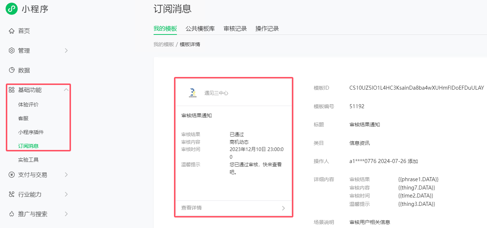
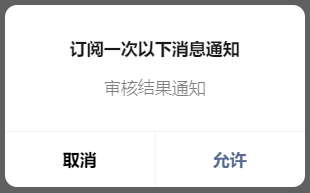
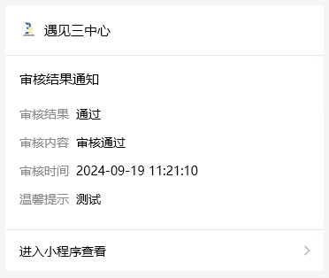

# 微信小程序通知

> 官方文档：[developers.weixin.qq.com/miniprogram/dev/framework/open-ability/subscribe-message.html](https://developers.weixin.qq.com/miniprogram/dev/framework/open-ability/subscribe-message.html)

## 使用步骤

- 获取模板ID：
  - 在微信公众平台手动配置获取模板 ID：登录[https://mp.weixin.qq.com](https://mp.weixin.qq.com/)获取模板，如果没有合适的模板，可以申请添加新模板，审核通过后可使用
- 获取下发权限：
  - 一次性订阅消息、长期订阅消息，详见接口[wx.requestSubscribeMessage](https://developers.weixin.qq.com/miniprogram/dev/api/open-api/subscribe-message/wx.requestSubscribeMessage.html)，设备订阅消息，详见接口[wx.requestSubscribeDeviceMessage](https://developers.weixin.qq.com/miniprogram/dev/api/open-api/subscribe-message/wx.requestSubscribeDeviceMessage.html)
- 调用接口下发订阅消息：
  - 一次性订阅消息、长期订阅消息，详见服务端接口[subscribeMessage.send](https://developers.weixin.qq.com/miniprogram/dev/api-backend/open-api/subscribe-message/subscribeMessage.send.html)，次数限制：开通支付能力的小程序下发上限是3kw/日，没开通的是1kw/日。设备订阅消息，详见服务端接口[hardwareDevice.send](https://developers.weixin.qq.com/miniprogram/dev/api-backend/open-api/hardware-device/hardwareDevice.send.html)

注意：用户勾选`"总是保持以上选择，不再询问"`之后，下次订阅调用`wx.requestSubscribeMessage`不会弹窗，保持之前的选择，修改选择需要打开小程序设置进行修改

**配置模板**：



**用户同意**：



**发送结果**：



## 示例代码

### 请求处理

> [uni.requestSubscribeMessage(Object object) | uni-app官网 (dcloud.net.cn)](https://uniapp.dcloud.net.cn/api/other/requestSubscribeMessage.html#requestsubscribemessage)

subscribe.js

```js
export default {
	noticeExamine() {
		uni.requestSubscribeMessage({
			// 需要用户同意的模板
			tmplIds: ['CS10UZ5lO1L4HC3KsainDa8ba4wXUHmFlDoEFDuULAY'],
			success(res) {
				// CS10UZ5lO1L4HC3KsainDa8ba4wXUHmFlDoEFDuULAY: "accept"，errMsg: "requestSubscribeMessage:ok"
				console.log(res, "----")
			},
			fail(res) {
				console.log(res, "----")
			}
		})
	}
}
```

### 后端处理

> 如果用户没同意，会发送失败，会返回`error_msg`为`user refuse to accept the msg rid: 66bf2320-3c6e441a-2eee3801`

定义发送给用户的内容`WxExamineData.java`

```java
import com.alibaba.fastjson2.JSONObject;

public class WxExamineData {
    /**
     * 审核结果
     * {{phrase1.DATA}}
     * 审核内容
     * {{thing7.DATA}}
     * 审核时间
     * {{time2.DATA}}
     * 温馨提示
     * {{thing3.DATA}}
     */

    /**
     * 已通过
     */
    private JSONObject phrase1;

    /**
     * 商机动态
     */
    private JSONObject thing7;

    /**
     * 2023年12月10日 23:00:00
     */
    private JSONObject time2;

    /**
     * 您已通过审核，快来查看吧。
     */
    private JSONObject thing3;

    public JSONObject getPhrase1() {
        return phrase1;
    }

    public void setPhrase1(String phrase1) {
        JSONObject jsonObject = new JSONObject();
        jsonObject.put("value", phrase1);
        this.phrase1 = jsonObject;
    }

    public JSONObject getThing7() {
        return thing7;
    }

    public void setThing7(String thing7) {
        JSONObject jsonObject = new JSONObject();
        jsonObject.put("value", thing7);
        this.thing7 = jsonObject;
    }

    public JSONObject getTime2() {
        return time2;
    }

    public void setTime2(String time2) {
        JSONObject jsonObject = new JSONObject();
        jsonObject.put("value", time2);
        this.time2 = jsonObject;
    }

    public JSONObject getThing3() {
        return thing3;
    }

    public void setThing3(String thing3) {
        JSONObject jsonObject = new JSONObject();
        jsonObject.put("value", thing3);
        this.thing3 = jsonObject;
    }
}

```

定义发送给微信的消息体`WxInformMsg.java`

```java
/**
 * 微信通知消息体
 */
public class WxInformMsg<T> {
    /**
     * 用户的openid（要发送给的那个用户）
     */
    private String touser;

    /**
     * 订阅消息模板id
     */
    private String template_id;

    /**
     * 点击消息跳转的页面
     */
    private String page = "pages/index/index";

    private T data;

    /**
     * 跳转小程序类型
     * developer为开发版；trial为体验版；formal为正式版；
     */
    private String miniprogram_state;

    private String lang = "zh_CN";
}
```

定义微信Token对象`WxAccessToken.java`

```java
public class WxAccessToken {

    private String access_token;

    private Integer expires_in;
}
```

定义微信返回结果对象`WxMsgResponse.java`

```java
public class WxMsgResponse {

    private Integer errcode;

    public String errmsg;
}
```

定义发送的请求的对象`WxRestTemplate.java`

```java
    /**
     * WxToken获取方法
     *
     * @return WxAccessToken对象
     */
    private WxAccessToken getWxAccessToken() {
        String wxMsgUrl = String.format("https://api.weixin.qq.com/cgi-bin/token?grant_type=client_credential" +
                        "&appid=%s" +
                        "&secret=%s",
                wxAppConfig.getAppId(), wxAppConfig.getAppSecret());
        ResponseEntity<WxAccessToken> forEntity = restTemplate.getForEntity(wxMsgUrl, WxAccessToken.class);
        if (ObjectUtils.isEmpty(forEntity.getBody()) || ObjectUtils.isEmpty(forEntity.getBody().getAccess_token())) {
            throw new UniappException("获取Token异常");
        }
        return forEntity.getBody();
    }

    /**
     * 获取微信请求令牌
     *
     * @return 令牌值
     */
    private String getAccessToken() {
        // 查找是否有Redis缓存
        WxAccessToken wxAccessToken = redisCache.getCacheObject(WXACCESSTOKEN);
        if (ObjectUtils.isEmpty(wxAccessToken)) {
            wxAccessToken = getWxAccessToken();
            // 设置Redis缓存
            redisCache.setCacheObject(WXACCESSTOKEN, wxAccessToken);
            redisCache.expire(WXACCESSTOKEN, wxAccessToken.getExpires_in() - 200);
        }
        return wxAccessToken.getAccess_token();
    }

    /**
     * 微信消息通知方法
     *
     * @param wxInformMsg 微信通知结构
     * @return 结果响应
     */
    public WxMsgResponse sendWxMsg(WxInformMsg<?> wxInformMsg) {
        String url = "https://api.weixin.qq.com/cgi-bin/message/subscribe/send?access_token=" + getAccessToken();
        if (active.equals("dev")) {
            wxInformMsg.setMiniprogram_state("trial");
        } else {
            wxInformMsg.setMiniprogram_state("formal");
        }
        ResponseEntity<WxMsgResponse> wxMsgResponseResponseEntity = restTemplate.postForEntity(url, wxInformMsg, WxMsgResponse.class);
        if (ObjectUtils.isEmpty(wxMsgResponseResponseEntity.getBody()) || wxMsgResponseResponseEntity.getBody().getErrcode() != 0) {
            // 用户没有授权43101 47003格式错误
            return wxMsgResponseResponseEntity.getBody();
        }
        return null;
    }

    /**
     * 微信审核结果提醒
     *
     * @param wxExamineData 发送对象
     * @param open_id       用户唯一标识
     * @param page          跳转路径
     * @return 响应结果
     */
    public WxMsgResponse sendWxExamineMsg(WxExamineData wxExamineData, String open_id, String page) {
        WxInformMsg<WxExamineData> wxInformMsg = new WxInformMsg<>();
        wxInformMsg.setTemplate_id(WxSubscribeEnum.WXEXAMINE.getTemplate());
        wxInformMsg.setPage(page);
        wxInformMsg.setTouser(open_id);
        wxInformMsg.setData(wxExamineData);
        return sendWxMsg(wxInformMsg);
    }
```