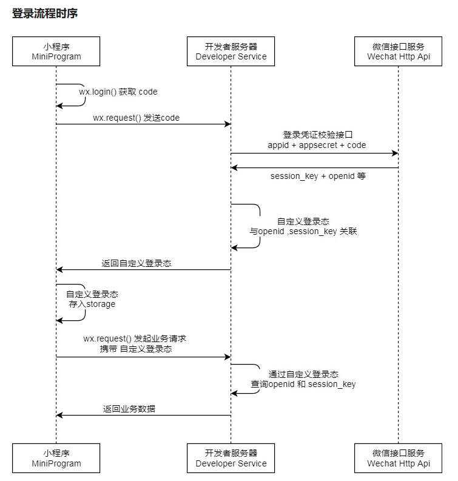

# 微信小程序登录

## 登录时序图



说明：

- 调用`wx.login()`获取 临时登录凭证code ，并回传到开发者服务器
- 调用`auth.code2Session`接口，换取 用户唯一标识 OpenID 、 用户在微信开放平台账号下的唯一标识UnionID（若当前小程序已绑定到微信开放平台账号） 和会话密钥`session_key`

之后开发者服务器可以根据用户标识来生成自定义登录态，用于后续业务逻辑中前后端交互时识别用户身份

注意事项：

- 会话密钥 session_key 是对用户数据进行 加密签名 的密钥。为了应用自身的数据安全，开发者服务器不应该把会话密钥下发到小程序，也不应该对外提供这个密钥
- 临时登录凭证 code 只能使用一次

## 前端请求代码

调用接口获取登录凭证（code）。通过凭证进而换取用户登录态信息，包括用户在当前小程序的唯一标识（openid）、微信开放平台账号下的唯一标识（unionid，若当前小程序已绑定到微信开放平台账号）及本次登录的会话密钥（session_key）等。用户数据的加解密通讯需要依赖会话密钥完成

示例代码：

```js
wx.login({
  success (res) {
    if (res.code) {
      //发起网络请求
      wx.request({
        url: 'https://example.com/onLogin',
        data: {
          code: res.code
        }
      })
    } else {
      console.log('登录失败！' + res.errMsg)
    }
  }
})
```

完整参数代码：

```js
wx.login({
  timeout: 10000, // 设置超时时间为10秒
  success: function(res) {
    if (res.code) {
      // 发起网络请求
      wx.request({
        url: 'https://example.com/onLogin',
        data: {
          code: res.code
        }
      })
    } else {
      console.log('登录失败！' + res.errMsg)
    }
  },
  fail: function(err) {
    // 登录失败的回调函数
    console.log('登录接口调用失败')
  },
  complete: function() {
    // 接口调用结束的回调函数，无论成功还是失败都会执行
    console.log('登录流程结束')
  }
})
```

回调函数：

- `object.success`回调函数，`code`为用户登录凭证（有效期五分钟）。开发者需要在开发者服务器后台调用`code2Session`，使用 code 换取 openid、unionid、session_key 等信息
- `object.fail`回调函数，`errMsg`为错误信息，`errno`为错误码

## 后台请求代码

登录凭证校验。通过 wx.login 接口获得临时登录凭证 code 后传到开发者服务器调用此接口完成登录流程

请求接口：

```
GET https://api.weixin.qq.com/sns/jscode2session
```

请求参数：

|    属性    |  类型  | 必填 |                   说明                   |
| :--------: | :----: | :--: | :--------------------------------------: |
|   appid    | string |  是  |               小程序appId                |
|   secret   | string |  是  |             小程序appSecret              |
|  js_code   | string |  是  |   登录时获取的code，可通过wx.login获取   |
| grant_type | string |  是  | 授权类型，此处只需填写authorization_code |

返回参数：

|    属性     |  类型  |                             说明                             |
| :---------: | :----: | :----------------------------------------------------------: |
| session_key | string |                           会话密钥                           |
|   unionid   | string | 用户在开放平台的唯一标识符，若当前小程序已绑定到微信开放平台账号下会返回 |
|   errmsg    | string |                           错误信息                           |
|   openid    | string |                         用户唯一标识                         |
|   errcode   | int32  |                            错误码                            |

> 如果开发者拥有多个移动应用、网站应用、和公众账号（包括小程序），可通过 UnionID 来区分用户的唯一性，因为只要是同一个微信开放平台账号下的移动应用、网站应用和公众账号（包括小程序），用户的 UnionID 是唯一的。换句话说，同一用户，对同一个微信开放平台下的不同应用，UnionID是相同的

错误码：

| 属性  |                        错误码取值                         |            解决方案            |
| :---: | :-------------------------------------------------------: | :----------------------------: |
| 40029 |                         code 无效                         |          js_code无效           |
| 45011 | api minute-quota reach limit mustslower retry next minute |   API 调用太频繁，请稍候再试   |
| 40226 |                       code blocked                        | 高风险等级用户，小程序登录拦截 |
|  -1   |                       system error                        |          用户唯一标识          |

请求示例：

```
GET https://api.weixin.qq.com/sns/jscode2session?appid=APPID&secret=SECRET&js_code=JSCODE&grant_type=authorization_code
```

响应示例：

```json
    {
        "openid":"xxxxxx",
        "session_key":"xxxxx",
        "unionid":"xxxxx",
        "errcode":0,
        "errmsg":"xxxxx"
    }
```

## 登录状态校验

检查登录态是否过期。 通过`wx.login`接口获得的用户登录态拥有一定的时效性。用户越久未使用小程序，用户登录态越有可能失效。反之如果用户一直在使用小程序，则用户登录态一直保持有效。具体时效逻辑由微信维护，对开发者透明。开发者只需要调用 wx.checkSession 接口检测当前用户登录态是否有效

参数：

|   属性   |   类型   | 必填 |                       说明                       |
| :------: | :------: | :--: | :----------------------------------------------: |
| success  | function |  否  |              接口调用成功的回调函数              |
|   fail   | function |  否  |              接口调用失败的回调函数              |
| complete | function |  否  | 接口调用结束的回调函数（调用成功、失败都会执行） |

示例代码：

```js
wx.checkSession({
  success () {
    //session_key 未过期，并且在本生命周期一直有效
  },
  fail () {
    // session_key 已经失效，需要重新执行登录流程
    wx.login() //重新登录
  }
})
```

> 这个接口主要用于小程序在前端检测登录态的有效性，确保在返回业务数据之前，用户的登录状态是有效的