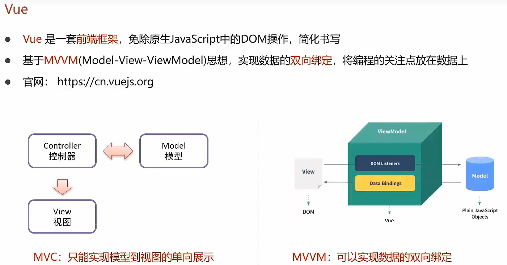
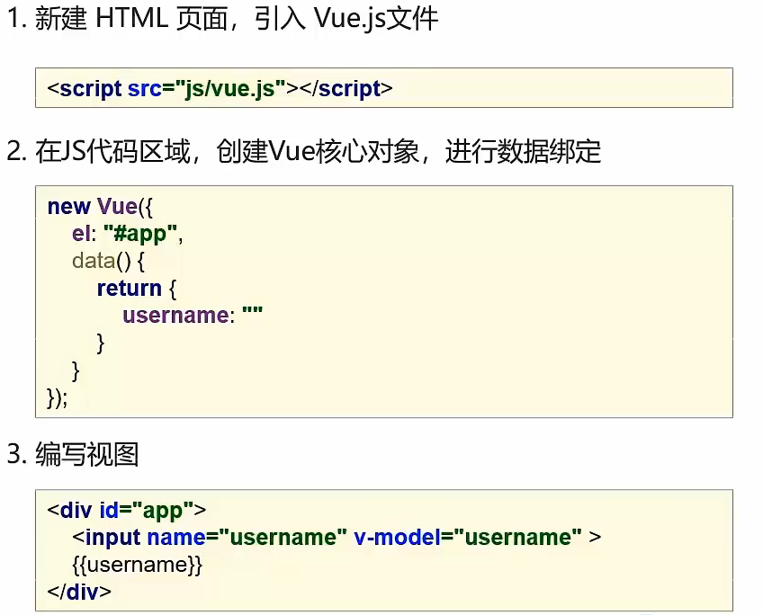
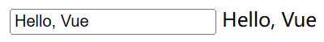

# Vue入门

## Vue概念



## Vue快速入门



```html
<!DOCTYPE html>
<html lang="en">
<head>
    <meta charset="UTF-8">
    <meta name="viewport" content="width=device-width, initial-scale=1.0">
    <title>Document</title>
    <script src="js/vue.js"></script>
</head>
<body>
    <div id="app">
        <input type="text" v-model="message">
        {{message}}
    </div>
</body>
<script>
    // 定义Vue对象
    new Vue({
        el: "#app", // Vue接管区域
        data: {
            message: "Hello, Vue"
        }
    })
</script>
</html>
```

> 两个数据进行了绑定，修改方框内的值，也会导致方框外的值发生改变
>
> 
