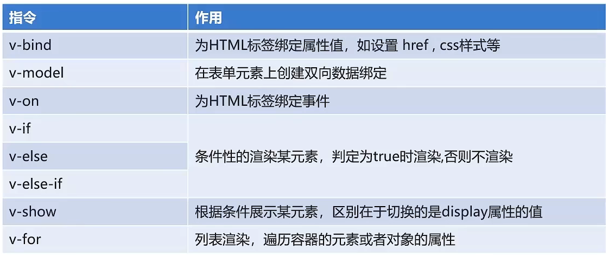
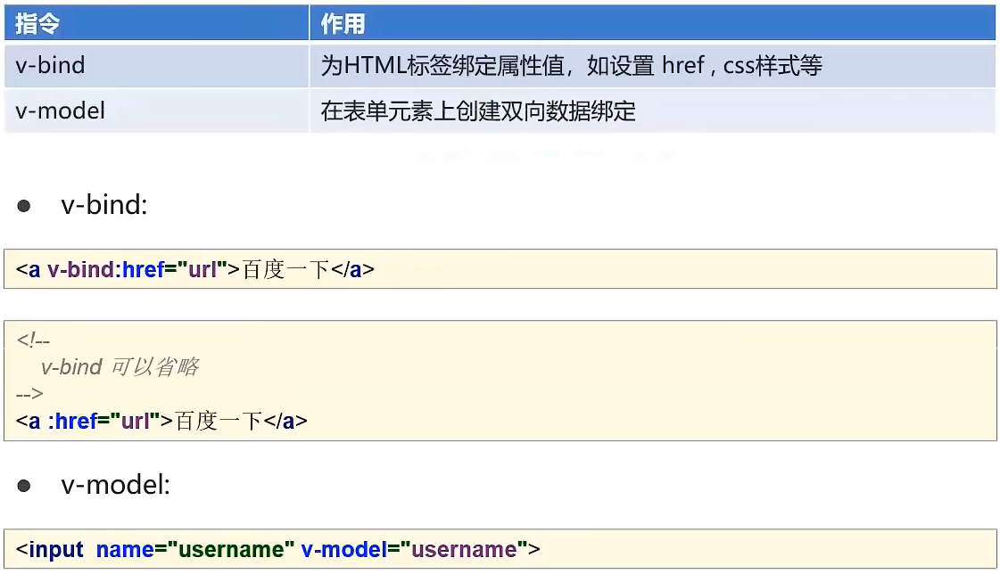
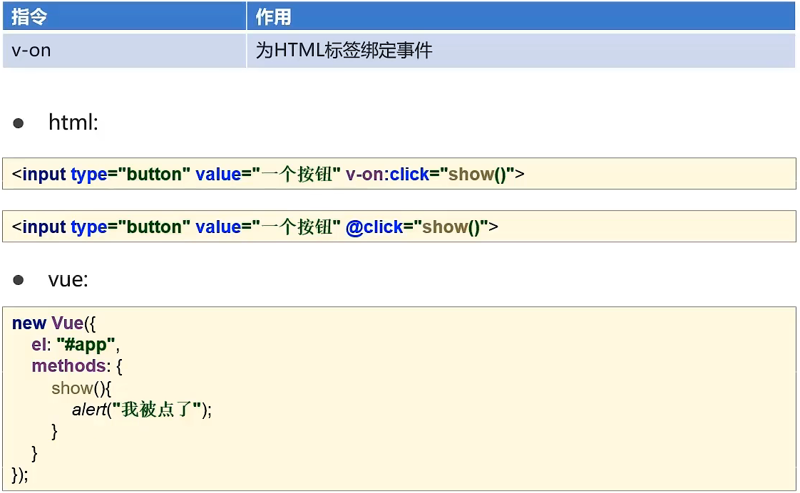
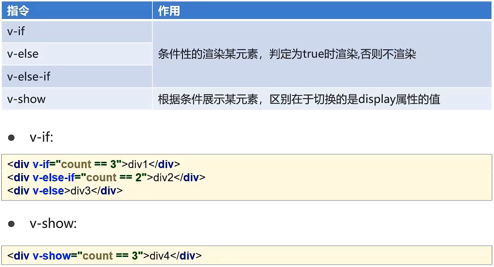
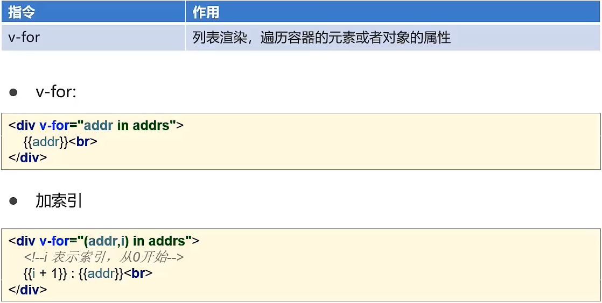
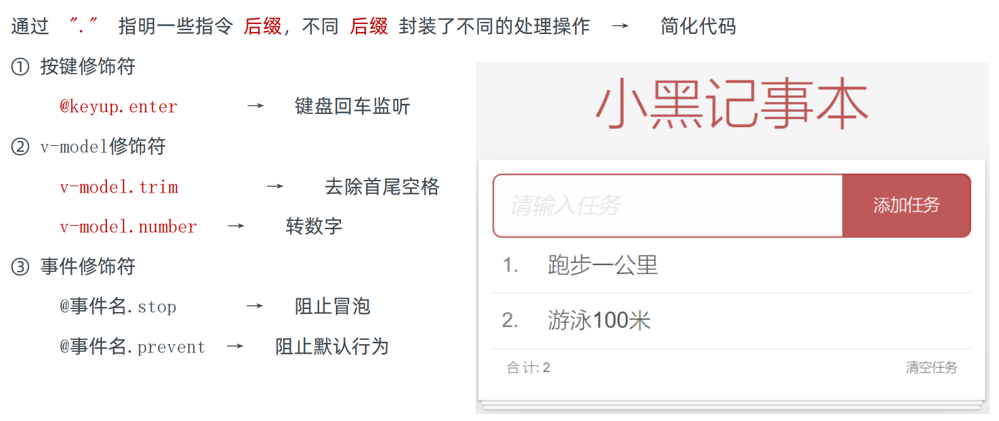
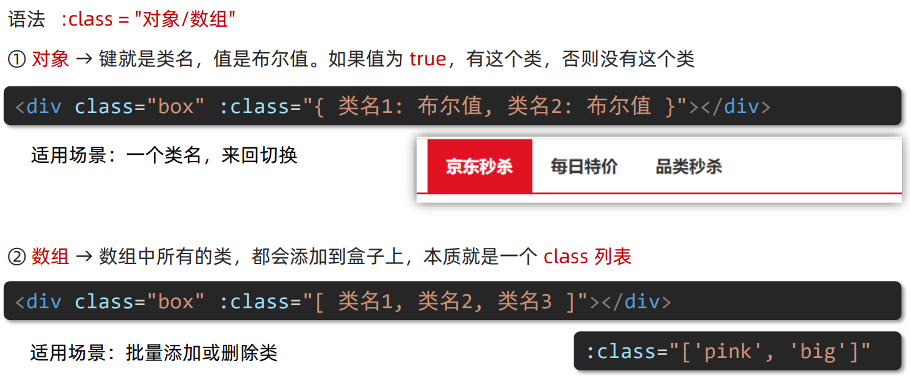
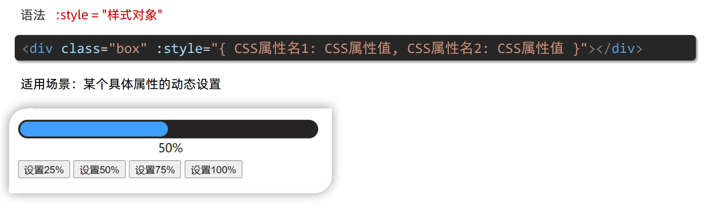
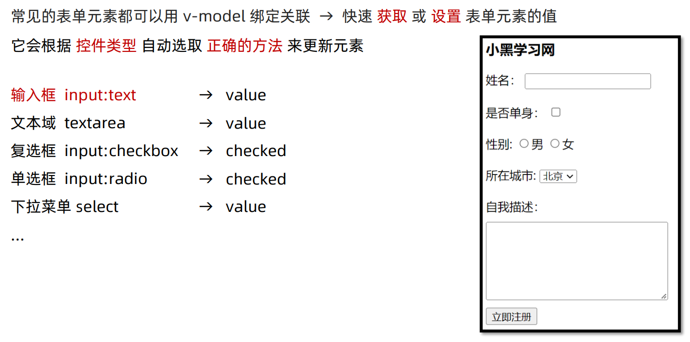
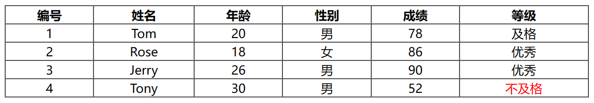

# Vue常用指令

## Vue常用指令

- 指令：HTML标签上带有V-前缀的特殊属性，不同指令具有不同含义



### v-bind和v-model



> `v-model`本质上它是`v-bind`和`v-on`的语法糖，在一个输入元素上时，背后大致相当于这样：
>
> ```vue
> <input v-bind:value="message" v-on:input="message = $event.target.value">
> ```

### v-on



### v-if和v-show



### v-for



### 循环对象

> - 单一参数循环：当使用一个参数（如`v-for="value in myObject"`），循环将只输出每个元素的值。在数组中，这将输出数组项；在对象中，这将输出对象的属性值
> - 双参数循环：使用两个参数（如`v-for="(value, key) in myObject"`），循环将输出每个元素的值及其对应的键。这对于对象非常有用，因为它允许你同时访问属性值和属性键
> - 三参数循环：使用三个参数（如`v-for="(value, key, index) in myObject"`），循环将输出每个元素的值、键以及它们在源数据中的索引位置

```vue
<template>
  <ul>
    <li v-for="(value, key, index) in object">
      {{ index }}. {{ key }}: {{ value }}
    </li>
  </ul>
</template>

<script>
export default {
  data() {
    return {
      object: {
        firstName: 'John',
        lastName: 'Doe',
        age: 30
      }
    };
  }
};
</script>
```

## 指令修饰符

> 修饰符是以半角点`.`表示的特殊后缀，指令修饰符用于指出一个指令应该以特殊方式绑定



> - `.native`修饰符用于监听自定义组件根元素上的原生 DOM 事件。在 Vue 2 中，组件上的事件监听器**默认只监听自定义事件**（通过 `$emit` 触发），而不是原生 DOM 事件。使用 `.native` 修饰符可以告诉 Vue，**想要监听组件的根元素上的原生事件**
>   - 在 Vue 3 中，不再需要 `.native` 修饰符，因为组件上的事件监听器**默认就是监听原生事件**
> - `.stop` 修饰符用于阻止事件冒泡。在 DOM 中，事件默认会从触发事件的元素向上冒泡到父元素。使用 `.stop` 修饰符可以阻止这个冒泡过程
>   - `@tap.stop` 修饰符用于阻止触摸事件（如点击、长按等）的冒泡
>   - `@click.stop` 修饰符用于阻止点击事件的冒泡，点击事件是用户在屏幕上快速点击的行为

## v-bind对于样式控制的增强

> 为了方便开发者进行样式控制， Vue 扩展了`v-bind`的语法，可以针对`class`类名和`style`行内样式进行控制

### 操作class



### 操作style



## v-model应用于其他表单元素



## 案例

```html
<!DOCTYPE html>
<html lang="en">
<head>
    <meta charset="UTF-8">
    <meta name="viewport" content="width=device-width, initial-scale=1.0">
    <title>Document</title>
    <!-- 本地文件 -->
    <script src="js/vue.js"></script>
    <!-- 生产环境 -->
	<!-- <script src="https://cdn.jsdelivr.net/npm/vue@2/dist/vue.min.js"></script> -->
	<!-- 开发环境 -->
    <!-- <script src="https://cdn.jsdelivr.net/npm/vue@2/dist/vue.js"></script> -->
</head>
<body>
    <div id="app">
        <table border="1" cellspacing="0" width="60%">
            <tr>
                <th>编号</th>
                <th>姓名</th>
                <th>年龄</th>
                <th>性别</th>
                <th>成绩</th>
                <th>等级</th>
            </tr>
            <!-- :key为每个被迭代的元素提供唯一的标识符，以提高性能、维持状态和避免警告 -->
            <tr align="center" v-for="(user, index) in users" :key="index">
                <td>{{index+1}}</td>
                <td>{{user.name}}</td>
                <td>{{user.age}}</td>
                <td>
                    <span v-if="user.gender == 1">男</span>
                    <span v-if="user.gender == 2">女</span>
                </td>
                <td>{{user.score}}</td>
                <td>
                    <span v-if="user.score >= 85">优秀</span>
                    <!-- 只要能到第二个条件，那第一个条件是肯定不成立的 -->
                    <span v-else-if="user.score >= 60">及格</span>
                    <span v-else style="color: red;">不及格</span>
                </td>
            </tr>
        </table>
    </div>
</body>
<script>
    // 定义Vue对象
    new Vue({
        el: "#app", // Vue接管区域
        data: {
            users:[{
                name: 'Tom',
                age: 20,
                gender: 1,
                score: 78
            },{
                name: 'Rose',
                age: 18,
                gender: 2,
                score: 86
            },{
                name: 'Jerry',
                age: 26,
                gender: 1,
                score: 90
            },{
                name: 'Tony',
                age: 30,
                gender: 1,
                score: 52
            }]
        }
    })
</script>
</html>
```

> 