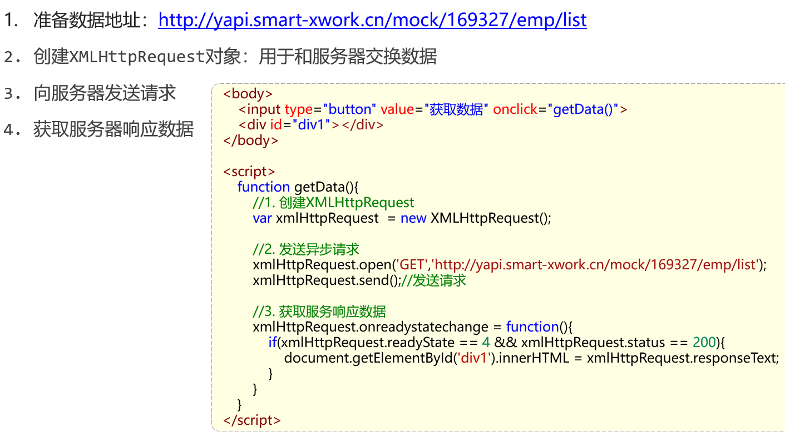

# Ajax


## 同步与异步


## 原生Ajax



## Axios

对原生的Ajax进行了封装，简化书写，快速开发

官网：https://www.axios-http.cn/


### 请求方式简写


两者等同：

```js
        axios({
            method: "post",
            url: "http://yapi.smart-xwork.cn/mock/169327/emp/deleteById",
            data: "id=1"
        }).then(result => {
            console.log(result.data);
        })


        axios.post("http://yapi.smart-xwork.cn/mock/169327/emp/deleteById","id=1").then(result => {
            console.log(result.data);
        })
```

## 发送请求绑定数据

```html
<!DOCTYPE html>
<html lang="en">
<head>
    <meta charset="UTF-8">
    <meta http-equiv="X-UA-Compatible" content="IE=edge">
    <meta name="viewport" content="width=device-width, initial-scale=1.0">
    <title>Ajax-Axios-案例</title>
    <script src="js/axios-0.18.0.js"></script>
    <script src="js/vue.js"></script>
</head>
<body>
    <div id="app">
        <table border="1" cellspacing="0" width="60%">
            <tr>
                <th>编号</th>
                <th>姓名</th>
                <th>图像</th>
                <th>性别</th>
                <th>职位</th>
                <th>入职日期</th>
                <th>最后操作时间</th>
            </tr>

            <tr align="center" v-for="(emp,index) in emps">
                <td>{{index + 1}}</td>
                <td>{{emp.name}}</td>
                <td>
                    
                </td>
                <td>
                    <span v-if="emp.gender == 1">男</span>
                    <span v-if="emp.gender == 2">女</span>
                </td>
                <td>{{emp.job}}</td>
                <td>{{emp.entrydate}}</td>
                <td>{{emp.updatetime}}</td>
            </tr>
        </table>
    </div>
</body>
<script>
    new Vue({
       el: "#app",
       data: {
         emps:[]
       },
       mounted () {
          //发送异步请求,加载数据
          axios.get("http://yapi.smart-xwork.cn/mock/169327/emp/list").then(result => {
            this.emps = result.data.data;
          })
       }
    });
</script>
</html>
```

> JSON数据
>
> 
>
> 运行效果
>
> 