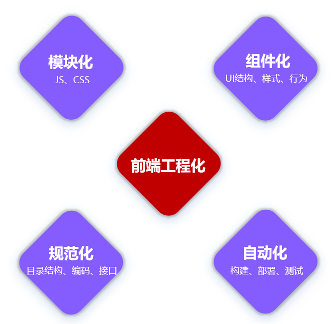
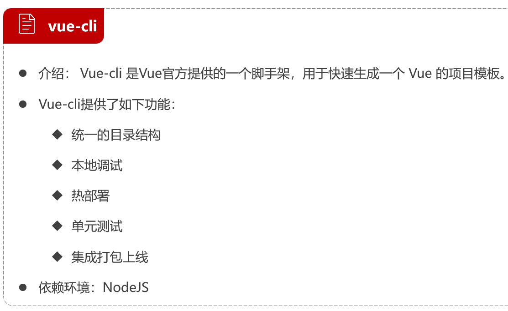
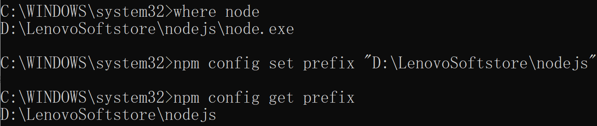
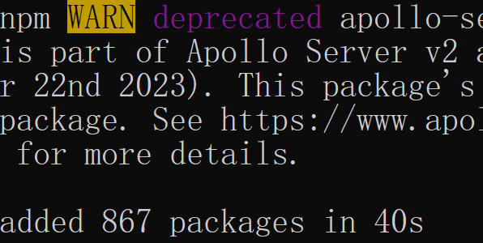
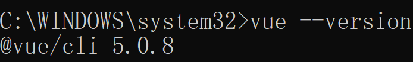

# 前端工程化

前端工程化是指在企业级的前端项目开发中，把前端开发所需的工具、技术、流程、经验等进行规范化、标准化



## vue-cli



## 配置node.js的基本环境

> node.js直接安装即可

### 配置npm的全局安装路径

以管理员身份运行命令行窗口，执行如下命令：

```
npm config set prefix "D:\LenovoSoftstore\nodejs"
```

> 通过`where node`查看安装node.js应用目录
>
> 

### 切换npm的淘宝镜像

以管理员身份运行命令行窗口，执行如下命令：

```
npm config set registry https://registry.npm.taobao.org
```

## 安装脚手架vue-cli

以管理员身份运行命令行窗口，执行如下命令：

```
npm install -g @vue/cli
```

> 

检测是否安装完成：

```
vue --version
```

> 