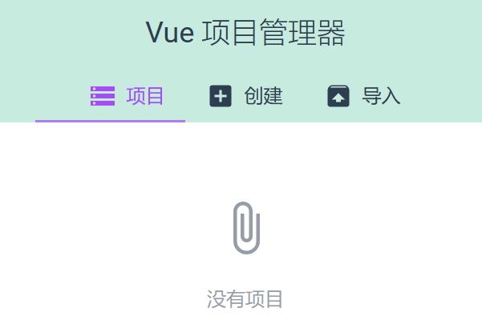
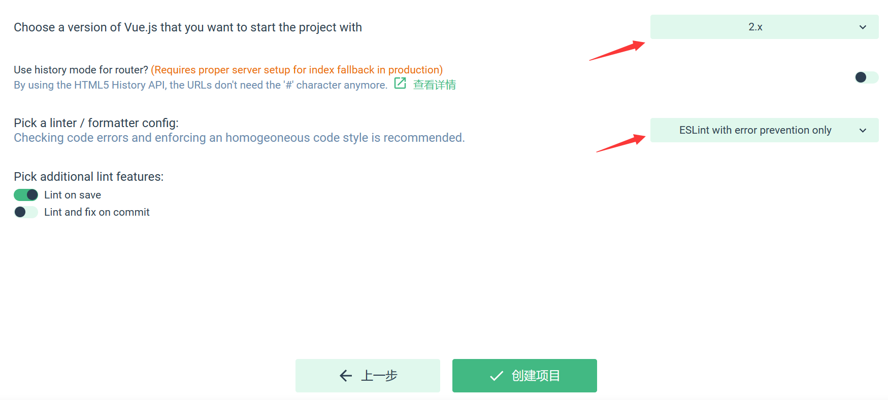
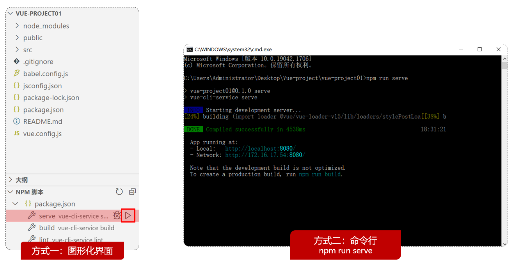
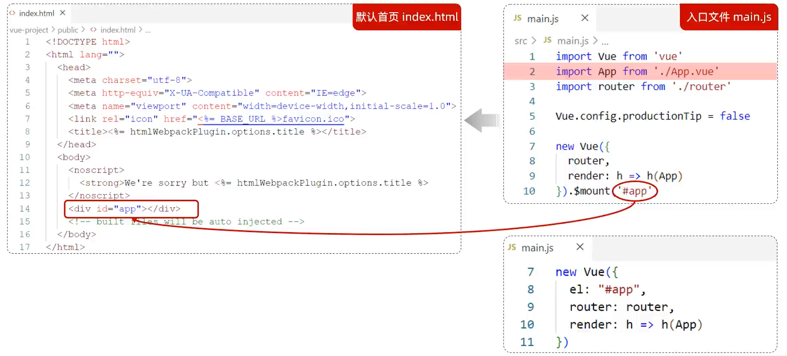

# Vue项目

## Vue项目创建

- 命令行方式：`vue create vue-project01`
- 图形化界面：`vue ui`

> 使用图形化的方式更为简便

在需要创建的文件目录下使用命令行窗口，执行图形化界面的命令：


通过图形化界面创建Vue项目：



## 创建新项目

选择"创建"：


手动配置预设，添加"Router"预设：


选择vue2.x，并选择第一个语法检查规范：



创建完成：


> 可以通过VSCode打开文件夹

## 目录结构


## 项目启动

启动项目方式：



> 通过编译器集成的启动更为便捷

修改VScode的设置：


重启，打开package.json：


点击运行：


启动效果：


## 配置端口


```js
const { defineConfig } = require('@vue/cli-service')
module.exports = defineConfig({
  transpileDependencies: true,
  devServer:{
    port: 7000
  }
})
```

> 

## Vue项目开发流程



## Vue组件


App.vue

```vue
<template>
  <div>
    <h1>{{message}}</h1>
  </div>
</template>

<script>
export default {
  data(){
    return{
      message: "Hello,Vue2"
    }
  }
}
</script>

<style>

</style>
```

> 