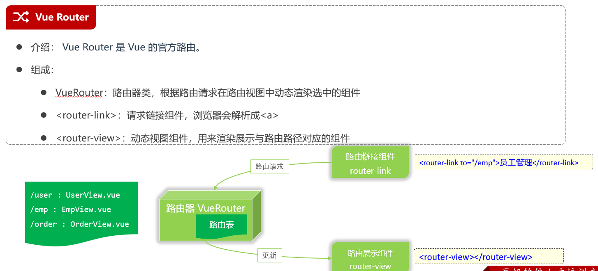
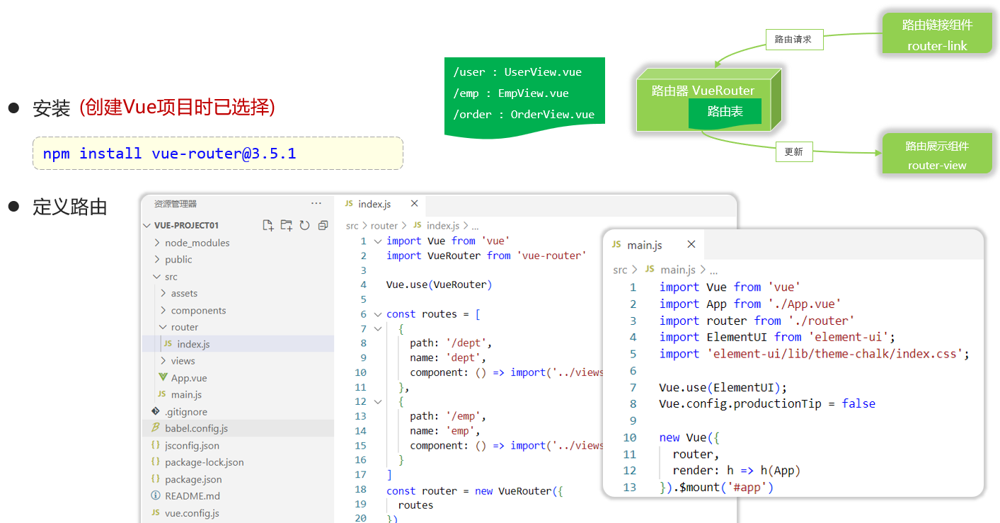
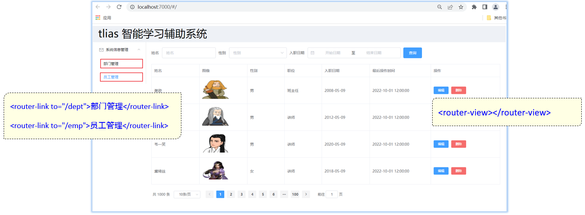
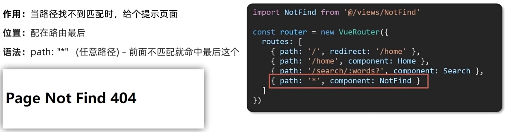
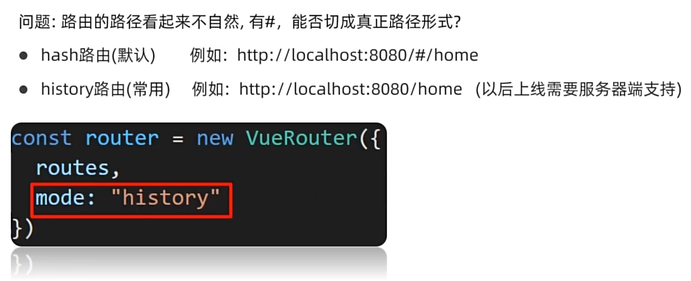
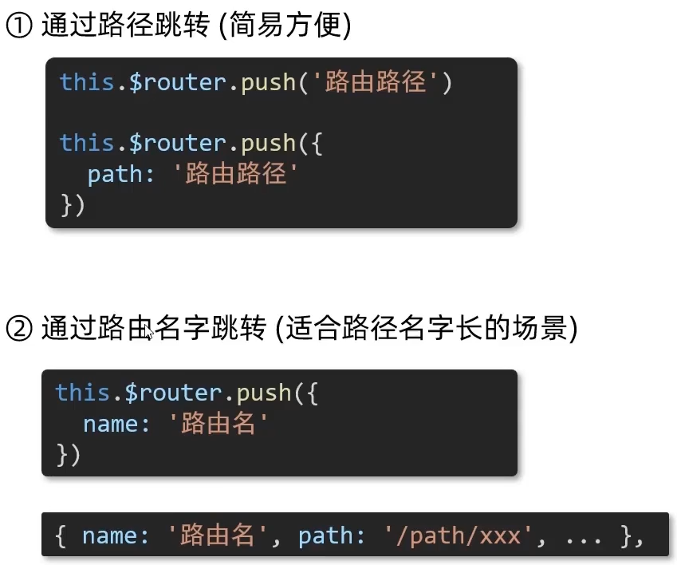
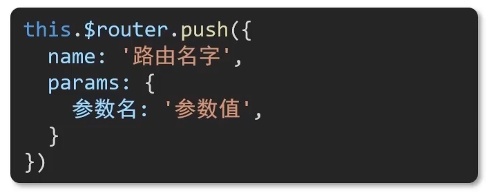

# Vue路由



## 基本使用



> 不指定版本直接安装会因为现在默认支持vue3而报错

index.js

```js
import Vue from 'vue'
import VueRouter from 'vue-router'

Vue.use(VueRouter)

const routes = [
  {
    path: '/dept',
    name: 'dept',
    component: () => import('../views/tlias/DeptView.vue')
  },
  {
    path: '/emp',
    name: 'emp',
    component: () => import('../views/tlias/EmpView.vue')
  },
  {
    path: '/',
    redirect: '/dept' // 当访问首页时，重定向到请求'/dept'
  },
  {
    path: '/about',
    name: 'about',
    // route level code-splitting
    // this generates a separate chunk (about.[hash].js) for this route
    // which is lazy-loaded when the route is visited.
    component: () => import(/* webpackChunkName: "about" */ '../views/AboutView.vue')
  }
]

const router = new VueRouter({
  routes
})

export default router
```

DeptView.vue

```vue
                <el-aside width="230px" style="border: 1px solid #eee">
                    <el-menu :default-openeds="['1', '3']">
                        <el-submenu index="1">
                            <template slot="title"><i class="el-icon-message"></i>系统信息管理</template>
                            <el-menu-item index="1-1">
                                <router-link to="/dept">部门管理</router-link>
                            </el-menu-item>
                            <el-menu-item index="1-2">
                                <router-link to="/emp">员工管理</router-link>
                            </el-menu-item>
                        </el-submenu>
                        </el-menu>
                </el-aside>
```

EmpView.vue

```vue
                <el-aside width="230px" style="border: 1px solid #eee">
                    <el-menu :default-openeds="['1', '3']">
                        <el-submenu index="1">
                            <template slot="title"><i class="el-icon-message"></i>系统信息管理</template>
                            <el-menu-item index="1-1">
                                <router-link to="/dept">部门管理</router-link>
                            </el-menu-item>
                            <el-menu-item index="1-2">
                                <router-link to="/emp">员工管理</router-link>
                            </el-menu-item>
                        </el-submenu>
                        </el-menu>
                </el-aside>
```

App.vue

```vue
<template>
  <div>
    <!-- <h1>{{message}}</h1> -->
    <!-- <element-view></element-view> -->

    <!-- 员工管理 -->
    <!-- <emp-view></emp-view> -->
    <router-view></router-view>

  </div>
</template>

<script>
// import EmpView from './views/tlias/EmpView.vue'
/* import ElementView from './views/element/ElementView.vue' */
export default {
  components: {/* EmpView */ /* ElementView */ },
  data() {
    return {
      message: "Hello vue222"
    }
  },
  methods: {
    
  }
}
</script>

<style>

</style>
```



## 404



## 路由模式



> 后端需要配置为：对于所有的单页面应用程序路由，都返回同一个HTML文件，一般为`index.html`

## 编程式导航

> 用JS代码来进行跳转



## 路由传参

> 两种传参方式：查询(query)传参 + 动态路由传参，两者都支持两种传参方式
>
> - path路径跳转传参
> - name命名路由跳转传参

### path路径跳转

path跳转 + 查询传参：


> 通过`$route.query.参数名`获取参数

path跳转 + 动态路由传参：


> 通过`$route.params.参数名`（动态路由传参需要配路由，配置如下所示）
>
> ```js
> const router = new VueRouter({
>   routes: [
>     {
>       path: '/user/:id', // 这里的 :id 就是一个路由参数
>       component: UserComponent
>     }
>   ]
> });
> ```

### name命名路由跳转

name命名路由跳转 + 查询传参：


> 通过`$route.query.参数名`获取参数

name命名路由跳转 + 动态路由传参：



> 通过`$route.params.参数名`（动态路由传参需要配路由，配置如上所示）