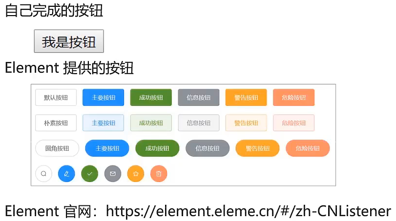
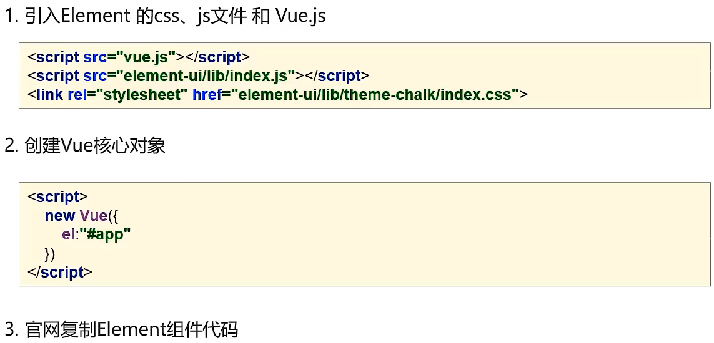
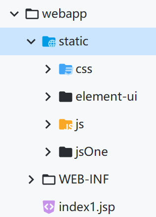
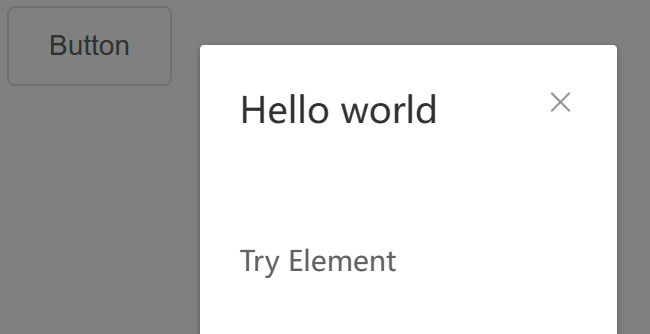
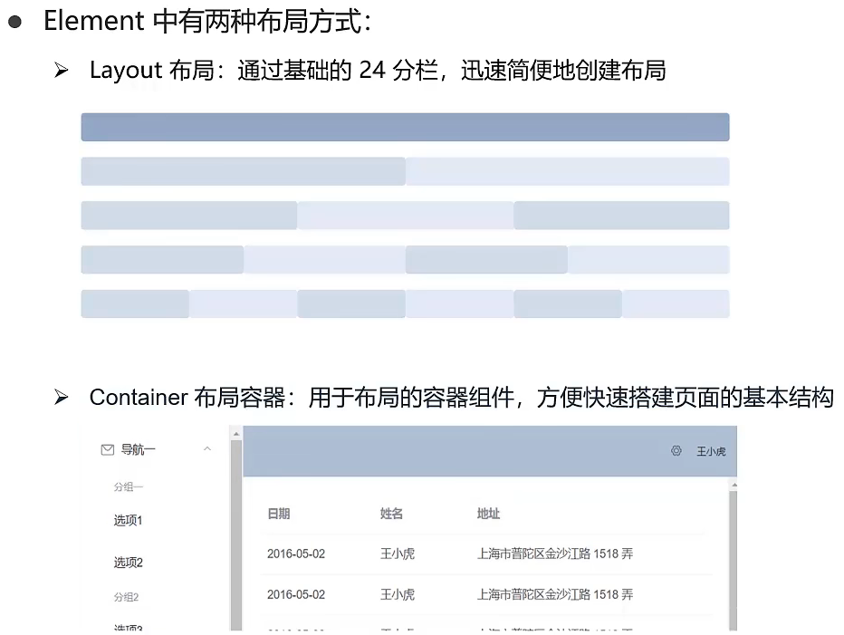
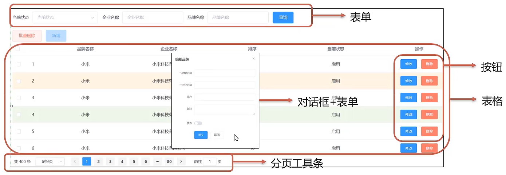

# Element

- Element：饿了么公司前端开发团队提供的一套基于Vue的网站组件库，用于快速构建网站

- 组件：组成网页的部件，例如：超链接、按钮、图片、表格等等



> 官网：[Element - 网站快速成型工具](https://element.eleme.cn/#/zh-CN)

## Element快速入门



### 引入

在`<head>`里面引用：

- 已下载文件版本(**更稳定，可以避免一些未知错误**)：(**SpringMVC需要放在static目录下，代表静态资源，其它目录则访问不到**)



```html
    <script th:src="@{/static/jsOne/vue.js}"></script>
    <script th:src="@{/static/jsOne/axios.js}"></script>
    <script th:src="@{/static/element-ui/lib/index.js}"></script>
    <link rel="stylesheet" th:href="@{/static/element-ui/lib/theme-chalk/index.css}" type="text/css">
```

- 官网网页引入版本：(**适合直接创建HTML文件运行查看效果**)

```html
	<script src="https://unpkg.com/vue@2/dist/vue.js"></script>
    <script src="https://unpkg.com/element-ui/lib/index.js"></script>
    <link rel="stylesheet" href="https://unpkg.com/element-ui/lib/theme-chalk/index.css">
```

### 创建Vue核心对象

在`<body>`标签的**末尾**(**仅限已下载文件**)或**以外**都可以(**使用return包裹后数据中变量只在当前组件中生效，不会影响其他组件**)

```html
	<script>
        new Vue({
            el: '#app',
            data: function() {
            return { visible: false }
          }
        })
	</script>
```

### 官网示例代码

```html
<!DOCTYPE html>
<html>
<head>
	<meta charset="UTF-8">
	<!-- import CSS -->
	<link rel="stylesheet" href="https://unpkg.com/element-ui/lib/theme-chalk/index.css">
</head>
<body>
	<div id="app">
		<el-button @click="visible = true">Button</el-button>
    	<el-dialog :visible.sync="visible" title="Hello world">
		<p>Try Element</p>
    	</el-dialog>
	</div>
</body>
	<!-- import Vue before Element -->
	<script src="https://unpkg.com/vue@2/dist/vue.js"></script>
	<!-- import JavaScript -->
	<script src="https://unpkg.com/element-ui/lib/index.js"></script>
	<script>
        new Vue({
            el: '#app',
            data: function() {
                return { visible: false }
            },
            methods: {
                test: function() {
                    
                }
            }
        })
	</script>
</html>
```



## Element布局



## Element组件

