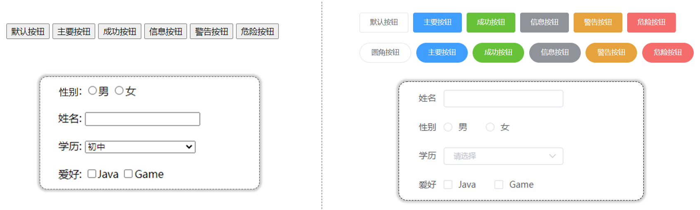
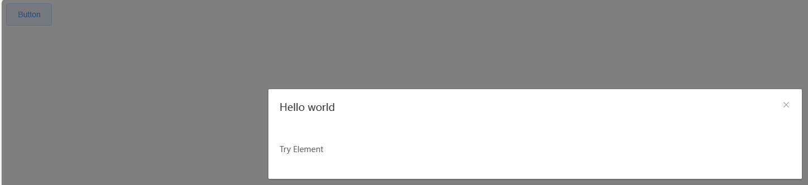
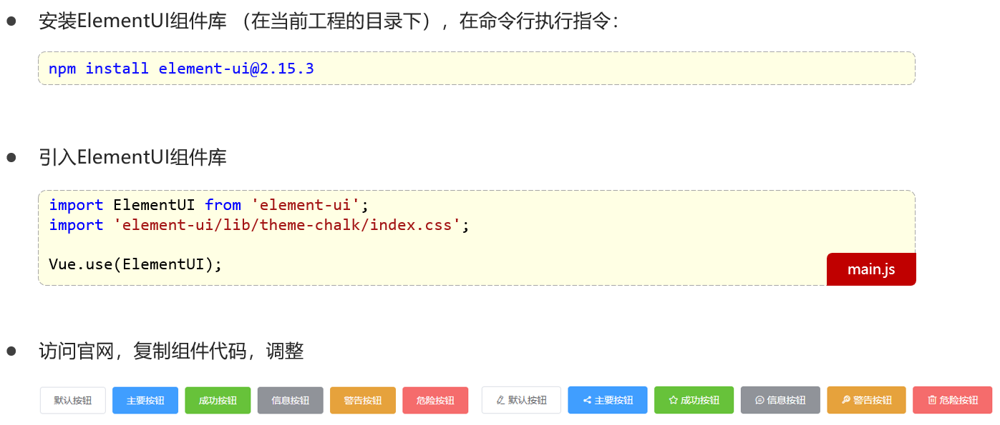
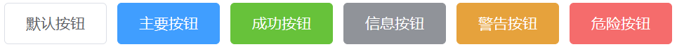

# Element入门

- Element：是饿了么团队研发的，一套为开发者、设计师和产品经理准备的基于 Vue 2.0 的桌面端组件库
- 组件：组成网页的部件，例如 超链接、按钮、图片、表格、表单、分页条等等
- 官网：[https://element.eleme.cn/#/zh-CNListener](https://element.eleme.cn/)



> 原生使用：
>
> ```html
> <!DOCTYPE html>
> <html>
> <head>
>   <meta charset="UTF-8">
>   <!-- import CSS -->
>   <link rel="stylesheet" href="https://unpkg.com/element-ui/lib/theme-chalk/index.css">
> </head>
> <body>
>   <div id="app">
>     <el-button @click="visible = true">Button</el-button>
>     <el-dialog :visible.sync="visible" title="Hello world">
>       <p>Try Element</p>
>     </el-dialog>
>   </div>
> </body>
>   <!-- import Vue before Element -->
>   <script src="https://unpkg.com/vue@2/dist/vue.js"></script>
>   <!-- import JavaScript -->
>   <script src="https://unpkg.com/element-ui/lib/index.js"></script>
>   <script>
>     new Vue({
>       el: '#app',
>       data: function() {
>         return { visible: false }
>       }
>     })
>   </script>
> </html>
> ```
>
> 

## 快速入门



> 从npm 5.0.0版本开始，`npm install`命令默认会添加`--save`选项的行为，实际相当于命令
>
> ```
> npm install element-ui@2.15.3 --save
> ```
>
> 可以在安装依赖的同时，将项目依赖加入脚手架的`package.json`中
>
> - `package.json`文件是项目的配置文件，用于管理项目的依赖关系和配置选项
> -  `package-lock.json`文件是 npm 用来锁定依赖版本的文件，确保项目在不同的环境中具有相同的依赖版本，是自动生成的，不需要手动编辑
>
> 这两个文件共同工作，确保项目的一致性和可重现性

main.js

```js
import Vue from 'vue'
import App from './App.vue'
import router from './router'
// 引入Element组件
import ElementUI from 'element-ui'
import 'element-ui/lib/theme-chalk/index.css'

Vue.config.productionTip = false
Vue.use(ElementUI)

new Vue({
  router,
  render: h => h(App)
}).$mount('#app')
```

ElementView.vue

```vue
<template>
  <div id="app">
    <el-row>
        <el-button>默认按钮</el-button>
        <el-button type="primary">主要按钮</el-button>
        <el-button type="success">成功按钮</el-button>
        <el-button type="info">信息按钮</el-button>
        <el-button type="warning">警告按钮</el-button>
        <el-button type="danger">危险按钮</el-button>
    </el-row>
  </div>
</template>

<script>
export default {

}
</script>

<style>

</style>
```

App.vue

```vue
<template>
  <element-view></element-view>
</template>

<script>
import ElementView from './views/element/ElementView.vue'
export default {
  components: { ElementView },

}
</script>

<style>

</style>
```

> 