# 前端环境搭建

## JS运行环境

node.js下载地址：[Index of /download/release/v16.20.2/ (nodejs.org)](https://nodejs.org/download/release/v16.20.2/)

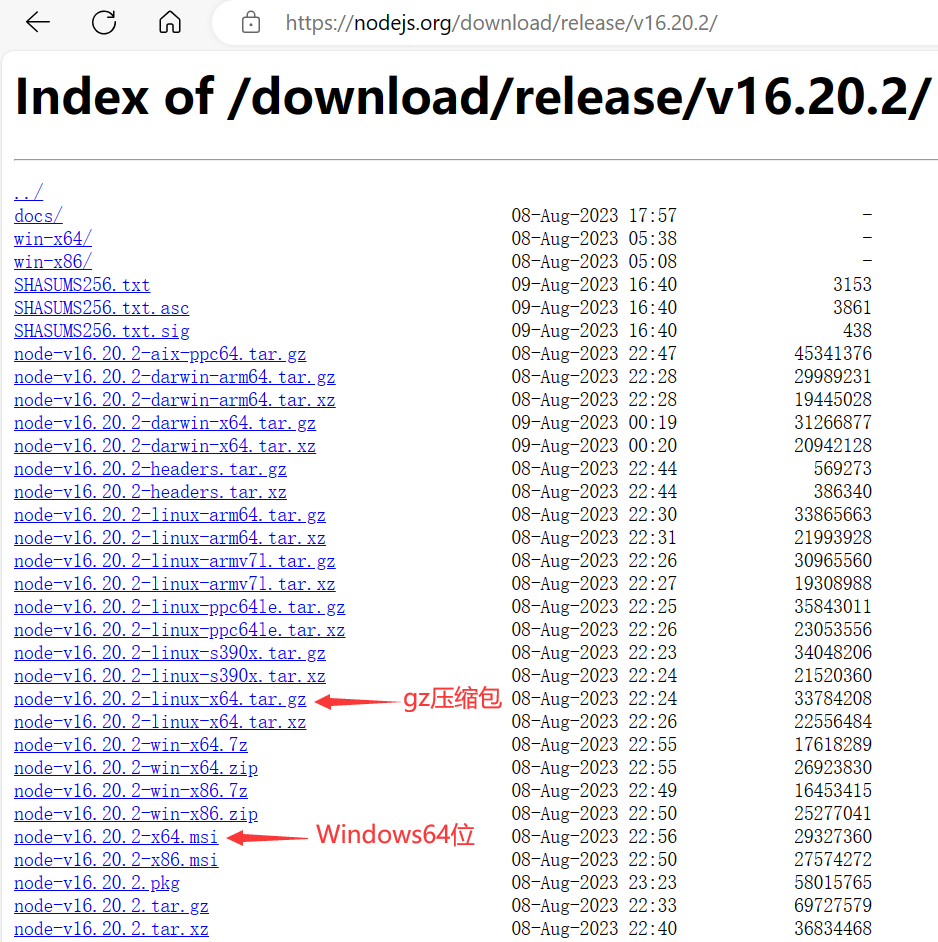

运行镜像文件之后除了同意协议，其他不需要动，等待安装完成

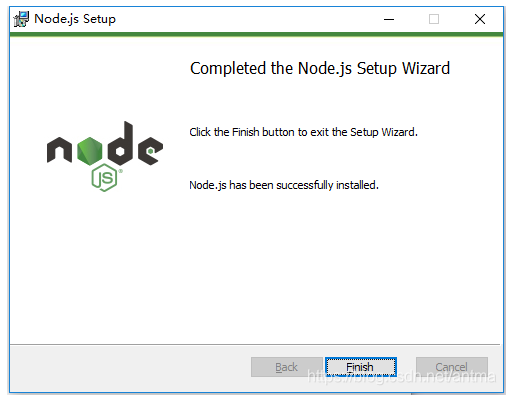

安装成功后，在上面安装过程中已自动配置了环境变量和安装好了npm包，此时可以执行 node -v 和 npm -v 分别查看node和npm的版本号

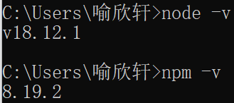

### 优化文件目录

因为在执行例如`npm install webpack -g`等命令全局安装的时候，默认会将模块安装在`C:\Users\用户名\AppData\Roaming`路径下的`npm`和`npm_cache`中，不方便管理且占用C盘空间，所以可以在D盘创建新建两个文件夹`node_global`和`node_cache`，然后在cmd命令下执行如下两个命令

```js
npm config set prefix "D:\Program Files\nodejs\node_global"

npm config set cache "D:\Program Files\nodejs\node_cache"
```

然后在环境变量 -> 系统变量中新建一个变量名为 “NODE_PATH”，变量值为安装路径下的node_modules

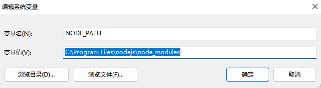

最后编辑用户变量里的Path，将相应npm的路径改为：`D:\Program Files\nodejs\node_global`

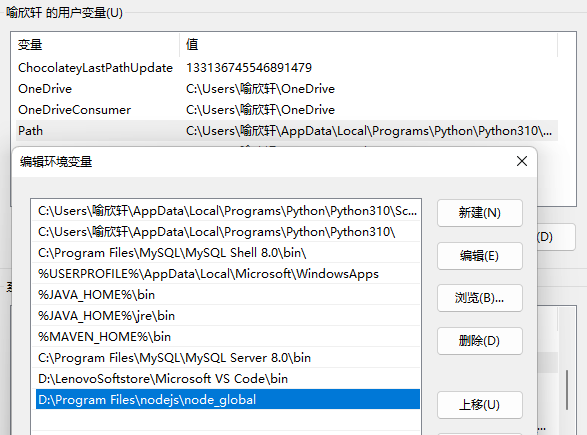

### 配置镜像

```
# 设置镜像
npm config set registry https://registry.npm.taobao.org

# 查看镜像
npm config get registry
```

## Vue环境搭建

- 安装vue

  - 安装vue
    - 缺点：安装速度较慢，使用国内源镜像安装较快
    - 打开cmd，键入：`npm install --global vue-cli `，回车后等待安装即可
    - vue-cli安装完成后，键入：`npm install webpack -g` ，回车进行webpack的安装

  - 使用国内源镜像安装

    - 首先安装 cnpm
      - `npm install -g cnpm --registry=https://registry.npm.taobao.org`

    - 安装vue
      - 打开cmd，键入：`cnpm install vue-cli -g`，回车等待安装即可
      - vue-cli安装完成后，键入：`cnpm install webpack -g` ，回车进行webpack的安装

恢复原来的地址：`npm config set registry https://registry.npmjs.org`

### 安装npm镜像

因为npm是国外的，所以使用起来速度比较慢。我们这里使用了淘宝的cnpm镜像安装vue。使用淘宝的cnpm命令管理工具代替默认的npm管理工具。
进入cmd 输入命令： 

```vue
npm install -g cnpm --registry=https://registry.npm.taobao.org
```

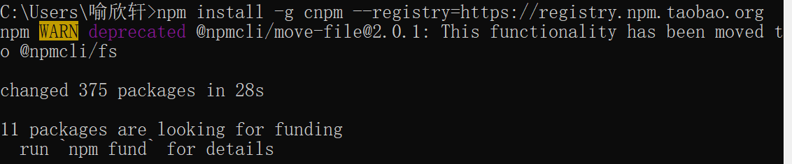

### 安装全局vue-cli脚手架

npm镜像安装完成之后，接下来安装全局vue-cli脚手架。进入cmd，输入命令：

```vue
cnpm install --global vue-cli
```

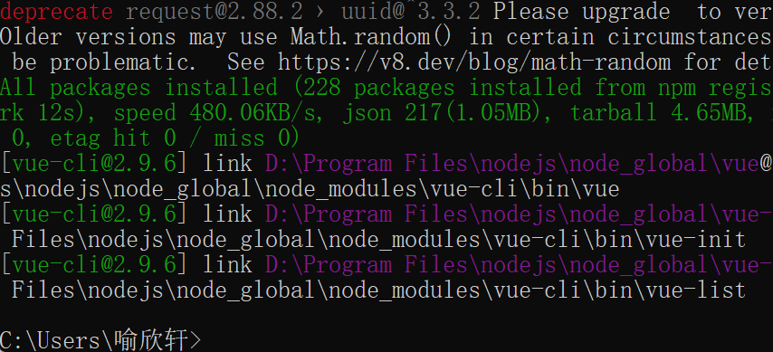

验证是否安装成功`vue`

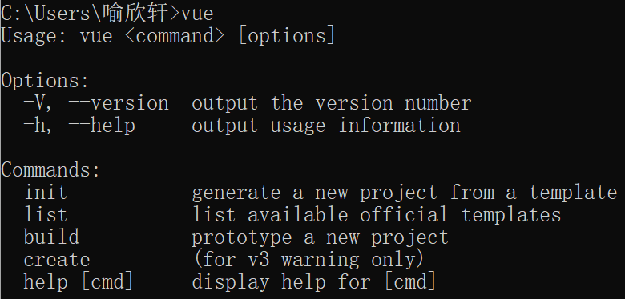

注意：**这里少了进行webpack的安装，但是影响不大**

## 创建新项目

脚手架搭建完成之后，接下来创建一个新项目。进入cmd，输入命令：

```vue
vue init webpack my-project-first<!--my-project-first名字可以改-->
```

输入命令后，需要根据提示进行回答选择。命令中的my-project-first是新项目的文件夹名称，是基于webpack的项目，输入命令之后可以一直回车，直到出现是否要安装vue-route，选择Yes，之后三项选择no （如上图所示） 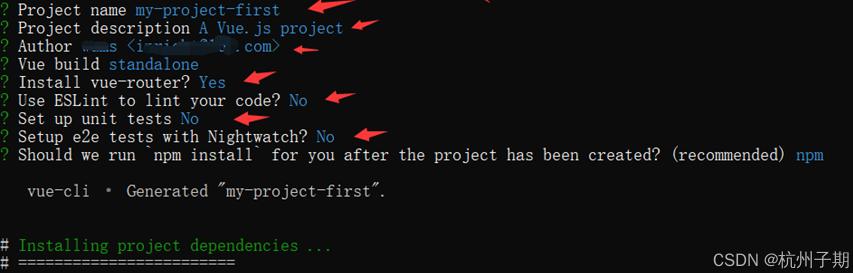

当出现npm run dev ,则表示安装完成了

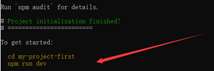

cmd的对应目录下会生成

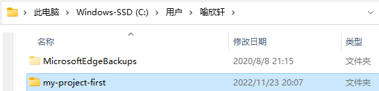

## 安装项目依赖

因为各个模板之间都是相互依赖的，所以接下来需要安装依赖。
进入cmd , 切换到my-project-first目录，输入命令

```vue
cnpm install
```

安装项目依赖。

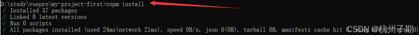

## 系统运行

在项目目录下进入cmd ，输入命令：

```vue
cnpm run dev
```

启动服务

此时打开浏览器输入http://localhost:8080

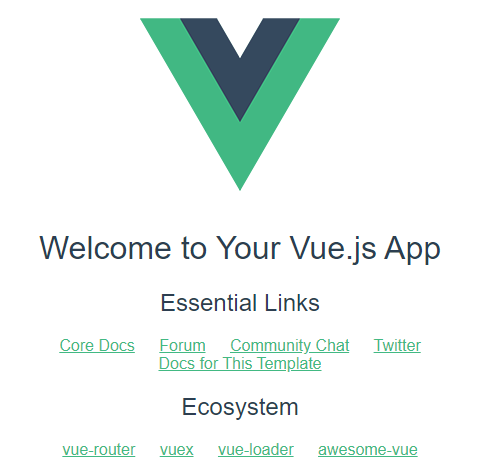

## 修改端口

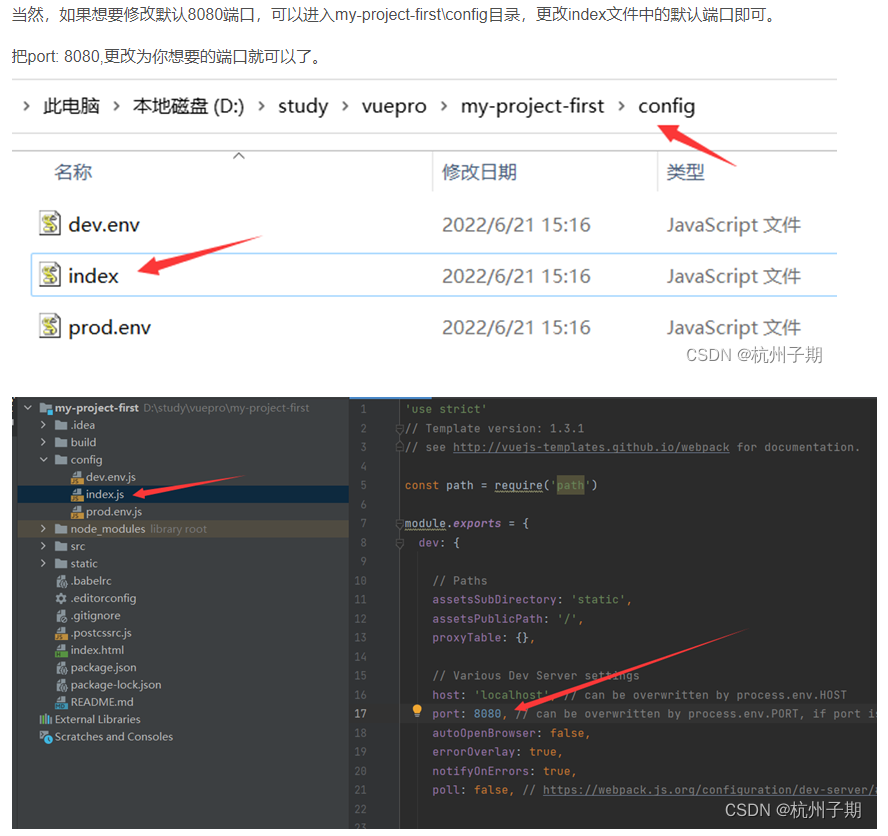

## 对于版本兼容性问题

18的版本如果需要兼容16的版本，需要在运行的项目下执行如下指令(**如果依旧无法运行得使用nvm进行版本切换**)

```
set NODE_OPTIONS=--openssl-legacy-provider
```

## 配置cmd运行程序的环境变量

环境变量Path中添加`C:\Windows\System32`或者 `%SystemRoot%\system32`

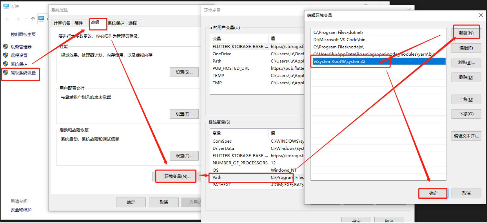
