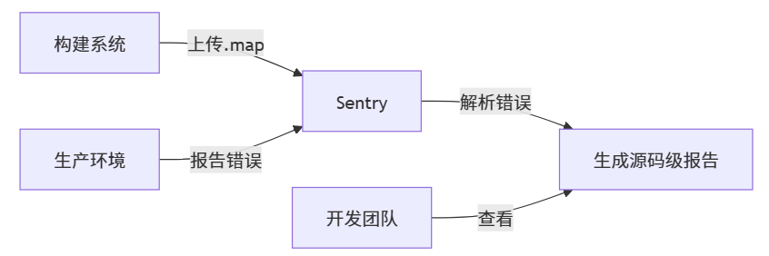

# 源码映射

**Source map是一种标准化的映射文件**，记录了：

- 压缩后代码位置 ↔ 原始源代码位置
- 转换过程（如 TypeScript → JS、SASS → CSS）
- 源码文件名及目录结构

文件规范示例：

```json
{
  "version": 3,
  "sources": ["src/App.vue", "src/components/Button.vue"],
  "mappings": "AASA,SAASC,OAASC,OACdC...",
  "sourcesContent": ["<template>...</template>"],
  "names": ["handleClick", "userData"]
}
```

源码映射可以让：

```
// 错误监控平台（Sentry）看到的错误
- 无 Source Map：Button.1a2b3.js:1:3546 → 无法定位  
+ 有 Source Map：src/components/Button.vue:48:10 → 精准定位
```

存在意义：

|     维度     |        开发环境        |       生产环境       |    Source Map 的解决     |
| :----------: | :--------------------: | :------------------: | :----------------------: |
| **代码形态** |       可读的源码       |   压缩混淆的机器码   |      重建源代码结构      |
| **调试定位** |     浏览器直接断点     |     无法定位错误     | 将错误映射回原始文件行号 |
| **协作效率** |   开发者直观理解代码   | 团队无法阅读压缩代码 |   提供代码审查的可行性   |
| **技术演进** | 使用现代语法（TS/JSX） |     需编译为 ES5     |     还原高级语法特征     |

## Vue2

Webpack 官方支持多devtool配置，下表按**开发/生产**使用场景分类：

**开发环境推荐模式**：

|            模式名称            | 构建速度 | 重载速度 |     调试体验      |      适用场景      |
| :----------------------------: | :------: | :------: | :---------------: | :----------------: |
|       `eval-source-map`        |   中等   |    快    |   完整源码行列    |      中小项目      |
|    `cheap-eval-source-map`     |    快    |  非常快  |    源码行映射     |      通用推荐      |
| `cheap-module-eval-source-map` |    快    |  非常快  | loader 处理前源码 | Vue/React 项目最佳 |
|             `eval`             |   最快   |   最快   |    编译后代码     |      极速开发      |

**生产环境推荐模式**：

|        模式名称        |   映射质量   |    文件位置    |             适用场景             |
| :--------------------: | :----------: | :------------: | :------------------------------: |
|      `source-map`      | 完整行列映射 | 独立 .map 文件 |    标准生产环境（需保护文件）    |
|  `hidden-source-map`   | 完整行列映射 | 独立 .map 文件 |        避免浏览器自动加载        |
| `nosources-source-map` |   行列映射   | 独立 .map 文件 | 保护源码（只显示错误不暴露源码） |

使用`cheap-module-eval-source-map`平衡速度与调试体验

```js
// vue.config.js
module.exports = {
  configureWebpack: {
    devtool:
      process.env.NODE_ENV === 'development'
        ? 'cheap-module-eval-source-map'
        : 'source-map'
  }
}
```

## Vue3

无需打包的Dev Server，浏览器直接加载**原生ES模块**（源码文件），不再需要source map映射到源码（**源码本身就是源码！**）

- 开发环境：浏览器直接调试源码
- 生产环境：`vite.config.js`简单启用即可

```js
// vite.config.js
export default {
  build: {
    sourcemap: true // 一键启用生产源映射
  }
}
```

## 速度影响

**开发环境**

影响只针对webpack：

|    性能指标    | 无 source map | `cheap-module-eval-source-map` | 完整 `source-map` |
| :------------: | :-----------: | :----------------------------: | :---------------: |
|  **启动时间**  |  100% (基准)  |            +30%~50%            |     +70%~120%     |
| **热更新时间** |    <500ms     |           500-800ms            |      1.2-3s       |
|  **内存占用**  |    基准值     |            +15%-25%            |     +40%-60%      |

**生产环境**

Webpack：

|   项目规模   | 无 Source Map | 启用 Source Map | 速度影响 | 额外时间开销 |
| :----------: | :-----------: | :-------------: | :------: | :----------: |
| **小型项目** |   10-15 秒    |    14-22 秒     | +40-60%  |    4-7 秒    |
| **中型项目** |   30-45 秒    |    45-70 秒     | +50-75%  |   15-25 秒   |
| **大型项目** |   90-180 秒   |   140-290 秒    | +55-80%  |  50-110 秒   |

Vite：

|   项目规模   | 无 Source Map | 启用 Source Map | 速度影响 | 额外时间开销 |
| :----------: | :-----------: | :-------------: | :------: | :----------: |
| **小型项目** |    5-8 秒     |     6-10 秒     | +20-30%  |    1-2 秒    |
| **中型项目** |   15-25 秒    |    19-32 秒     | +25-35%  |    4-7 秒    |
| **大型项目** |   50-100 秒   |    62-130 秒    | +25-30%  |   12-30 秒   |

## 保护.map

浏览器**不会主动请求`.map`文件**，除非同时满足：

- 开发者工具已经打开
- JavaScript文件中包含`//# sourceMappingURL`声明
- `.map`文件未设置访问限制

```js
// 打包后的 JS 文件尾部
console.log("App loaded...");
//# sourceMappingURL=app.8a7b6c.js.map
```

### 泄露危险

浏览器可以通过.map文件完整重建原始项目：

```
# 使用 reverse-sourcemap 工具
npx reverse-sourcemap --output-dir leaked-source --config app.xxxx.js.map
```

重建后得到：

```
leaked-source/
├── src/
│   ├── components/
│   │   ├── UserProfile.vue  # 完整源代码
│   │   └── PaymentForm.vue
│   └── App.vue
├── package.json
└── webpack.config.js
```

现代框架的安全方案：

|  框架   |            配置方式            |           安全机制           |
| :-----: | :----------------------------: | :--------------------------: |
|  Vite   |  `build.sourcemap = 'hidden'`  | 生成.map但不添加sourceMapURL |
| Webpack | `devtool: 'hidden-source-map'` | 生成.map但不添加sourceMapURL |

### 解决方案

|        场景        |         Webpack 推荐          |          Vite 推荐           |
| :----------------: | :---------------------------: | :--------------------------: |
|  **CI/CD 流水线**  | `nosources-source-map` + 缓存 |      `sourcemap: true`       |
|  **本地生产构建**  |      `hidden-source-map`      |    `sourcemap: 'hidden'`     |
| **需要源码级监控** |    `source-map` + 上传平台    | `sourcemap: true` + 上传平台 |

