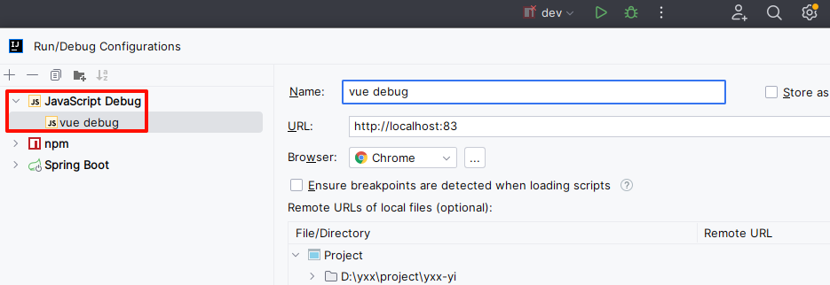
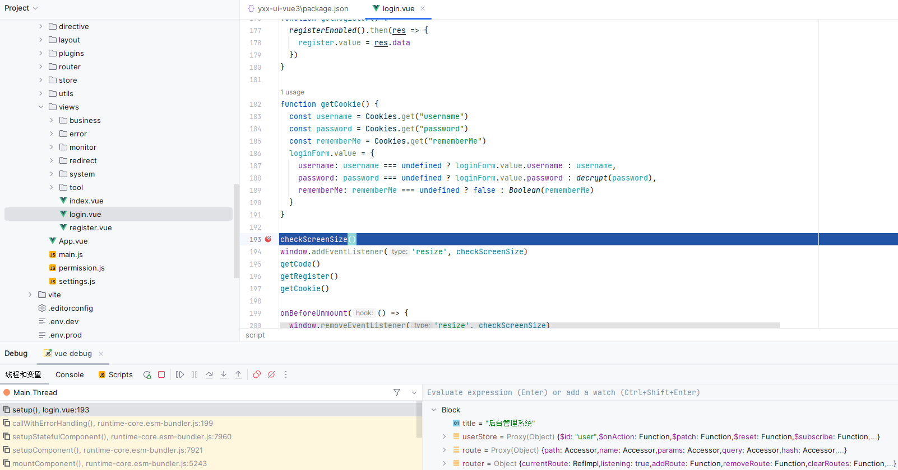
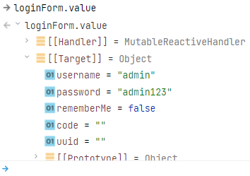
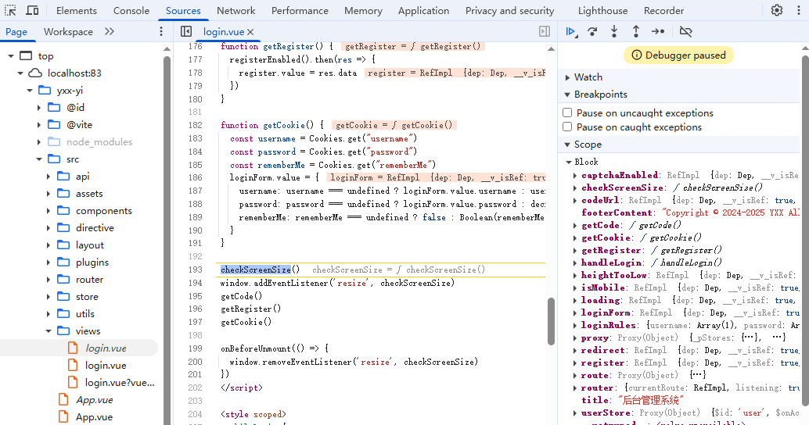
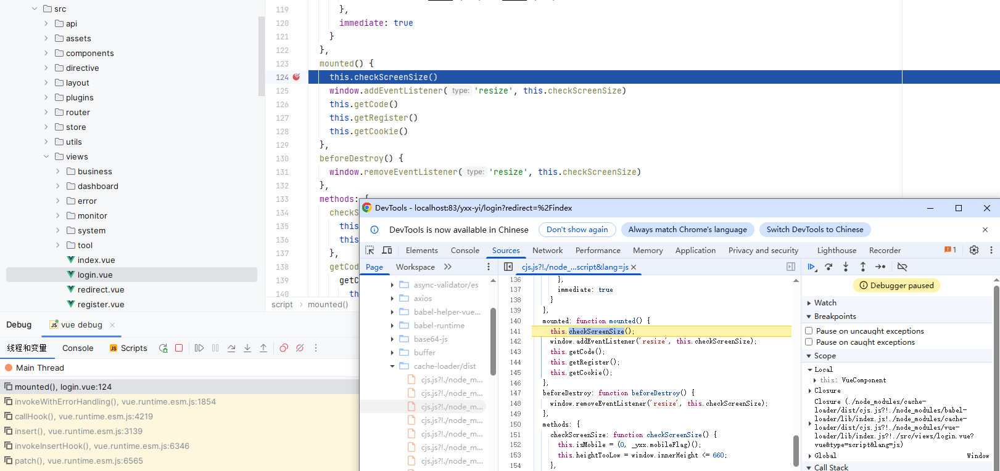
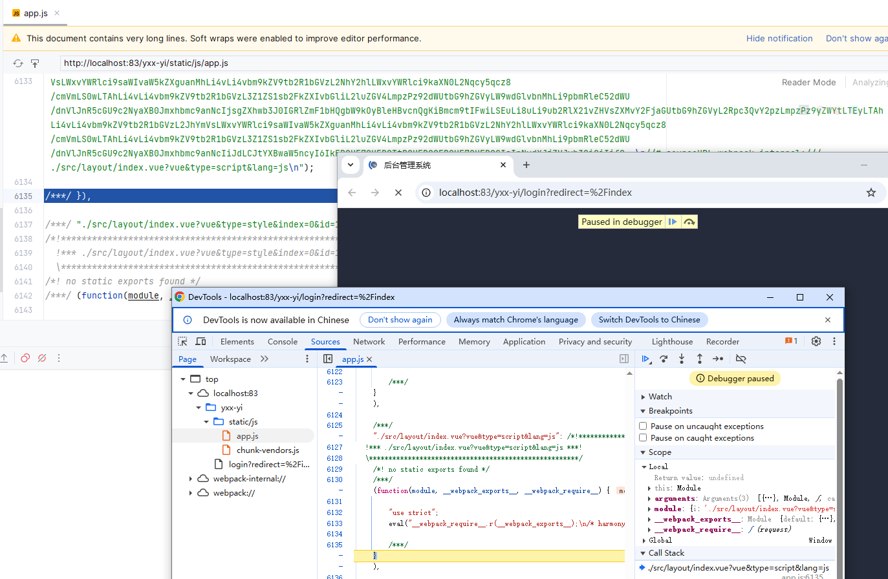

# 断点调试

## IDEA

新建断点运行：



debug运行`JavaScript Debug`，然后启动debug运行`Vue`或者直接运行`Vue`都可以：



表达式求值：



浏览器的开发者工具也可以断点：



## Vue2项目

需要在`vue.config.js`配置中开启`devtool: 'source-map'`：

```js
  configureWebpack: {
    name: name,
    // 开启源码映射，防止调试时源代码无法阅读，生产环境需要生成文件.map文件需要开启 productionSourceMap
    devtool: process.env.NODE_ENV === 'development' ? 'cheap-module-eval-source-map' : 'source-map',
    resolve: {
      alias: {
        '@': resolve('src')
      }
    },
  }
```

断点效果：



> 没有开启源码映射的情况：
>
> 

