# 组件

## 组件注册

### 局部注册

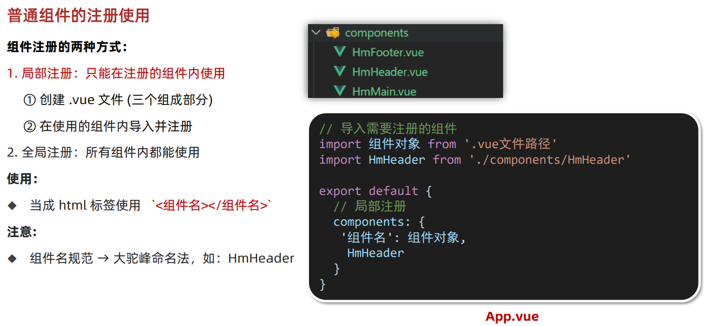

### 全局组件

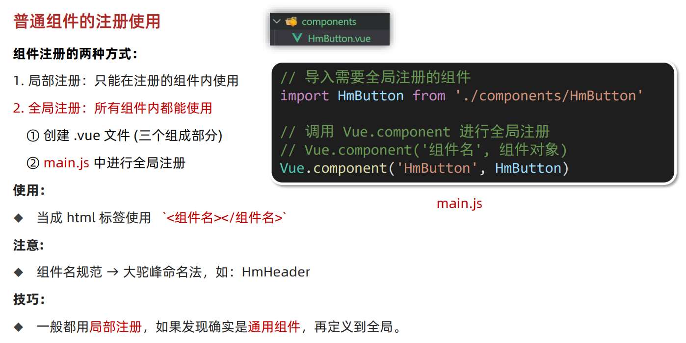

## scoped解决样式冲突

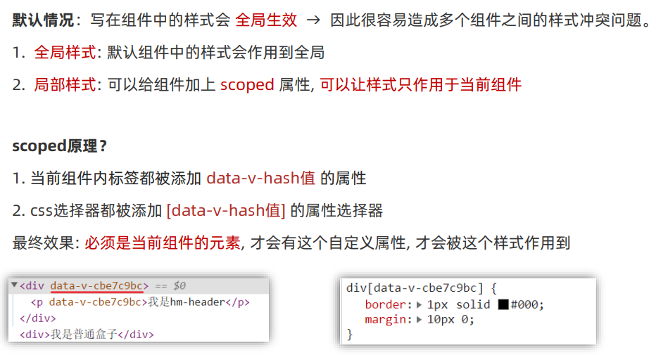

## data组件内为函数

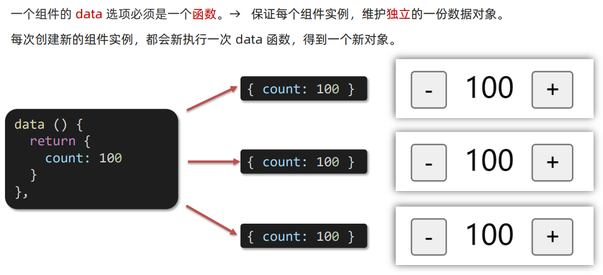

## 组件通信

### 组件通信解决方案

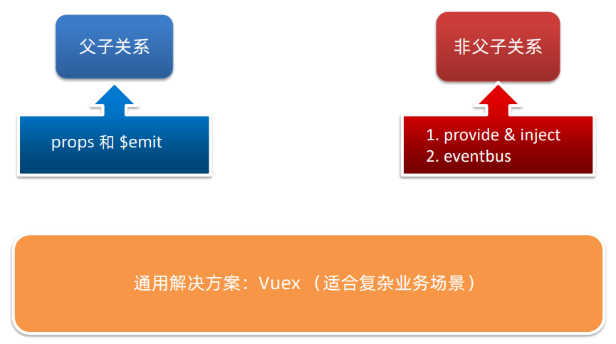

### 父子通信

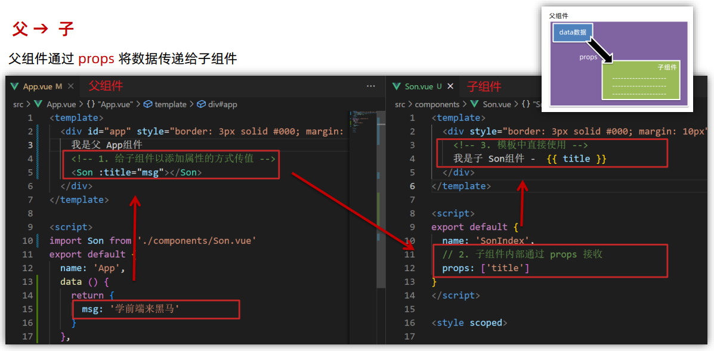

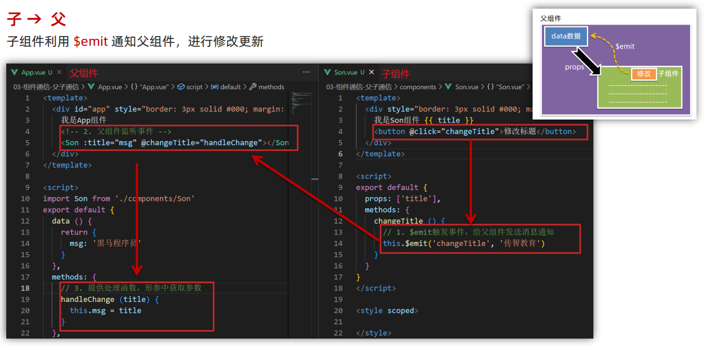

### prop

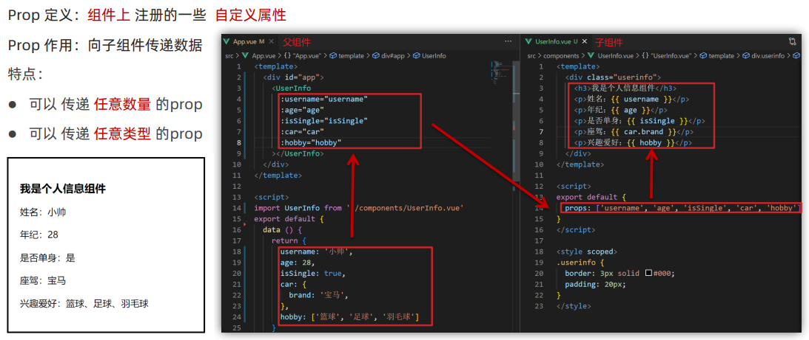

**props校验**

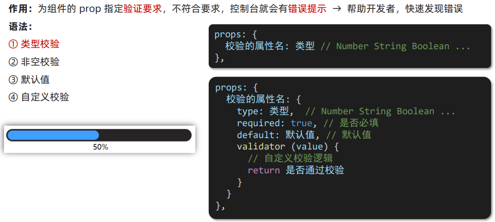

**和data对比**

> 共同点：都可以给组件提供数据
>
> 区别：
>
> - data 的数据是自己的 → 随便改
> - prop 的数据是外部的 → 不能直接改，要遵循单向数据流
>
> 单向数据流：父级 prop 的数据更新，会向下流动，影响子组件。这个数据流动是单向的

### 非父子通信

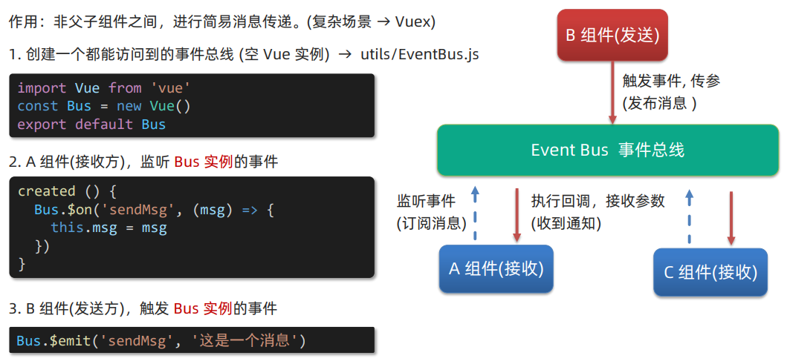

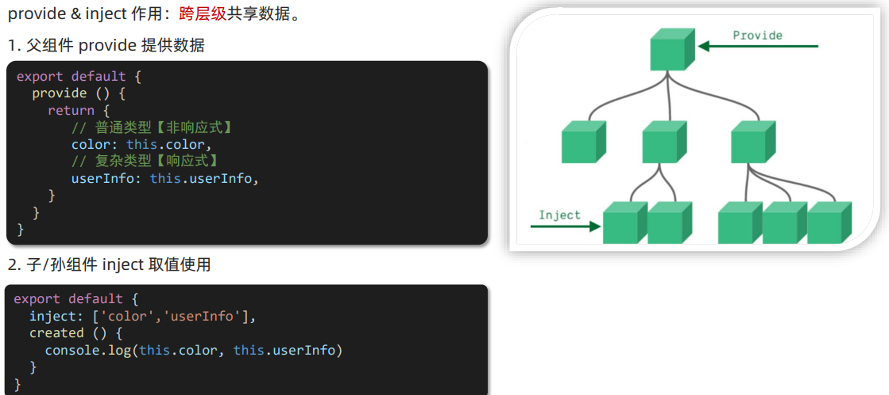

## keep-alive组件缓存

> - `keep-alive`是 Vue 的内置组件，当它包裹动态组件时，会缓存不活动的组件实例，而不是销毁它们
>- `keep-alive`是一个抽象组件：它自身不会渲染成一个DOM元素，也不会出现在父组件链中

优点：在组件切换过程中 把切换出去的组件保留在内存中，防止重复渲染DOM，减少加载时间及性能消耗，提高用户体验性

### 三个属性

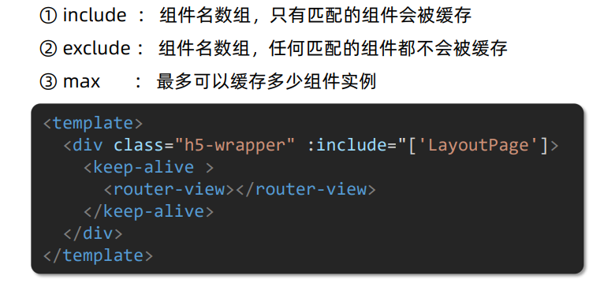

### 触发的生命周期函数

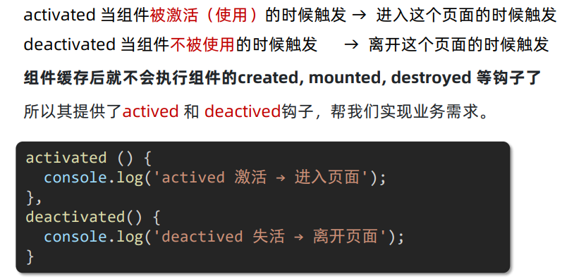