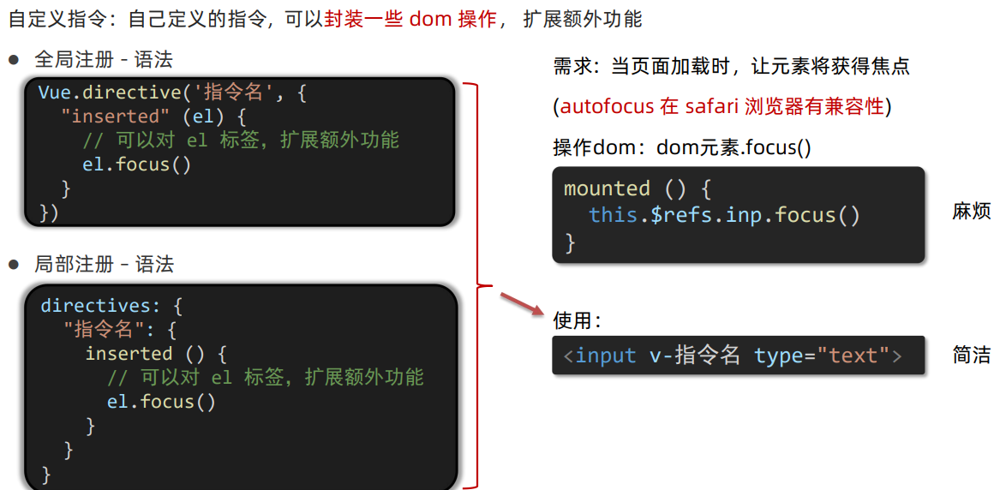
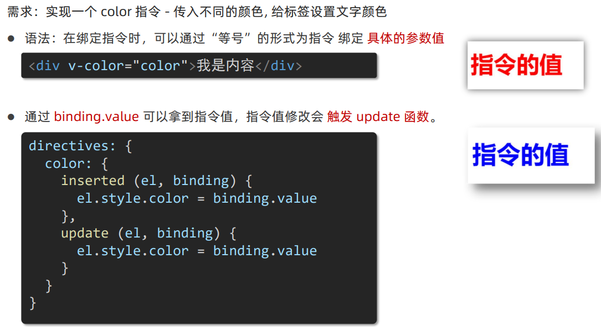
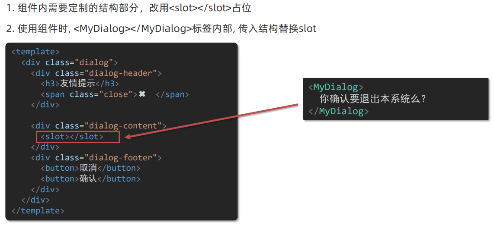
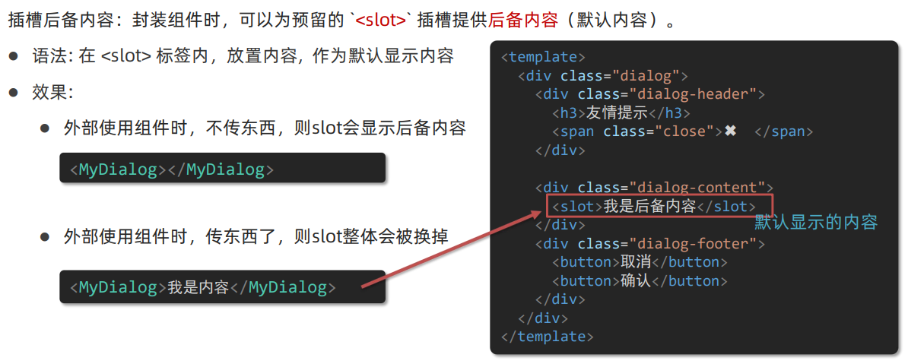
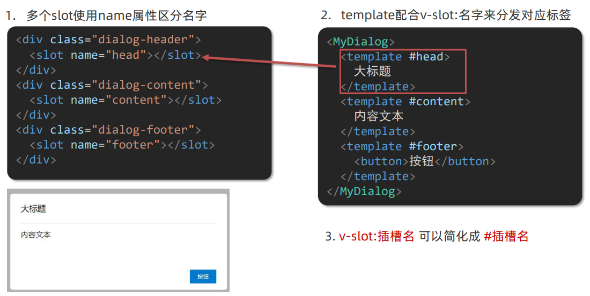
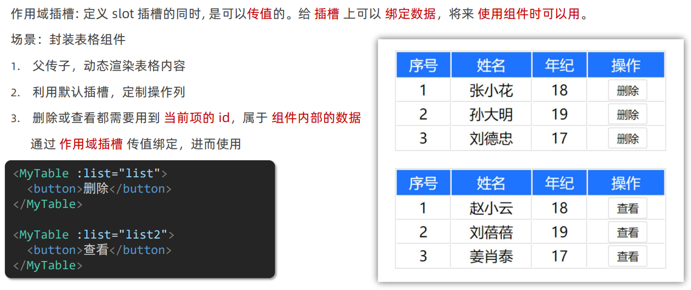
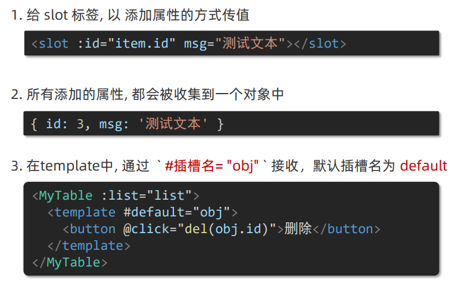

# 自定义指令和插槽

## 自定义指令



### inserted和update方法



### 其它生命周期钩子函数

Vue自定义指令可用的钩子函数列表

- `bind`：只调用一次，指令第一次绑定到元素时调用。在这里可以进行一次性的初始化设置
- `inserted`：被绑定元素插入父节点时调用 (仅保证父节点存在，但不一定已被插入文档中)
- `update`：所在组件的 VNode 更新时调用，但是可能发生在其子 VNode 更新之前。指令的值可能发生了改变，也可能没有。但是你可以通过比较更新前后的值来忽略不必要的模板更新
- `componentUpdated`：指令所在组件的 VNode 及其子 VNode 全部更新后调用
- `unbind`：只调用一次，指令与元素解绑时调用

```js
Vue.directive('demo', {
  bind(el, binding, vnode) {
    // 当指令第一次绑定到元素时调用
    // 进行初始化设置
  },
  inserted(el, binding, vnode) {
    // 被绑定元素插入父节点时调用
  },
  update(el, binding, vnode, oldVnode) {
    // 所在组件的 VNode 更新时调用
  },
  componentUpdated(el, binding, vnode, oldVnode) {
    // 指令所在组件的 VNode 及其子 VNode 全部更新后调用
  },
  unbind(el, binding, vnode) {
    // 指令与元素解绑时调用
  }
});
```

> 在定义自定义指令时，可以根据需要选择使用这些钩子函数中的任何一个或多个。每个钩子函数都可以接收以下参数：
>
> - `el`：指令所绑定的元素，可以用来直接操作DOM
> - `binding`：一个对象，包含以下属性：
>   - `name`：指令名，不包括`v-`前缀
>   - `value`：指令的绑定值，例如：`v-my-directive="1 + 1"`中，绑定值为`2`
>   - `oldValue`：指令绑定的前一个值，仅在`update`和`componentUpdated`钩子中可用。无论值是否改变都可用
>   - `expression`： 绑定值的字符串形式。例如：`v-my-directive="1 + 1"`中，表达式为 `"1 + 1"`
>   - `arg`：传给指令的参数，可选。例如：`v-my-directive:foo`中，参数为`"foo"`
>   - `modifiers`： 一个包含修饰符的对象。例如：`v-my-directive.foo.bar`中，修饰符对象为`{ foo: true, bar: true }`
> - `vnode`:：Vue编译生成的虚拟节点
> - `oldVnode`：上一个虚拟节点，仅在`update`和`componentUpdated`钩子中可用

## 插槽

> 让组件内部的一些结构支持自定义

### 基本语法



### 后备内容（默认值）



### v-slot具名插槽



### 作用域插槽



**基本使用步骤**

