# 路由

## 单页应用程序

> SPA - Single Page Application

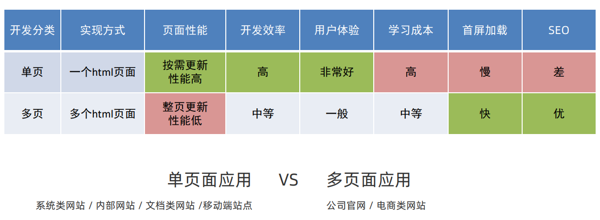

> 优点：按需更新性能高，开发效率高，用户体验好
>
> 缺点：学习成本，首屏加载慢，不利于SEO

## VueRouter

> 修改地址栏路径时，切换显示匹配的组件

### VueRouter使用

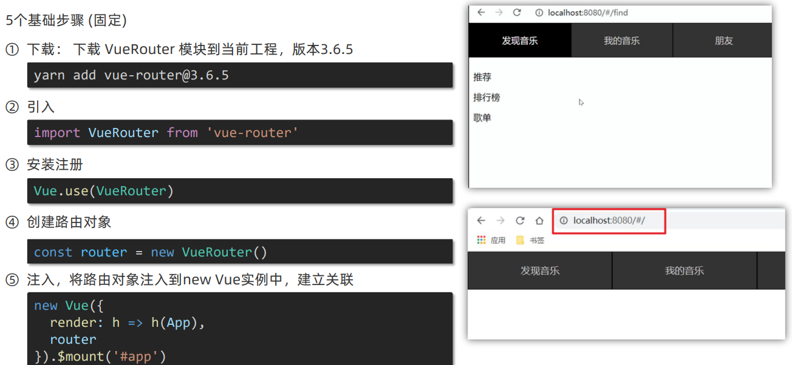

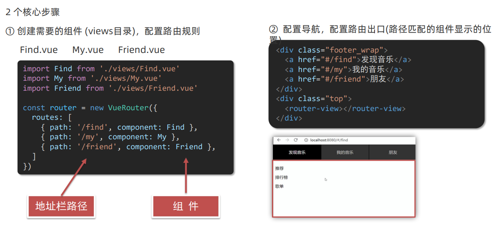

> 多级路由配置方式：在`routes`对应的路由下新增`children[]`属性，依旧配置`path、component`，路由出口同样为`<router-view></router-view>`
>
> 

## 路由模式

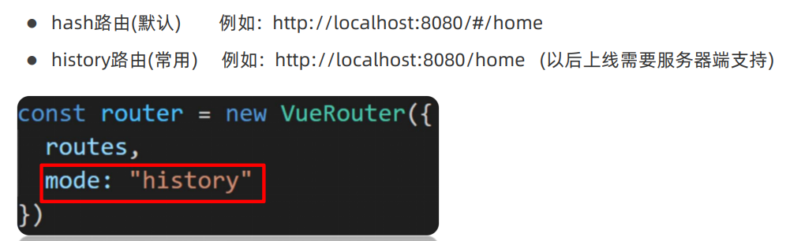

## 路由的封装抽离

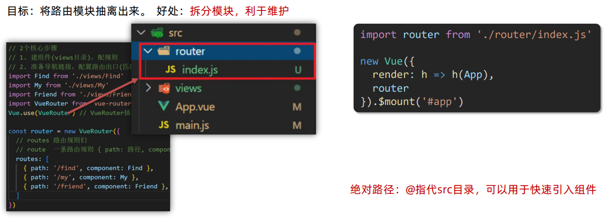

## 声明式导航

> 通过模板中的`<router-link>`组件来实现导航的

### 导航高亮

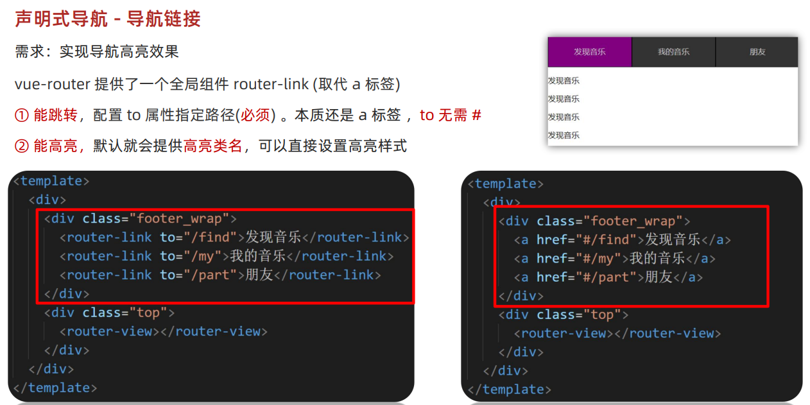

**两个类名**

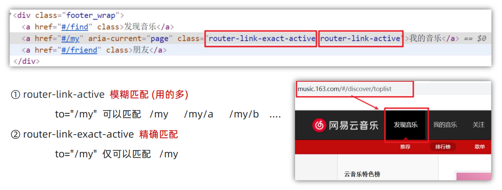

**类名定制**

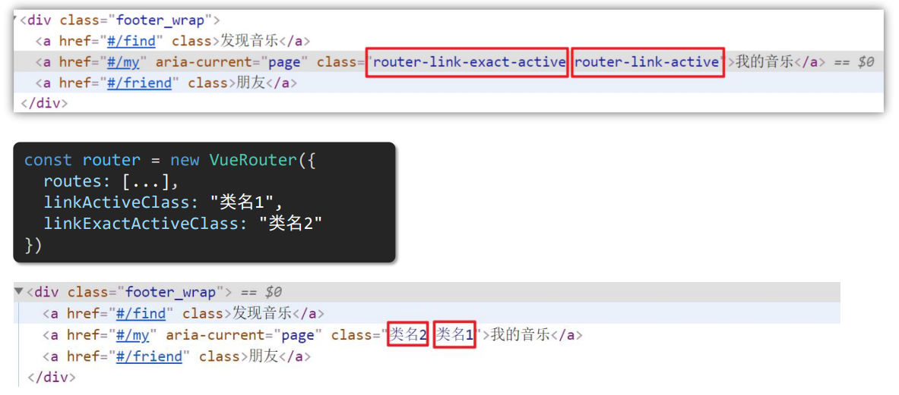

### 导航传参

**查询参数传参**

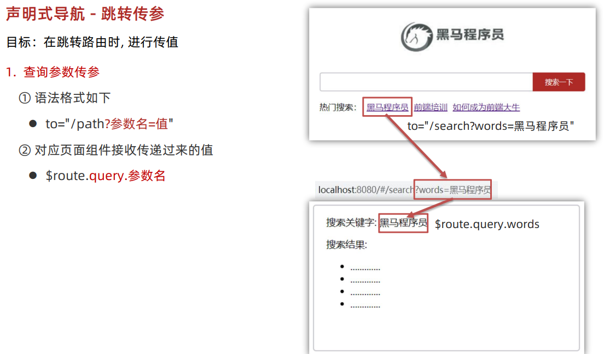

**动态路由传参**

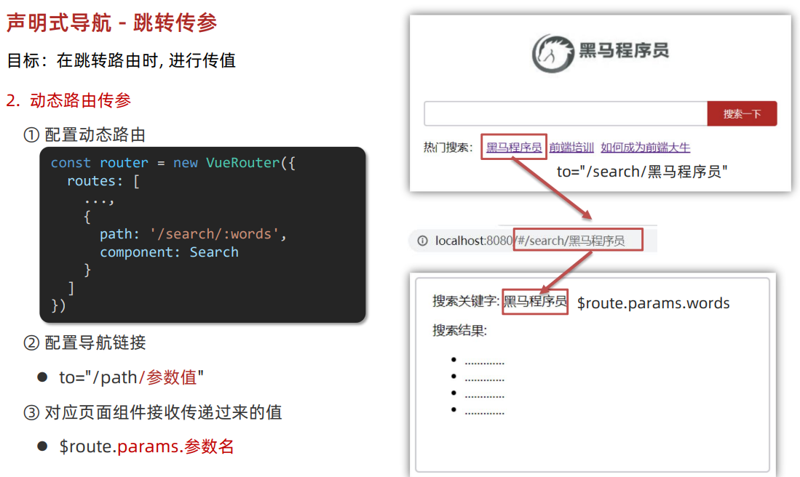

> `/search/:words`表示，必须要传参数。如果不传参数，也希望匹配，需要加个可选符 "?"，变成`/search/:words?`，路由传参方式为(这里假定name为search，换成path也是可以的)：
>
> - 对于声明式导航：`<router-link :to="{ name: 'search', params: { words: 'example' } }">`
> - 对于编程式导航：`this.$router.push({ name: 'search', params: { words: 'example' } })`

**区别**

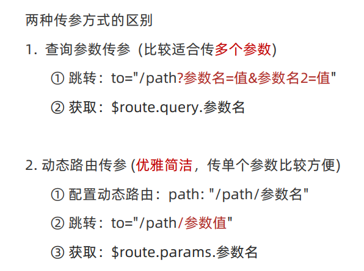

## 编程式导航

> 通过JS代码实现导航跳转
>
> - `$router.push('路由路径')`：跳转到对应路由路径
> - `$router.back()`：返回上一级路由

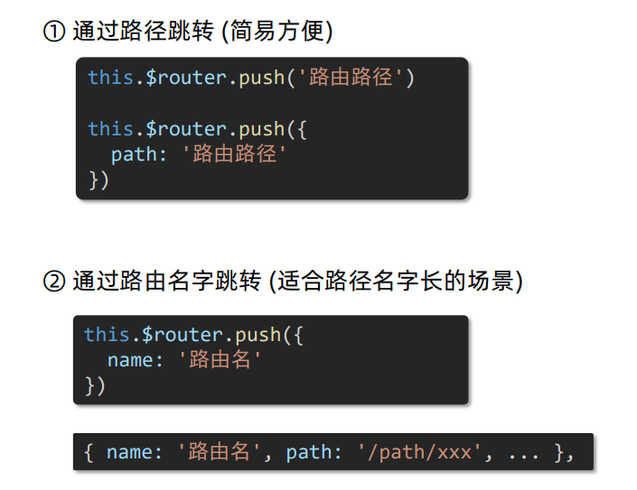

### 导航传参

**查询参数传参**

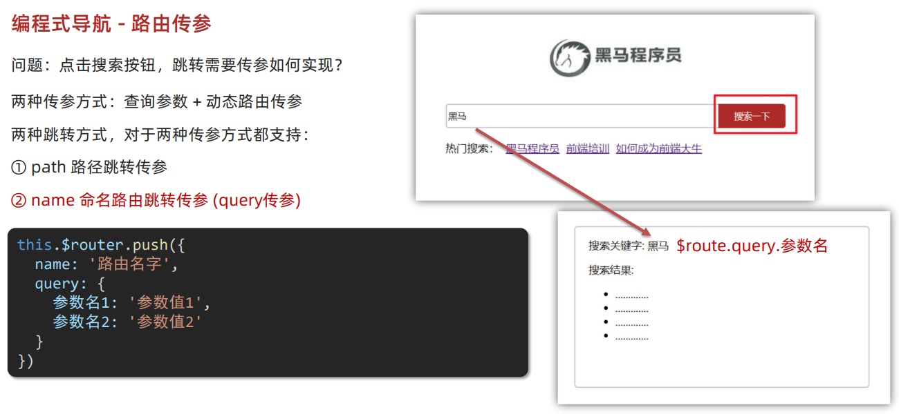

**动态路由传参**

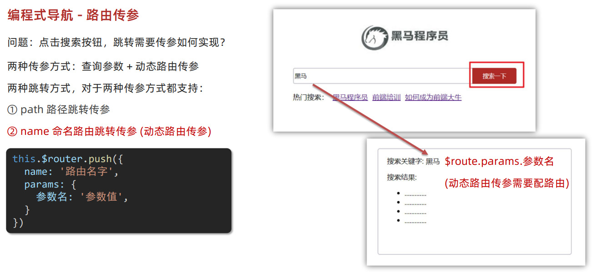

### path路径跳转

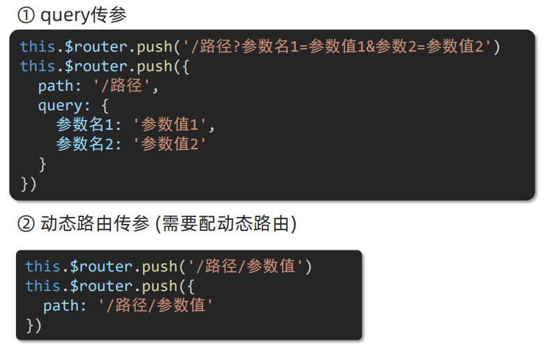

## 路由重定向

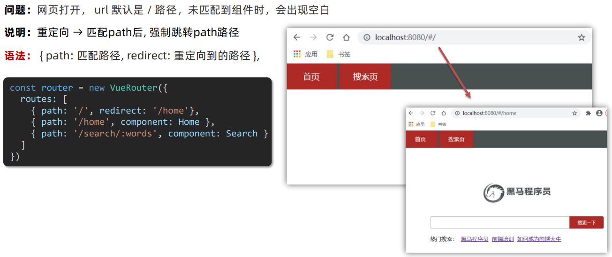

## 404

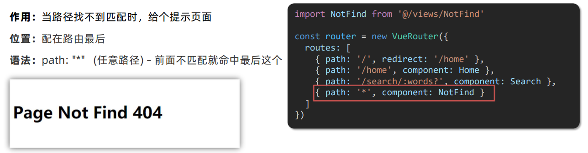

