# vuex

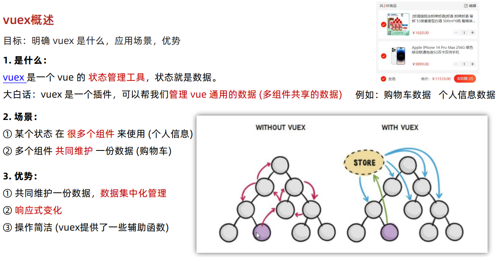

## 创建空仓库

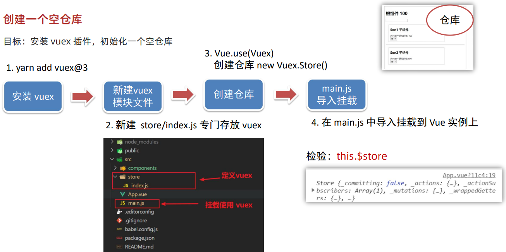

## state提供数据

### 提供数据

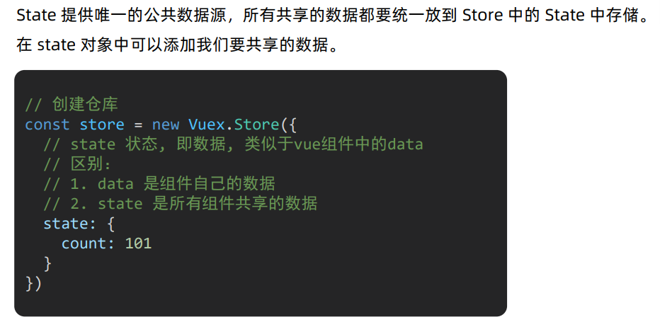

### 使用数据

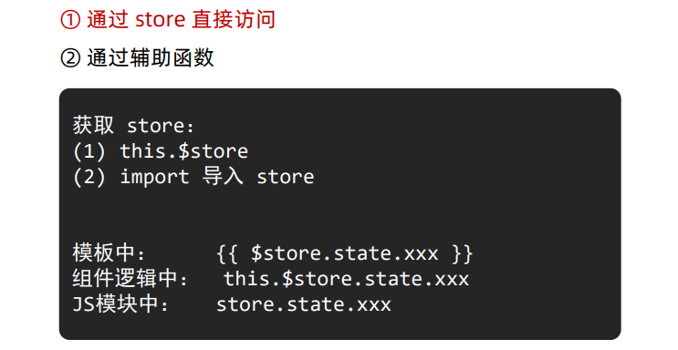

### 辅助函数mapState

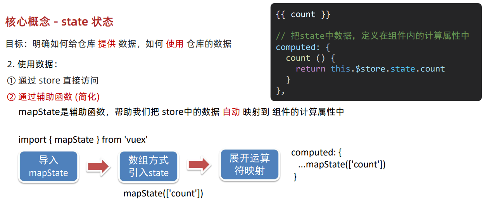

## mutations提供方法

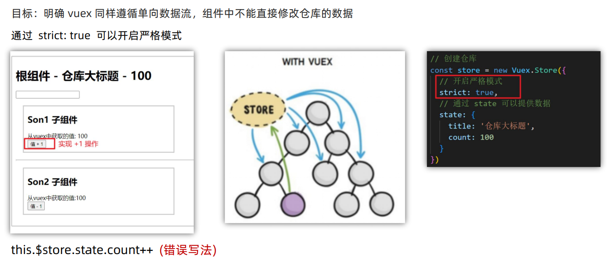

### 使用

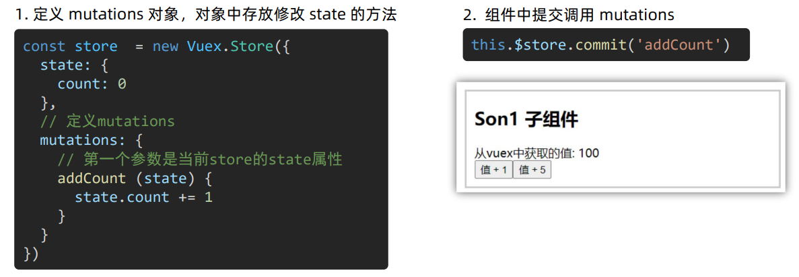

### 传参

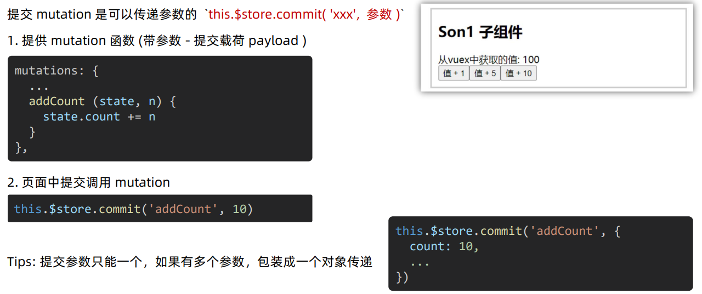

### 辅助函数mapMutations

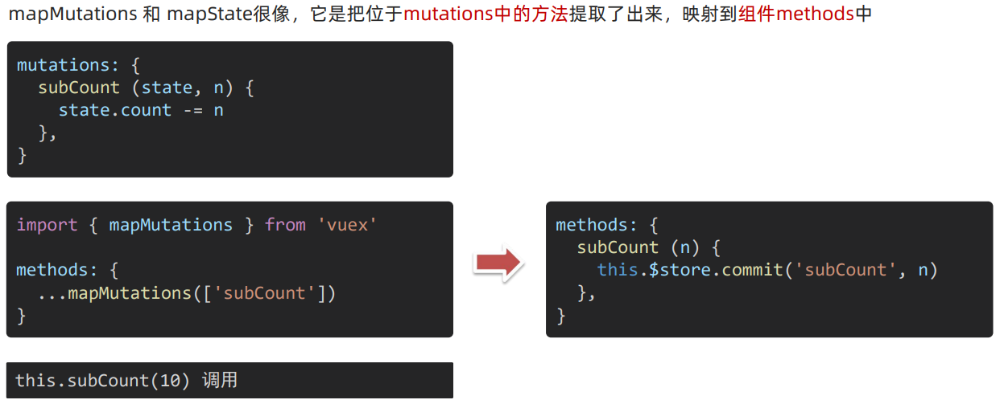

## actions异步操作

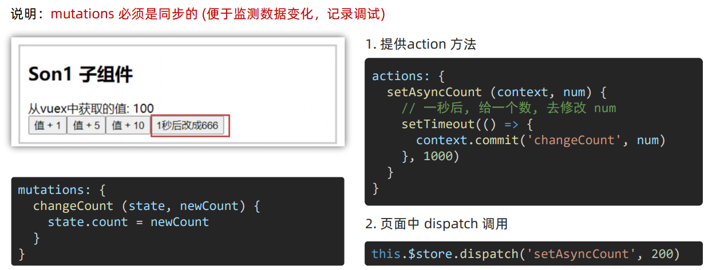

### 辅助函数mapActions

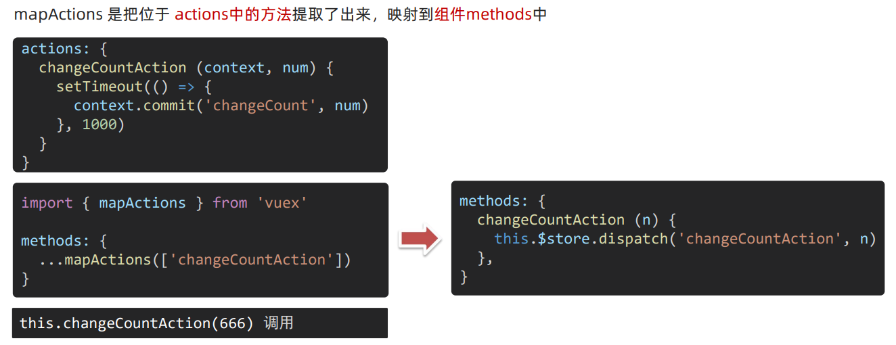

## getters计算属性

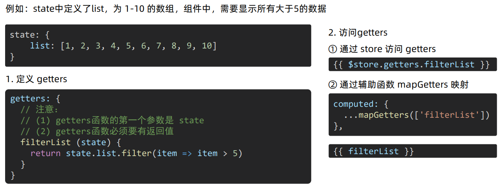

## 模块module(进阶语法)

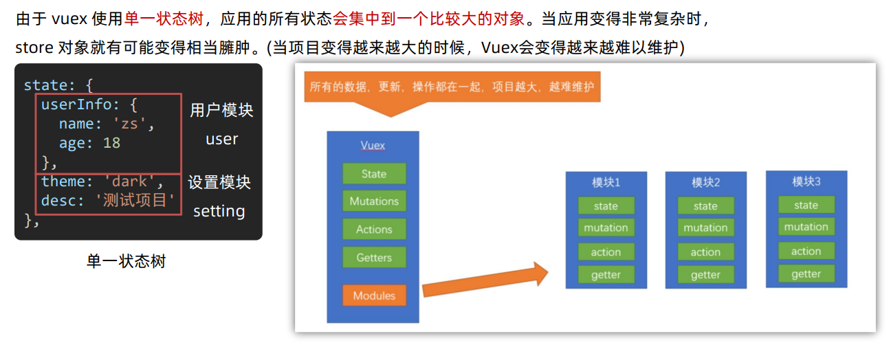

### 模块拆分

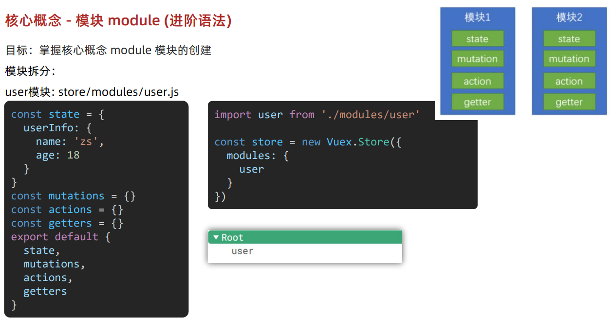

### state的访问语法

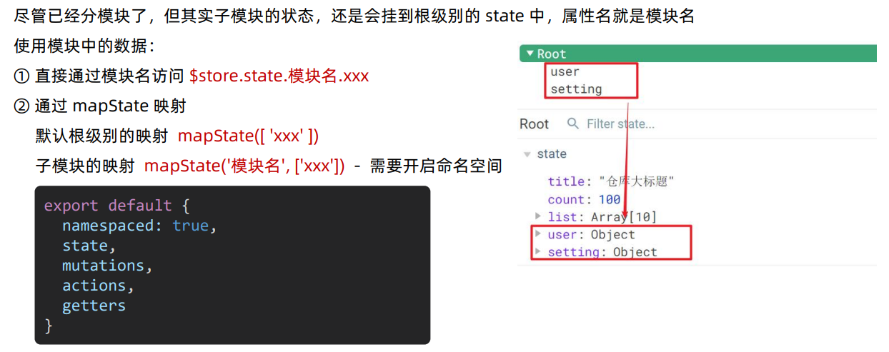

### getters的访问语法

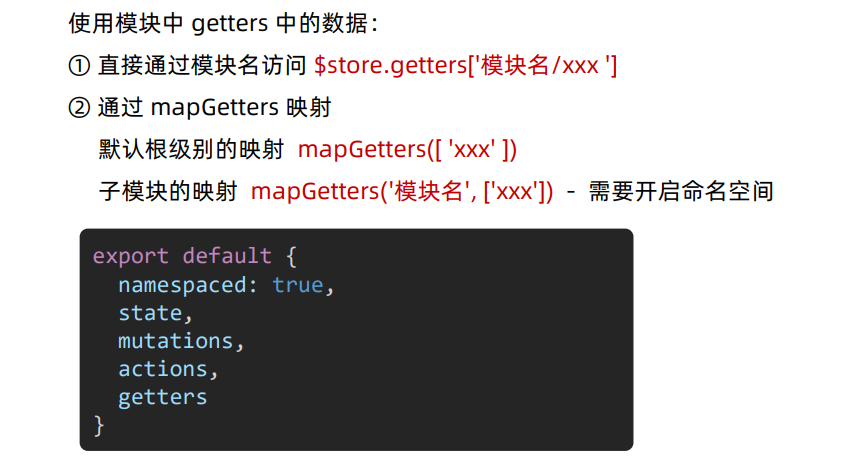

### mutation的调用语法

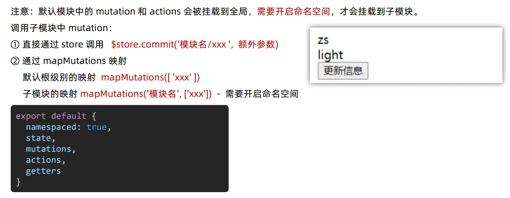

###  action的调用语法

> 同理 - 直接类比mutation

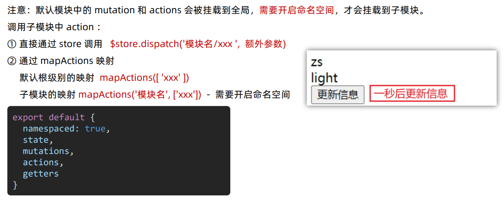