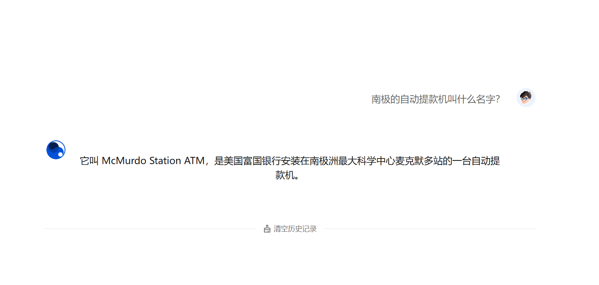

# TDesign

> TDesign适配桌面端的AI Chat组件库，适合在 vue3.x 技术栈中的AI chat组件
>
> 官网：https://tdesign.tencent.com/

## 基本使用

安装命令：

```
npm i @tdesign-vue-next/chat --save
```

按需导入插件：

```
npm install -D @tdesign-vue-next/auto-import-resolver unplugin-vue-components unplugin-auto-import --save
```

修改vite：

```js
import AutoImport from 'unplugin-auto-import/vite';
import Components from 'unplugin-vue-components/vite';
import { TDesignResolver } from '@tdesign-vue-next/auto-import-resolver';
export default {
  plugins: [
    // ...
    AutoImport({
      resolvers: [TDesignResolver({
        library: 'chat'
      })],
    }),
    Components({
      resolvers: [TDesignResolver({
        library: 'chat'
      })],
    }),
  ],
};
```

修改`App.vue`：

```vue
import { createApp } from 'vue';
// 引入组件库的少量全局样式变量
import 'tdesign-vue-next/es/style/index.css';

const app = createApp(App);
```

> 编辑器提示：推荐安装`volar`，并在项目的`tsconfig.json`的`includes`属性中增加`node_modules/@tdesign-vue-next/chat/global.d.ts`，即可实现该效果

## 使用效果

```vue
<template>
  <t-chat
    :data="[
        {
        avatar: 'https://tdesign.gtimg.com/site/chat-avatar.png',
        content: '它叫 McMurdo Station ATM，是美国富国银行安装在南极洲最大科学中心麦克默多站的一台自动提款机。',
        role: 'assistant',
      },
      {
        avatar: 'https://tdesign.gtimg.com/site/avatar.jpg',
        content: '南极的自动提款机叫什么名字？',
        role: 'user',
      }]"
  >
  </t-chat>
</template>

```

> 