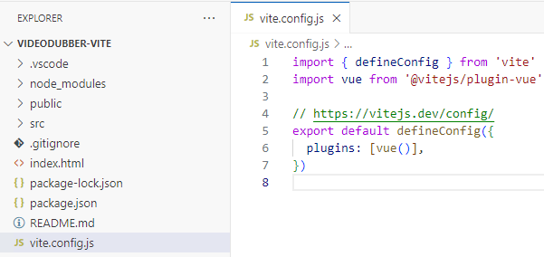
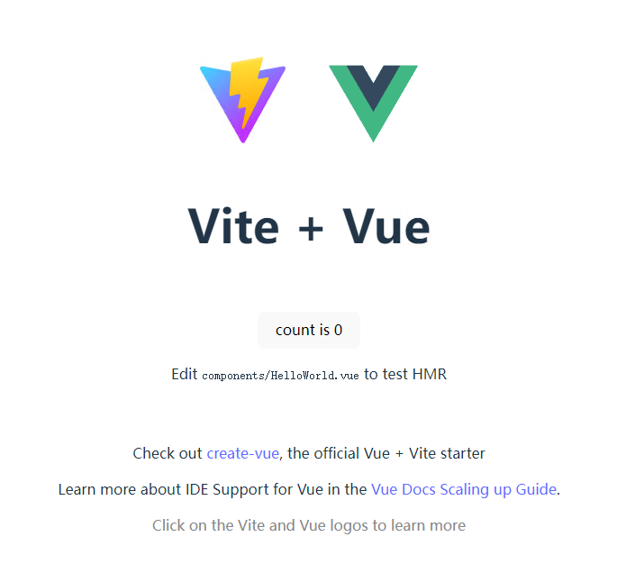
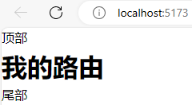
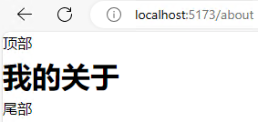

# Vite

## 基本使用

全局安装：

```
npm install -g vite
```

创建项目：

```
npm create vite@latest videodubber-vite -- --template vue
```

> 
>
> node16最新支持到vite4，太新的版本会导致安装依赖时警告：
>
> ```
> npm WARN EBADENGINE Unsupported engine {
> npm WARN EBADENGINE   package: '@vitejs/plugin-vue@5.2.1',
> npm WARN EBADENGINE   required: { node: '^18.0.0 || >=20.0.0' },
> npm WARN EBADENGINE   current: { node: 'v16.18.1', npm: '8.19.2' }
> npm WARN EBADENGINE }
> npm WARN EBADENGINE Unsupported engine {
> npm WARN EBADENGINE   package: 'vite@6.0.3',
> npm WARN EBADENGINE   required: { node: '^18.0.0 || ^20.0.0 || >=22.0.0' },
> npm WARN EBADENGINE   current: { node: 'v16.18.1', npm: '8.19.2' }
> npm WARN EBADENGINE }
> npm WARN EBADENGINE Unsupported engine {
> npm WARN EBADENGINE   package: 'esbuild@0.24.0',
> npm WARN EBADENGINE   required: { node: '>=18' },
> npm WARN EBADENGINE   current: { node: 'v16.18.1', npm: '8.19.2' }
> npm WARN EBADENGINE }
> ```
>
> 运行报错：
>
> ```
> error when starting dev server:
> ReferenceError: structuredClone is not defined
> ```
>
> 重新指定版本：
>
> ```
> npm install -g vite@4
> npm install -g create-vite@4
> ```
>
> 创建项目：
>
> ```
> create-vite videodubber-vite --template vue
> ```

运行项目：



## 修改图标

在`public`目录下放置`favicon.ico`文件，修改`index.html`的`<link>`标签：

```html
<!doctype html>
<html lang="en">
  <head>
    <meta charset="UTF-8" />
    <link rel="icon" type="image/svg+xml" href="/favicon.ico" />
    <meta name="viewport" content="width=device-width, initial-scale=1.0" />
    <title>Vite + Vue</title>
  </head>
  <body>
    <div id="app"></div>
    <script type="module" src="/src/main.js"></script>
  </body>
</html>
```

## 设置别名

在`vite.config.js`中配置：

```js
export default defineConfig({
  resolve: {
    alias: {
      '@': '/src', // 设置别名 '@' 指向 'src' 目录
    },
  },
})
```

## 转发配置

在`vite.config.js`中的`defineConfig`配置`server`：

```js
  // 开发服务器配置
  server: {
    port: 81,
    host: '0.0.0.0', // 设置为 '0.0.0.0'允许外部访问
    // 启动开发服务器后是否自动打开浏览器窗口
    open: true,
    proxy: {
      '/home-api': {
        // 本地开发时通常指向后端服务地址
        target: 'http://localhost:9000',
        // target: 'http://47.96.254.78:9000',
        // 是否改变代理请求的来源，使其看起来像是直接从目标服务器发起的
        changeOrigin: true,
        // 路径重写规则
        pathRewrite: {
          '^/home-api': ''
        }
      },
    }
  },
```

> 在`vue.config.js`下，开发服务器的配置选项应该放在`devServer`而不是`server`下，内容可以保持一致

## 增加路由

安装依赖：

```
npm install vue-router@4 --save
```

创建路由文件：

```js
// src/router/index.js
import { createRouter, createWebHistory } from 'vue-router'
import Home from '../views/Home.vue'
import About from '../views/About.vue'

const routes = [
  {
    path: '/',
    name: 'Home',
    component: Home
  },
  {
    path: '/about',
    name: 'about',
    component: About
  },
]

const router = createRouter({
  history: createWebHistory(),
  routes
})

export default router
```

在`main.js`中引入路由：

```js
import { createApp } from 'vue'
import App from './App.vue' // 引入根组件
import router from './router' // 引入路由配置

createApp(App).use(router)
```

修改`App.vue`：

```vue
<script setup>
import HomeTop from './components/Home/HomeTop.vue'
import HomeBottom from './components/Home/HomeBottom.vue'
</script>

<template>
  <HomeTop />
  <router-view />
  <HomeBottom />
</template>

<style scoped></style>
```

> 注意：为了防止影响效果和布局，需要消除全局css影响，在`main.js`中注释掉`import './style.css'`引入，或者注释掉`style.css`文件
>
> 使用路由效果，首页：
>
> 
>
> 跳转到指定路由界面：
>
> 