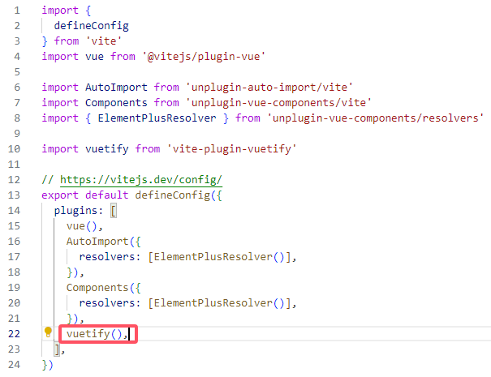
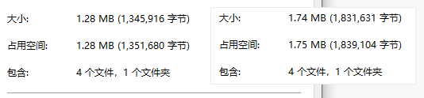

# Vuetify

> 官网：[Vuetify —— 一个 Vue 的组件框架 (vuetifyjs.com)](https://vuetifyjs.com/zh-Hans/)

## 安装

### 全局引入

安装模块

```
npm i vuetify
```

引入`main.js`

```js
import { createApp } from 'vue'

// Vuetify
import 'vuetify/styles'
import { createVuetify } from 'vuetify'
import * as components from 'vuetify/components'
import * as directives from 'vuetify/directives'

// Components
import App from './App.vue'

const vuetify = createVuetify({
  components,
  directives,
})

createApp(App).use(vuetify).mount('#app')
```

### 按需引入

> 官方教程：[Treeshaking — Vuetify (vuetifyjs.com)](https://vuetifyjs.com/en/features/treeshaking/)

安装模块

```
npm install vite-plugin-vuetify --save
```

修改`main.js`

```js
import { createVuetify } from 'vuetify'
// import * as components from 'vuetify/components'
// import * as directives from 'vuetify/directives'

const vuetify = createVuetify()
```

配置`vite.config.js`

```js
import vuetify from 'vite-plugin-vuetify'
 
vuetify()
```

> 
>
> 打包后大小对比
>
> 