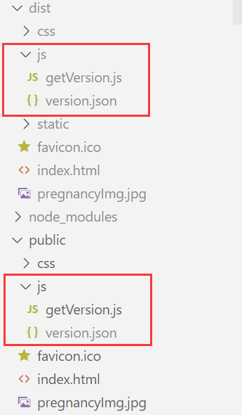

# 版本控制

前端在发布新版本后，由于Vue的特性，用户不刷新页面会一直请求到原本的js文件，但是由于哈希处理，新版本的js文件名称会发生变化，所以用户会请求不到js文件。如果请求本身使用axios进行了统一封装，可以在响应体中进行处理，但如果没有封装请求，就只能采用路由守卫的方式来在进行路由跳转之前发送某个请求来判断是否已经更新了版本

## 设计思路

> 因为Vue是单页面应用，所以无法通过请求响应来更新页面，就算让Nginx返回状态码为304也不会进行重定向，所以只能依赖js代码来进行处理，进行浏览器页面的刷新
>
> 可以通过在每次路由跳转前先请求`version.json`文件，如果文件发生了变化就提示，应该进行页面刷新，接下来就只需要保证在每次更新前都更新此文件即可，所以需要修改打包命令，让打包命令在打包前先修改`version.json文件`即可
>
> 把版本控制文件放入public目录，在打包时此目录会原封不动的放入dist目录，一般Nginx配置文件中会放行静态文件

给路由的js文件`index.js`添加前置守卫

```js
// 获取 Version 的方法
async function getVersion(path) {
    try {
        let data = {
            jsVersionExists: false,
            versionData: {}
        }
        // 发送异步请求，判断 Version 文件是否存在
        const response = await fetch(path)
        // 状态码正确的话
        if (response.status === 200) {
            data.jsVersionExists = true
            // 等待Promise对象解析为JSON数据
            const jsonData = await response.json();
            data.versionData = jsonData;
        }
        return data
    } catch (error) {
        return {}
    }
}

// 配置路由前置守卫
router.beforeEach(async (to, from, next) => {
    // 判断运行环境
    if (process.env.NODE_ENV === "production") {
        // 每次请求前先获取版本号
        const data = await getVersion('/mas/js/version.json')
        // 如果 Version 文件存在
        if (data.jsVersionExists) {
            let oldV = JSON.parse(localStorage.getItem('versionData'))
            // 如果没有存入版本信息，或者版本号不一致且开启了显示
            if (oldV == null || oldV.version !== data.versionData.version && data.versionData.isShow) {
                let userChoice = confirm('已发布新的版本，您可以点击确定后自动刷新网页获取更新，或者点击取消后您稍后手动刷新')
                if (userChoice) {
                    // 写入新版本号并刷新页面
                    localStorage.setItem('versionData', JSON.stringify(data.versionData))
                    window.location.reload();
                }
            } else {
                // 一致或者不展示则放行
                next()
            }
        } else {
            // 如果 Version 不存在，放行
            next()
        }
    } else if (process.env.NODE_ENV === "development"){
        next()
    }
})
```

新增`getVersion.js`文件

```js
const fs = require('fs');
const path = './public/js/version.json';

// 检查文件是否存在
fs.access(path, fs.constants.F_OK, (err) => {
    if (!err) {
        // 文件存在，读取内容并修改
        fs.readFile(path, 'utf8', (err, fileData) => {
            if (err) {
                console.error(`Error reading file: ${err}`);
            } else {
                let data = JSON.parse(fileData);
                data.version = new Date().getTime().toString();
                // 写入修改后的内容
                fs.writeFile(path, JSON.stringify(data), (err) => {
                    if (err) {
                        console.error(`Error writing file: ${err}`);
                    } else {
                        console.log('File version.json has been updated successfully');
                    }
                });
            }
        });
    } else {
        // 文件不存在，创建新文件并写入数据
        let data = {
            "version": new Date().getTime().toString(),
            // 是否更新版本时展示给用户
            "isShow": true,
        };
        fs.writeFile(path, JSON.stringify(data), (err) => {
            if (err) {
                console.error(`Error writing file: ${err}`);
            } else {
                console.log('New file version.json has been created successfully');
            }
        });
    }
});
```

修改`package.json`中的`build`相关的打包命令

```json
    "scripts": {
        "dev": "vue-cli-service serve",
        "build:prod": "node ./public/js/getVersion.js && vue-cli-service build",
```

> 效果优化
>
> - 添加`version.json`到`.gitignore`，可以防止多人打包后提交和拉取代码的问题，这样每个人打包互不影响
>
> 
>
> - 可以尝试给请求添加防抖或者控制浏览器缓存，降低服务器压力

## 实现效果

目录结构：



发布新版本后：


