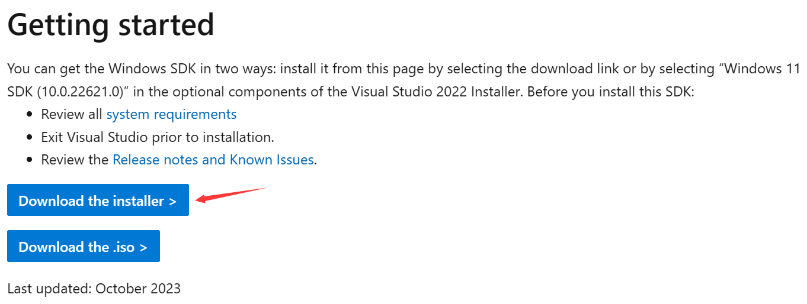
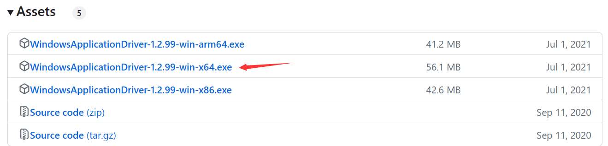

# 环境搭建

## Windows DSK

Windows SDK下载地址：[Releases · microsoft/WinAppDriver (github.com)](https://github.com/microsoft/WinAppDriver/releases)

## WinAppDriver

WinAppDriver下载地址：[Releases · microsoft/WinAppDriver (github.com)](https://github.com/microsoft/WinAppDriver/releases)

## 参考博客

- [Appium: Windows系统桌面应用自动化测试(一) 【环境搭建】_appium测试windows程序-CSDN博客](https://blog.csdn.net/weixin_43936332/article/details/131490397)