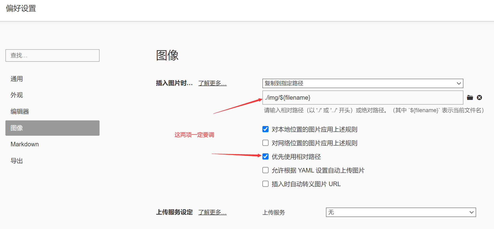

# Typora使用教程

## 一,标题

#＋空格＋内容=标题**（”#“决定标题的级别）**

## 二,字体

1. 左右单“*”斜体字体：

*内容*

2. 左右双“*”加粗字体：

**内容**

3. 左右三“*”斜体加粗：

***内容***

4. 左右双“~”删除效果：

~~内容~~

5. 左右单"`"按钮效果：

`let`

## 三,引用

使用">"＋内容即可:

> 内容

## 四,分割线

1. 使用三个"-":

---

2. 使用三个"*":

***

## 五,图片

"!"＋[名称]＋(图片地址):


**（直接拖拽更方便）**

## 六,超链接

[名称]＋(地址):

[哔哩哔哩](https://www.bilibili.com/)

## 七,列表

**1,有序列表**:数字＋"."＋空格:

2. 
3. 使用回车继续生成

**2,无序列表**:"-"＋空格:

- 
- 使用回车继续生成

## 八,表格

1. 右键直接插入表格:

| 内容 |
| ---- |

2. "|"＋内容＋"|"(两个及以上)＋回车:

| 内容 | 内容 |
| ---- | ---- |
|      |      |

## 九,代码

三个"`"＋语言名称＋回车:

```java
public
```

## 优化设置


