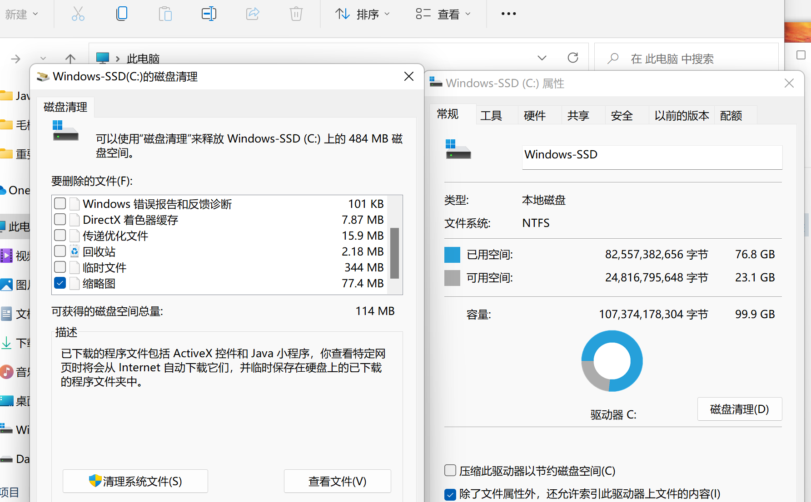
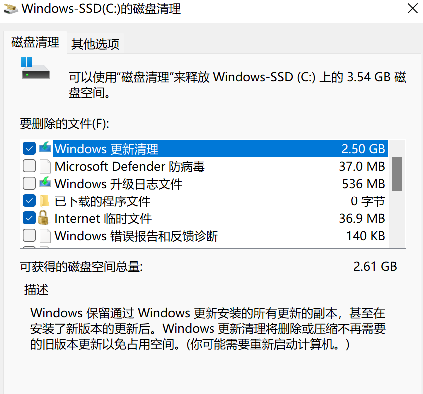
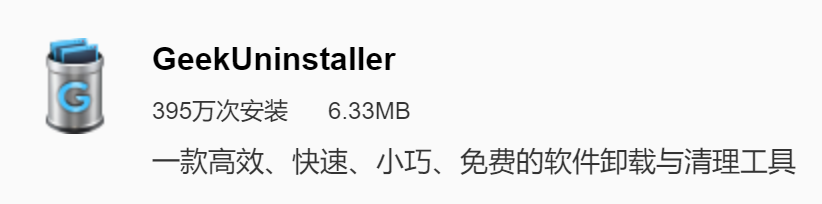
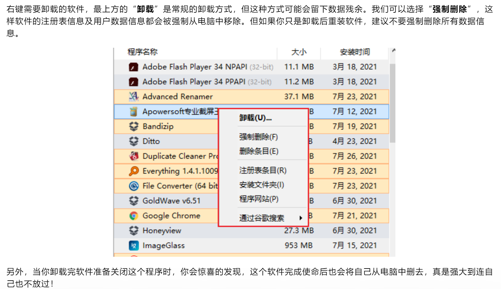
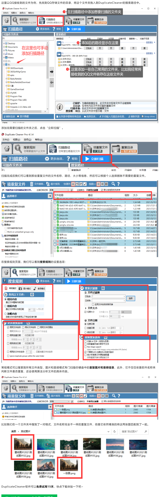
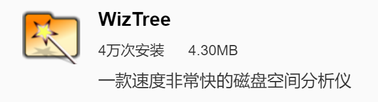
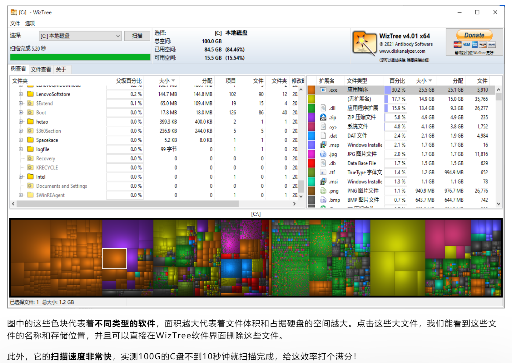

# WindowsC盘清理

1. win键+R键，输入%temp%打开临时文件，选择全部删除
2. 选择C盘，右键属性，选择磁盘清理，再选择清理系统文件，勾选windows更新清理

选择清理系统文件

## 清理软件

### GeekUninstallers

**彻底卸载不需要的程序**

### DuplicateCleaner

**清理电脑中的重复文件**

### WizTree

**大文件一秒现身**

