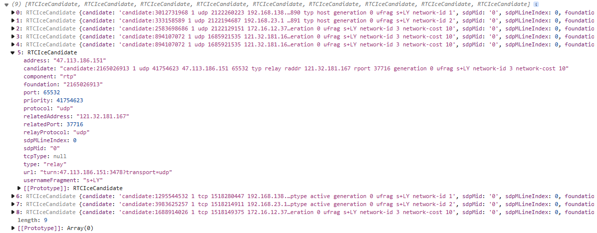
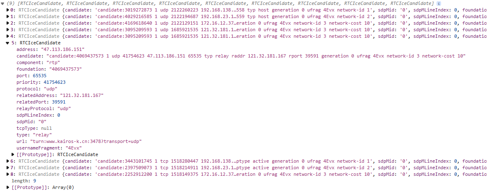
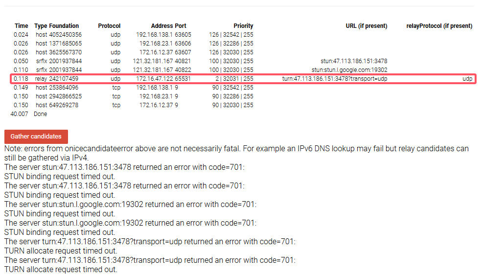
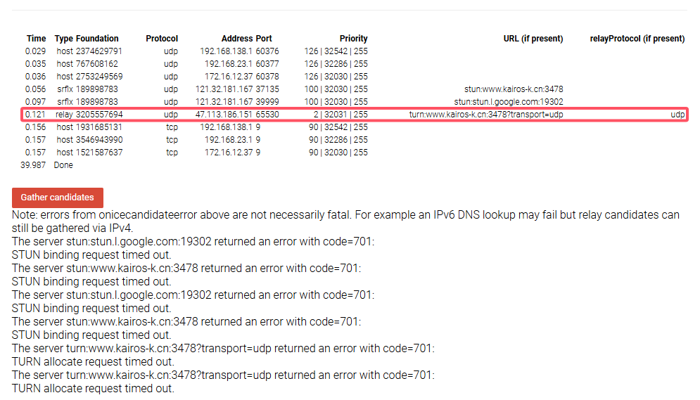

# WebRTC

> WebRTC（Web Real-Time Communication）是一个支持网页浏览器进行实时语音对话或视频对话的技术协议，由Google开源并推动其标准化。WebRTC的目标是无需安装任何插件或额外的软件，就能在浏览器之间实现点对点的通信

## 连接建立

> - 新用户创建一个`RTCPeerConnection`实例
> - 新用户获取本地媒体流并添加到`RTCPeerConnection`
> - 新用户为每个会议中的现有用户创建`offer`，并通过信令服务器发送这些`offer`
> - 现有用户接收到新用户的`offer`，创建`answer`，并通过信令服务器发送回新用户
> - 交换`ICE candidates`，直到所有连接都建立

## 回调方法

- `onicecandidate`：当本地代理找到ICE候选时会触发此事件。当候选被收集并发送，意味着连接正在尝试建立
- `onsignalingstatechange`：当信令状态改变时会触发此事件。通过检查状态是否变为`stable`，这是连接建立过程中的一个良好信号
- `oniceconnectionstatechange`：当ICE连接状态改变时会触发此事件。以下是一些常见的状态：
  - `new`：刚开始
  - `checking`：正在检查连接
  - `connected`：至少有一个ICE连接成功
  - `completed`：所有ICE连接尝试完成，连接成功
  - `disconnected`：连接已断开
  - `failed`：连接尝试失败
  - `closed`：连接已关闭
- `onnegotiationneeded`：当需要重新协商连接时会触发此事件
- `ontrack`：当接收到远端媒体轨道时会触发此事件，通常用于视频或音频通信

## 候选地址

候选地址包括四种类型：

- **主机候选地址（Host Candidates）**：
  - 这类候选地址是由设备的网络接口直接生成的，不需要NAT（网络地址转换）或任何类型的代理
  - 它通常指的是设备上的每个IP地址和端口对

- **服务器反射候选地址（Server Reflexive Candidates）**：
  - 当WebRTC在NAT环境中运行时，它会使用STUN（Session Traversal Utilities for NAT）服务器来发现其公网IP地址和端口
  - 通过与STUN服务器通信，WebRTC客户端获得其NAT分配给它的公网IP地址和端口，这些信息构成了服务器反射候选地址

- **对等反射候选地址（Peer Reflexive Candidates）**：
  - 这是在WebRTC连接过程中动态发现的候选地址，当一个ICE候选地址被用来与对等端通信时，对等端可能会发送信号，表明它看到了与发送端不同的IP地址和端口
  - 这通常发生在NAT环境中，当一个端点位于对称NAT后面时

- **中继候选地址（Relayed Candidates）**：
  - 当直接连接（主机候选地址或服务器反射候选地址）不可行时，WebRTC可以使用TURN（Traversal Using Relays around NAT）服务器作为中继
  - TURN服务器接收来自一个WebRTC客户端的数据，然后转发给另一个客户端，从而允许两端通过TURN服务器进行通信

对应的连接优先级：

- **尝试直接点对点连接**：ICE首先尝试找到可以直接连接的对等端候选地址
- **使用STUN服务器**：如果直接连接失败，ICE会尝试使用STUN服务器获取自己的公网IP和端口，以及NAT的类型，并尝试与对等端建立连接
- **使用TURN服务器**：如果STUN方法也失败（例如，由于对称NAT或防火墙限制），客户端之间无法直接建立P2P连接，那么ICE会尝试使用TURN服务器将视频、音频和其他媒体流作为中继来建立连接

对于局域网连接失败，WebRTC首先尝试使用STUN服务器获取公网IP地址。如果客户端可以直接通过NAT映射到公网，那么它可能不会使用TURN服务器，TURN服务器是最终确保能够建立起连接的，配置了STUN和TURN服务器的`RTCPeerConnection`的示例代码：

```js
const rtcPcParams = {
    iceServers: [
        { urls: "stun:stun.l.google.com:19302" }, // STUN服务器
        {
            urls: "turn:your.turnserver.com:3478", // TURN服务器的URL
            username: "yourUsername",              // TURN服务器的用户名
            credential: "yourCredential"           // TURN服务器的密码
        }
    ],
};

const rtcPeerConnection = new RTCPeerConnection(rtcPcParams);

// ...其余的代码，比如设置onicecandidate回调等
```

### 安装coturn

> 有多种开源的TURN服务器软件可供选择，如`coturn`、`restund`等，其中`coturn`是最常用的一个

```
yum install coturn
```

> 服务命令：
>
> ```
> systemctl status coturn
> systemctl start coturn
> systemctl restart coturn
> ```

日志位置：

```
/var/log/coturn/turnserver.log
```

配置文件位置：

```
vim /etc/coturn/turnserver.conf
```

参考配置文件：

```
# 运行监听的接口，根据服务器情况修改
listening-port=3478

# TURN服务器的Relay IP地址，如果没有特殊需求，可以不用修改
# relay-ip=<服务器公网IP>

# 默认情况下，如果没有设置external-ip，coturn服务器不会进行地址映射。如果服务器位于NAT后面，并且没有正确配置external-ip，那么客户端可能无法通过NAT与服务器建立连接(这里配置之后可以在打印的ICE中看到公网ip和使用的端口号)
external-ip=xxx.xxx.xxx.xxx

# TURN服务器的用户和密码，用于客户端认证
user=<用户名>:<密码>
# 例如:
# user=yourusername:yourpassword

# TURN服务器的域，通常设置为服务器域名或公网IP
realm=<yourdomain.com>

# 中继时默认UDP连接使用的端口范围
# min-port=49152
# max-port=65535
min-port=65530
max-port=65535

# 设置日志文件路径
log-file=/var/log/coturn/turnserver.log

# 开启指纹认证，需要客户端发送一个由用户证书或者某些唯一标识生成的指纹
fingerprint

# 如果有证书，可以配置SSL/TLS
# cert=/etc/pki/coturn/public/turn_server_cert.pem
# pkey==/etc/pki/coturn/private/turn_server_pkey.pem

# no-stun选项的作用是关闭STUN功能，使得coturn服务器只作为TURN服务器运行，所有STUN请求都将被忽略。这个选项默认是不设置的，意味着coturn服务器默认情况下既提供STUN服务也提供TURN服务，共享一个端口
# no-stun

```

> 配置ip：
>
> 
>
> 配置域名：
>
> 

### 连接测试网站

> 测试网站：[Trickle ICE](https://webrtc.github.io/samples/src/content/peerconnection/trickle-ice/)

配置ip：



配置域名：



> 注意：上述onicecandidateerror中的错误并不一定是致命的。例如，IPv6 DNS查找可能会失败，但仍然可以通过IPv4收集中继候选地址。
> 服务器stun:47.113.186.151:3478返回了一个错误，错误代码为701：STUN绑定请求超时

## 示例代码

RTCUtils.js

```js
class RTCClass {
    constructor(videoDom, userId, targetUid, socket, localStream = null) {
        // 保存sdp
        this.offer;
        this.answer;

        this.userId = userId;
        // 建立通信目标id，一个单点对点
        this.targetUid = targetUid;

        // 保存候选地址
        this.candidateList = [];
        // 如果两台服务器无法点对点连接，则会使用中继服务器来通信
        this.rtcPcParams = {
            iceServers: [
                { urls: "stun:stun.l.google.com:19302" }, // STUN服务器
                {
                    urls: "turn:xxx.xxx.xxx.xxx:3478", // TURN服务器的URL
                    username: "yxx",              // TURN服务器的用户名
                    credential: "yxx"           // TURN服务器的密码
                }
            ],
        };

        this.socket = socket;
        // rtc连接对象
        this.rtcConnection = this.createRtcConnection();

        // 如果初始化不为空，发送自身的本地流
        if (localStream && Object.keys(localStream) && localStream.active) {
            this.addLocalStreamToRtcConnection(localStream);
        }

        // 接收到流时展示的盒子
        this.onTrack(videoDom);
    }

    // 创建RTC连接
    createRtcConnection(socket) {
        this.rtcConnection = new RTCPeerConnection(this.rtcPcParams);
        this.onicecandidate(socket);
        this.oniceconnectionstatechange();
        console.log("rtc创建成功", this.rtcConnection);
        return this.rtcConnection;
    }

    // 定义获取候选地址时的逻辑，发起者创建offer时会触发，接受者设置远程描述后创建answer时会触发，以及内网连接失败后会尝试NAT穿透和使用TURN服务器时会触发
    onicecandidate() {
        // 存储自身候选地址
        this.rtcConnection.onicecandidate = (e) => {
            let candidate = e.candidate;
            if (candidate) {
                this.candidateList.push(candidate);
                // 有新的ICE地址时广播出去
                let sendObj = JSON.stringify({
                    type: "candidate",
                    targetUid: this.targetUid,
                    userId: this.userId,
                    candidate: candidate,
                });
                console.log("发送候选地址------", candidate)
                this.socket.send(sendObj);
            }
        };
    }

    // rtc状态改变时回调
    oniceconnectionstatechange() {
        this.rtcConnection.oniceconnectionstatechange = () => {
            console.log("rtc当前状态为：", this.rtcConnection.iceConnectionState);
        }
    }

    // 处理onTrack回调，接收到远程的媒体流时触发
    onTrack(videoDom) {
        this.rtcConnection.ontrack = (e) => {
            console.log(e.streams);
            console.log("rtc接收到了远程媒体流");
            videoDom.srcObject = e.streams[0];
        };
    }

    // 创建offer，创建会话描述协议sdp，双方需要互相交换sdp
    createOffer = async () => {
        let sdp = await this.rtcConnection.createOffer({
            offerToReceiveVideo: true,
            offerToReceiveAudio: true,
        })
        // 存储sdp
        this.offer = sdp;
        console.log("offer的sdp为", JSON.stringify(sdp));
        this.rtcConnection.setLocalDescription(sdp);
        return sdp;
    }

    // 创建Answer
    createAnswer = async () => {
        let sdp = await this.rtcConnection.createAnswer({
            offerToReceiveVideo: true,
            offerToReceiveAudio: true,
        });
        this.answer = sdp;
        console.log("answer的sdp为", JSON.stringify(sdp));
        this.rtcConnection.setLocalDescription(sdp);
        return sdp;
    }

    // 设置远程描述
    setRemoteDescription(currentText) {
        const remoteSdp = JSON.parse(currentText);
        this.rtcConnection.setRemoteDescription(
            new RTCSessionDescription(remoteSdp)
        );
        console.log("设置远程描述成功", remoteSdp);
    }

    // 添加候选地址
    addCandidate(currentText) {
        let candidate = JSON.parse(currentText);
        this.rtcConnection.addIceCandidate(new RTCIceCandidate(candidate));
        console.log("添加候选成功", candidate);
    }

    // 将本地视频流添加到RTC中
    addLocalStreamToRtcConnection(localStream) {
        try {
            localStream.getTracks().forEach((track) => {
                this.rtcConnection.addTrack(track, localStream);
            });
            console.log("将本地视频流添加到RTC连接成功");
        } catch (error) {
            console.error("将本地视频流添加到RTC连接失败:", error);
        }
    }
}


export default RTCClass;
```

> socket为WebSocket对象

参考博客：

- [coturn穿透服务器搭建与测试——小白入门-CSDN博客](https://blog.csdn.net/qq_34732729/article/details/107605895)
- [WebRTC 网络中继 Coturn 服务安装及部署 - 知乎 (zhihu.com)](https://zhuanlan.zhihu.com/p/636276243)
- [webRTC: 基于coturn项目的stun/turn服务器搭建-腾讯云开发者社区-腾讯云 (tencent.com)](https://cloud.tencent.com/developer/article/1730301)
