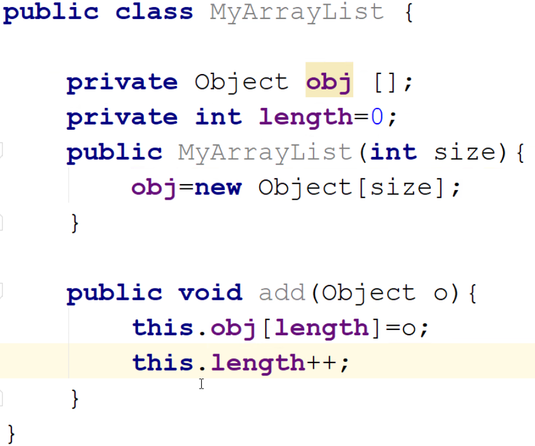
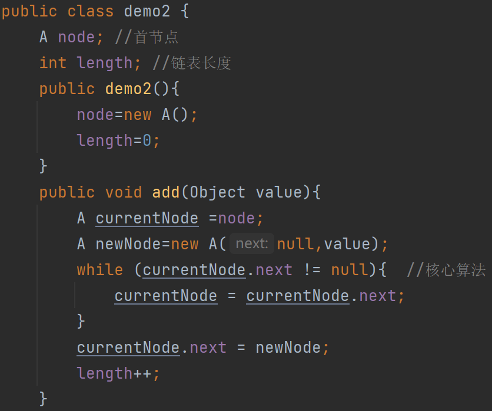

# 2

### java高级

1. 集合（原理）
2. 反射 动态代理（SSM核心＋底层）
3. 线程 多线程
4. 自定义注释
5. juc锁
6. jvm虚拟机

### 数据结构

为了数据增加在做数据增删改查时的效率。

1. 线型：线性表、链表、队列、堆栈、串
2. 非线性：树、图

线性表：JDK1.8中ArrayList为线性表，内存不够时扩容，内容复制下来，扩容后为原来的1.5倍。

链表：方便增加和删除，增加和删除后不需要一个个往前移，但查找效率降低

双链表：相对于链表查找速度减半

队列：先进先出，应对某些特定的业务下的方法

堆栈：先进后出

泛型：任意数据类型

Java线性表：

Java链表：

