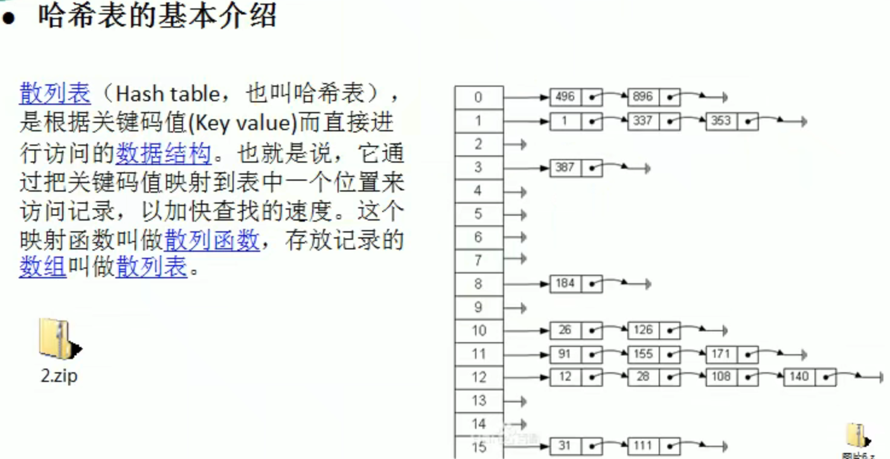

# 4、HashMap

***JDK7与JDK8及以后的HashMap结构与存储原理有所不同：***
Jdk1.7：数组 + 链表 ( 当数组下标相同，则会在该下标下使用链表)
Jdk1.8：数组 + 链表 + 红黑树(预值为8 如果链表长度<=8则会把链表变成红黑树 )

- Jdk1.7中链表新元素添加到链表的头结点,先加到链表的头节点,再移到数组下标位置
- Jdk1.8中链表新元素添加到链表的尾结点
  (数组通过下标索引查询，所以查询效率非常高，链表只能挨个遍历，效率非常低。jdk1.8及以上版本引入了红黑树，当链表的长度大于或等于8的时候则会把链表变成红黑树，以提高查询效率

